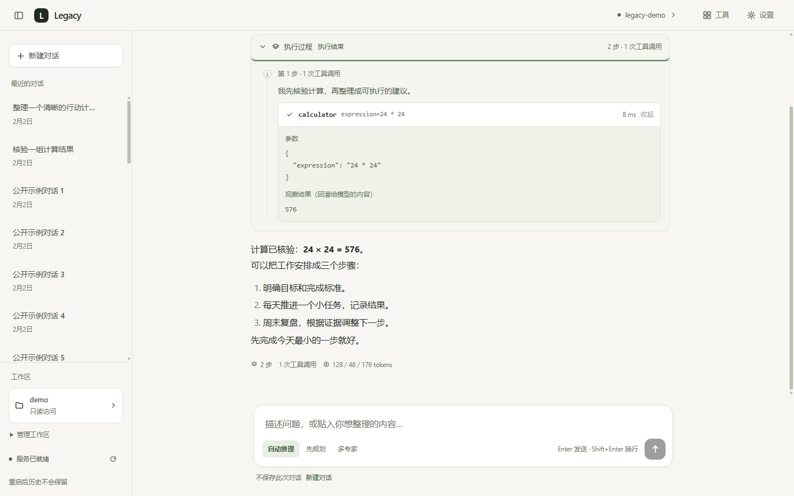
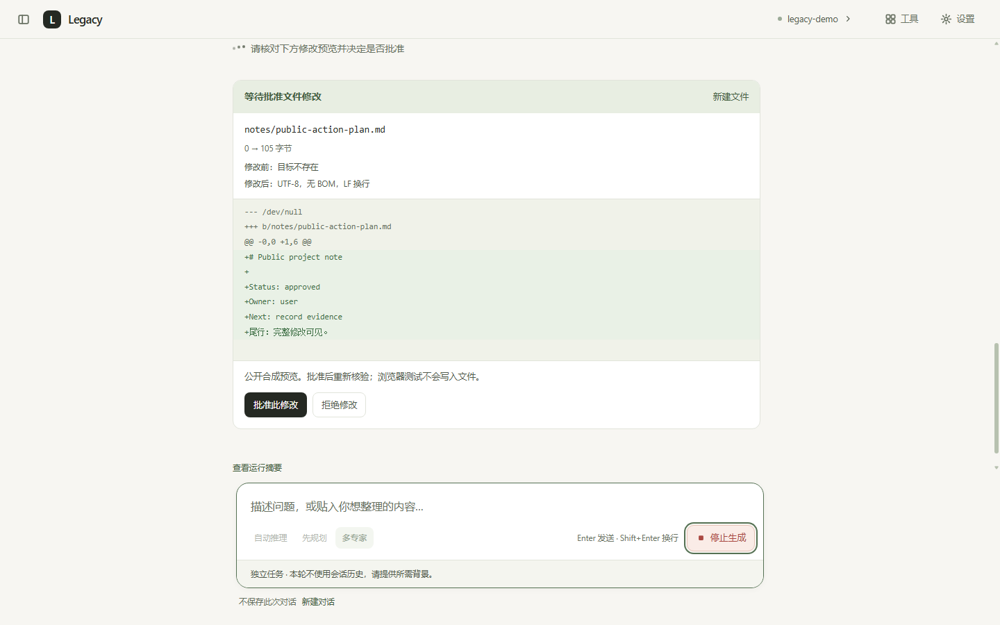
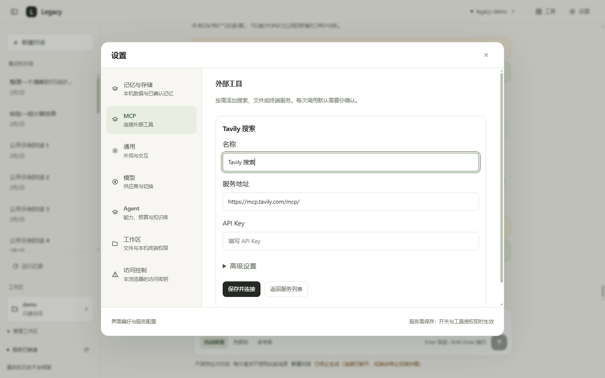
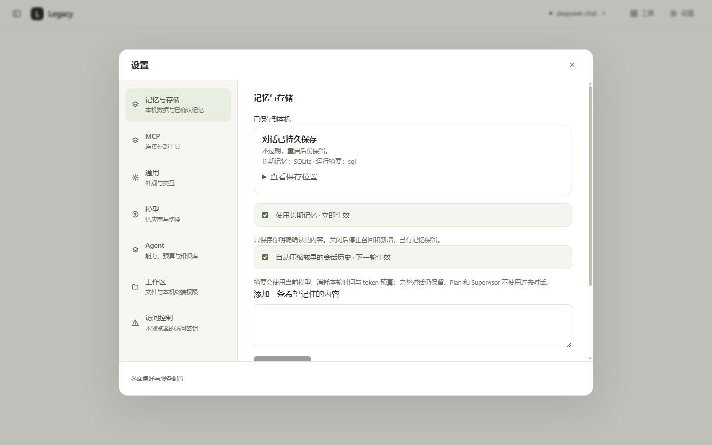
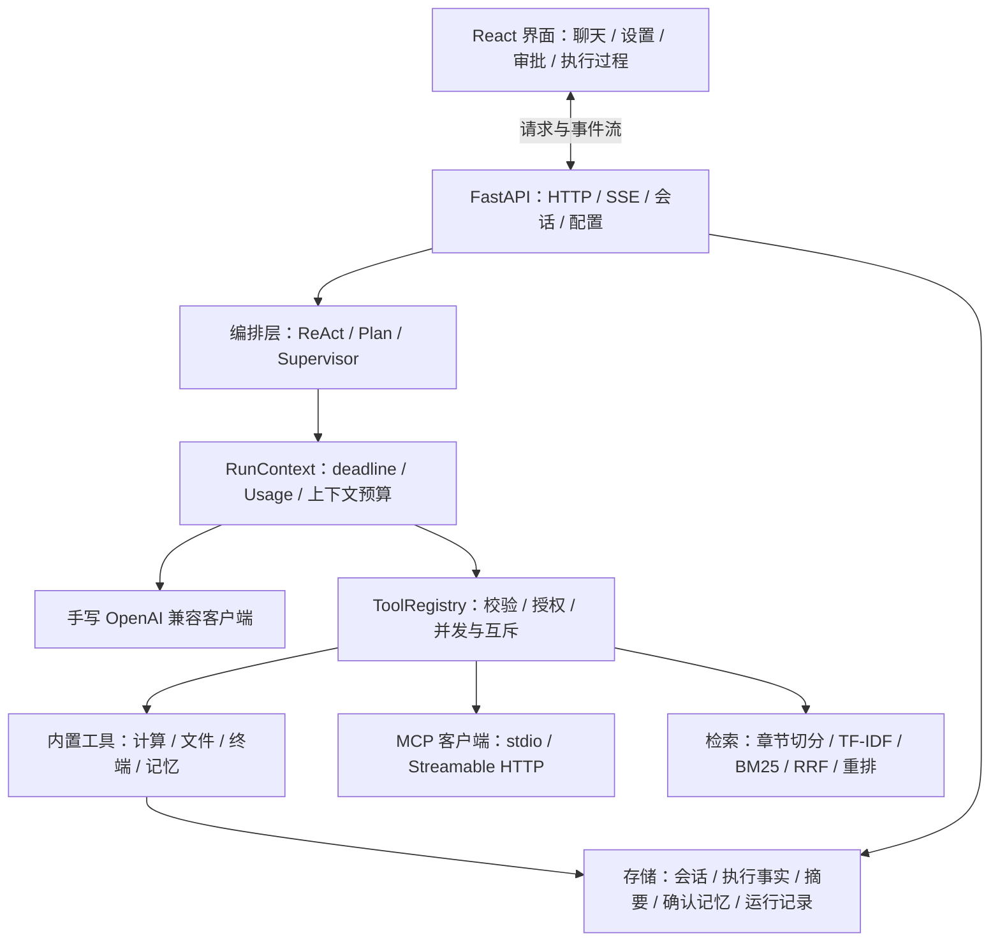

# Legacy · 手写内核的通用 AI Agent

基于 **Python / FastAPI + React / TypeScript** 的全栈 Agent 项目，手写 OpenAI 兼容客户端、工具执行协议与三种编排内核，不依赖 LangChain。

Legacy 围绕一个完整的任务生命周期实现：**理解任务 → 规划或调用工具 → 请求授权 → 执行 → 保存结果 → 清理资源**。支持 MCP、RAG、多轮会话和已确认的长期记忆，并提供 Windows 解压即用包。

[界面展示](#界面展示) · [系统架构](#系统架构) · [工程难点](#工程难点) · [验证与评测](#验证与评测) · [运行项目](#运行项目)

## 项目长处

| 方向 | 具体实现 |
|---|---|
| **编排内核可读、可比较** | ReAct、Plan-and-Execute、Supervisor 共用模型客户端、工具注册表、事件协议和运行预算；模式差异集中在编排层 |
| **运行控制贯穿全程** | 规划、重规划、专家、审批等待、工具与汇总消耗同一份时间预算；取消后等待清理，预算终止返回部分结果和明确原因 |
| **工具执行有授权边界** | 参数校验、只读并发、副作用串行；文件修改先展示完整 diff，批准后重新核验；终端命令逐条确认 |
| **历史与执行事实分开保存** | 完整对话、增量摘要、已执行操作和已确认偏好分别处理；失败或停止后的执行事实仍可供下一轮参考 |
| **MCP 能力进入真实执行链路** | 支持 stdio / Streamable HTTP，工具发现、Schema 校验、审批、超时和取消接入统一工具层；模型可查询实际 MCP 状态 |
| **检索与验收可复现** | 手写 BM25、TF-IDF、RRF 融合与重排；公开合成语料、冻结清单、离线消融和受控失败用例 |
| **从源码走到桌面交付** | Windows 目录包包含 Python 运行依赖、Node 和两个本地 MCP；资源与用户数据分离，支持首次配置、单实例和托盘退出 |

默认是通用助手，知识库与工作区由用户显式配置。求职工具保留为可选 `jobhunt` profile，不影响默认能力。

## 界面展示

### 对话与工具执行过程

答案与执行过程分开呈现，工具参数、返回内容、失败和截断信息可展开查看；停止及预算状态保留在答案附近。



<details>
<summary>文件修改审批：完整 diff、批准与拒绝</summary>

文件修改先形成预览，用户批准后才应用；批准不是对旧快照的无条件写入，执行前仍检查路径、权限与文件版本。



</details>

<details>
<summary>MCP 配置：直接填写密钥，工具授权放在高级设置</summary>

预设服务提供直接可见的配置项；连接状态与可用工具数量来自实际发现。密钥查询只返回配置状态或掩码，编辑留空保留旧值。



</details>

<details>
<summary>记忆与存储：持久化状态、增量摘要和确认式记忆</summary>

桌面版使用 SQLite 保存会话和已确认的长期记忆。关闭记忆停止召回与新增，已有内容保留并可管理。



</details>

截图来自使用公开合成数据的界面验收，不代表真实模型输出质量。聊天图采用源码内存会话配置；桌面版的持久化状态见记忆与存储图。

## 系统架构



三种模式共享执行基础设施，但保留不同的任务语义：

| 模式 | 编排方式 | 历史使用 |
|---|---|---|
| **ReAct** | 模型选择工具，执行结果回灌，再继续推理 | 使用所选会话的历史、摘要和执行事实 |
| **Plan-and-Execute** | 生成计划，逐步执行；必要时重规划，最后汇总 | 本轮为独立任务，不使用过去对话 |
| **Supervisor** | 路由选择专家，受控并发执行，再汇总 | 本轮为独立任务，不使用过去对话 |

三种模式均可召回相关的、用户已确认的长期偏好。未选择会话的请求不使用此前消息；长期记忆与会话历史是不同机制。

## 工程难点

### 1. 多 Agent 的预算必须覆盖整个调用树

给每个子 Agent 分别计时，会让规划、专家执行和汇总各拿一份完整预算，整轮超时因此失效。Legacy 每轮创建独立的 [`RunContext`](services/api/app/agent/runtime.py)，子任务共享基于单调时钟的绝对 deadline；模型调用、审批等待和汇总都在同一上下文中运行。

模型用量在调用边界累计，失败子任务已经返回的 Usage 也计入；缺少完整用量时显式标记 `usage_complete=false`。Plan / Supervisor 支持整轮累计 token 阈值；预算耗尽后不启动后续调用，保留已有结论并报告 `timeout` 或 `token_budget`。在途调用可能使最终用量超出阈值，因此该机制是调用控制，不是货币费用硬上限。

### 2. “停止生成”需要回收任务、生成器和子进程

浏览器停止显示文字并不意味着后端停止执行。[SSE 路由](services/api/app/api/routes.py)在断连时关闭底层生成器；[Supervisor](services/api/app/agent/multi.py)在取消、超时和异常退出时取消并等待专家任务。

本机终端在 Windows 上采用**挂起启动 → 绑定 Job → 恢复运行**，避免子进程抢先派生后逃出清理范围；退出、超时和取消都处理普通子孙进程。冻结程序启动系统工具时还需处理继承的 DLL 搜索环境。实现见 [`terminal_windows.py`](services/api/app/tools/terminal_windows.py) 与 [`desktop/process.py`](services/api/app/desktop/process.py)。

### 3. 审批与并发写入需要一起设计

每个专家自己串行执行，并不能阻止多个专家或多个请求同时修改同一目标。[工具注册表](services/api/app/tools/base.py)持有共享副作用锁，并在配置刷新时保留同一注册表与锁；只读工具继续受控并发。

文件审批在写锁外等待，真正应用修改在锁内完成。[文件修改流程](services/api/app/tools/file_changes.py)在批准后重新验证文件版本、路径与权限，防止预览后文件被改动，或等待期间权限已撤销。终端与未知外部工具默认逐次确认，具体只读 MCP 工具的免确认授权绑定服务配置和工具定义；定义变化后信任失效。

该互斥作用于同进程共享注册表；终端工作目录不是沙箱，已完成的写入也不随取消自动回滚。

### 4. “执行过”不能只存在于最终答案或 SSE 事件里

工具已成功写入文件，但模型随后失败，如果只保存最终答案，下一轮就会误以为什么都没发生。Legacy 在[实际执行点](services/api/app/agent/operations.py)采集有界执行事实，失败和停止时仍保存；只有正常完成的答案进入对话历史。

同进程、同会话的后续请求等待上一轮清理和保存结束，再读取上下文。[会话存储](services/api/app/session/sqlite_store.py)通过原子合并更新历史与元数据，避免覆盖并发保存或复活已删除会话。摘要保存已处理位置，只压缩新增历史；完整对话仍留在数据库。历史执行成功仅证明当时完成，不代表文件现在仍存在。

上下文裁剪还需维护协议配对：[`context.py`](services/api/app/agent/context.py)按 assistant 工具调用与对应 tool 结果整组裁剪，避免破坏 `tool_call_id`；MCP 工具定义也计入上下文预算。

### 5. MCP 的“已连接”不等于模型有工具可用

连接协商成功后，工具仍可能因为名称变化、选择配置或模型命名限制而没有注册。[MCP 接入层](services/api/app/mcp_client/manager.py)处理分页发现、稳定命名空间、原始 JSON Schema 与参数验证；状态接口报告实际暴露数量和缺失工具，`get_mcp_status` 让模型也能查询真实状态。

连接生命周期独立于模型客户端，切换模型不会丢失 MCP 连接。默认按有副作用工具串行、逐次确认；取消后无法确认结果的远程操作记录为“结果未确认”，不自动重发。当前聚焦 Tools，不扩展 Resources、Prompts 或 OAuth。

### 6. RAG 的改善需要能解释，也需要防止指标失真

[检索链路](services/api/app/rag/retriever.py)由章节切分、TF-IDF 与手写 BM25 召回、RRF 融合和重排组成；默认可离线运行，可选模型改写和重排按配置启用。检索支持来源引用、相关性闸门和逐阶段诊断，用于区分“没有召回”与“召回后排在 top-k 之外”。

评测使用公开合成开发集与[冻结留出集](services/api/app/rag/holdout.py)，按 manifest 校验语料；正例与无答案分开统计，NDCG 的理想排序基于全语料相关块。离线答案核验检查引用、原文 quote 和证据覆盖，语义支持仍需要人工审核。检索命中率、合成编排通过率与真实模型回答质量分别报告。

## 验证与评测

以下为 **2026-10-08 已完成的本地验收**。后端、前端逻辑与类型检查已在本次文档更新后复测；Edge、前端构建与 ZIP 数字引用对应功能完成时的验收，本次未重复运行。远程 CI 已取消，验证入口保留在仓库脚本中。

| 验证范围 | 已记录结果 | 复现入口与含义 |
|---|---|---|
| 后端离线回归 | **1567 通过，1 live 跳过** | `pytest services/api/tests`；最近一次在仅含 Git 跟踪文件的源码副本运行，不依赖本机工作文档或私人配置 |
| 前端逻辑 | **219 通过**；类型与构建通过 | `pnpm test`、`pnpm run typecheck`、`pnpm build` |
| Edge 界面验收 | **501 项通过** | `scripts/smoke_ui.py --visual`；公开合成 API/SSE，覆盖三种视口、主题、审批、设置和停止；来自此前界面验收 |
| 最终 Windows ZIP | **79 项通过** | `scripts/verify_desktop.py --picker`；实际解压运行，覆盖原生目录选择、MCP、终端清理、退出与重启持久化 |
| 三种编排离线评测 | **30 个公开任务 × 3 模式** | `scripts/eval_agent.py --offline`；合成模型驱动真实内核与工具，验证执行链路，不作为模型成功率 |
| 公开 RAG 评测 | 开发集 **16 文档 / 60 查询**；留出集 **12 文档 / 32 查询** | `scripts/eval_rag.py --compare --dataset general` 与 `scripts/eval_rag_ranking.py --dataset holdout`；合成数据，不是独立真实用户标注集 |

回归覆盖规划与工具延迟、专家失败、预算累计、取消清理、副作用互斥、失败后事实保留、审批拒绝、MCP 信任失效和重启持久化。真实模型测试默认跳过；只有显式 `-m live` 或 `--run-live` 才联网，可能产生费用。

Windows 包已在本机 Windows 11、中文及空格路径、仅保留 Windows 工具的 PATH 下验收。Windows 10、新设备和 Windows Sandbox 尚未实测；移除开发运行时 PATH 不等于在全新机器安装。

## 运行项目

### Windows 桌面包

完整解压可用的 `Legacy-Windows-x64.zip`，双击 `Legacy.exe`。包内提供 Python 运行依赖、Node 和两个本地 MCP，无需另外安装 Python、Node 或 Redis。

首次填写 **供应商、API 地址、模型名、API Key**，点击「保存并开始使用」，保存不发送模型测试请求。随后可在设置中配置 MCP、工作区、终端与记忆。

数据位于 `%LOCALAPPDATA%\Legacy`。更新前从托盘退出旧版，再完整解压新版；关闭浏览器不退出服务。模型推理会把所需上下文发送给你配置的服务，本机存储不意味着离线推理。

### 源码运行

需要 Python 3.12、Node 24 和 pnpm 10。在项目根目录的 PowerShell 中执行：

```powershell
python -m venv .venv
Remove-Item Env:PIP_TARGET -ErrorAction SilentlyContinue
& .venv\Scripts\python.exe -m pip install -r services\api\requirements.lock -e "./services/api[dev]" -c services\api\requirements.lock
if (-not (Test-Path .env)) { Copy-Item .env.example .env }
```

在 `.env` 中配置模型服务，保留已有用户配置。构建前端后启动：

```powershell
Set-Location apps\web
pnpm install --frozen-lockfile
pnpm build
Set-Location ..\..
powershell -File scripts\dev.ps1 serve -NoReload
```

打开 [本机界面](http://127.0.0.1:8000)，接口文档位于 [Swagger UI](http://127.0.0.1:8000/docs)。源码默认会话后端为 `auto`，不会自动选择 SQLite；要持久保存会话，显式配置 `SESSION_BACKEND=sql`。其余配置项见 [`.env.example`](.env.example)。

文件写入和内置终端默认关闭，知识库默认空语料；外部服务的访问范围由其配置决定。首次使用不自动读取私人文件或启动本地 MCP。

## 代码导航

| 入口 | 职责 |
|---|---|
| [`agent/`](services/api/app/agent/) | 三种编排、共享运行上下文、上下文裁剪、审批与记忆 |
| [`llm/client.py`](services/api/app/llm/client.py) | OpenAI 兼容 HTTP/SSE、流式 tool_calls 分片重组与错误处理 |
| [`tools/`](services/api/app/tools/) | 工具协议、文件修改、终端、参数校验及副作用执行 |
| [`mcp_client/`](services/api/app/mcp_client/) | 服务配置、连接、工具发现、适配与信任绑定 |
| [`rag/`](services/api/app/rag/) | 切分、召回、融合、重排、诊断与离线核验 |
| [`session/`](services/api/app/session/) · [`runs/`](services/api/app/runs/) | 会话存储、同会话执行顺序与有界运行摘要 |
| [`apps/web/src/`](apps/web/src/) | 流式交互、模式与审批、设置、会话与运行状态 |
| [`scripts/build_desktop.py`](scripts/build_desktop.py) | 锁定依赖的桌面构建、资源白名单和 ZIP 输出 |

桌面版面向单机、单个 Windows 用户，默认 SQLite 与进程内任务队列；源码另有 Redis 会话/任务适配和 API / RAG / Worker 的 [Compose 拆分](docker-compose.yml)。多实例执行锁、生产超时与限流标定、TLS 和 Redis 鉴权仍需要对应部署环境与真实流量数据。
