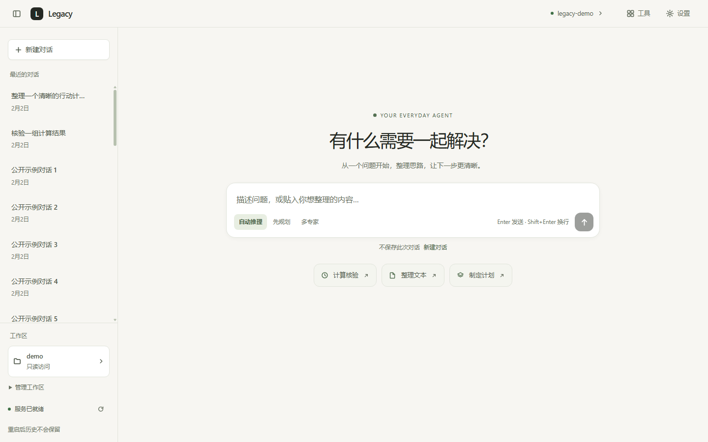

# Legacy · 手写内核的通用 AI Agent

Python 3.12 / FastAPI + React 19 / TypeScript 全栈项目，面向 AI 应用与 Agent 开发实践。
手写 OpenAI 兼容客户端、工具协议和编排内核，ReAct、Plan-and-Execute、Supervisor 共用工具与运行护栏。
默认通用助手；求职工具与专家作为可选 `jobhunt` 技能包保留。

知识库和文件工作区必须由用户显式声明。默认空语料、文件写权限与本机终端关闭、记忆与限流关闭、整轮超时为 0。
智能体接手先读 [AGENTS.md](AGENTS.md)；测量、参数及限制见 [可靠性证据](docs/05-reliability-evidence.md)。

## 当前实现

| 能力 | 当前实现与边界 |
|---|---|
| 三种编排 | ReAct 多轮；Plan 规划/执行/重规划/汇总；Supervisor 路由/并发专家/汇总 |
| 可靠性 | 每轮共享 deadline、累计已知 Usage、上下文裁剪；取消并等待专家，显式关闭模型/SSE 生成器 |
| 工具 | Pydantic 校验、错误回灌、只读并发；同一注册表的副作用跨专家/请求互斥 |
| 文件 | 显式工作区、越界拒绝、敏感文件保护；写权限默认关闭，开启后默认逐次预览差异并批准，应用前再核验版本与权限 |
| 本机终端 | 独立权限默认关闭，逐条确认完整命令、目录和时限；两路输出、退出码、停止及普通子孙清理；拥有服务账户权限，非沙箱 |
| RAG | 章节切分、TF-IDF、手写 BM25、RRF、特征/可选 LLM 重排、可选改写、引用与相关性闸门 |
| 会话与记忆 | 窗口/摘要/长期事实；memory、SQLite、Redis。Plan/Supervisor 本轮不使用会话历史 |
| Web | 暖白／石墨简约界面、统一执行过程、预算终态与用量完整性、停止按钮、五类设置、工作区与响应式抽屉 |
| 服务工程 | 内存/Redis 队列、trace id、指标、熔断、限流、已有 api/rag/worker/Redis Compose 拆分 |
| 可复现性 | Windows CI、Python 运行时 lock、pnpm lock、默认离线测试、公开样本评测、Edge 冒烟 |
| 任务评测 | 30 个通用公开任务、三模式统一评分；合成模型驱动真实内核与工具，保存原始事件、目标检查、覆盖率及已知用量；真实模型成绩尚未采集 |
| 通用检索基准 | 16份虚构公开文档/60查询、冻结合成留出12文档/32查询；检查多处证据、无答案与逐条退化，保留旧14查询 |
| 答案核验 | 导出无标签生成输入，离线核验引用及证据覆盖、绑定题目/答案/版本的人工审核；未审核语义与受控夹具保持未知 |
| 运行记录 | HTTP/SSE 每轮 run_id；失败、预算终止与取消均可查询，记录结构化执行摘要；默认内存，可显式启用单机 SQLite |

SQLite 已落地；PostgreSQL/pgvector、生产阈值标定、TLS 与 Redis 鉴权属于后续工作。
本轮没有扩展部署；历史路线图中的构想不算作当前实现。

## 模式与护栏

| mode | 适用任务 | 历史 | 默认累计对话模型 token 上限 |
|---|---|---|---:|
| react | 逐步探索、连续追问 | 使用会话或显式 history | 无累计阈值，受 max_steps 限制 |
| plan | 拆步骤的独立任务 | 本轮不使用会话历史 | 60000 |
| multi | 多角度核验的独立任务 | 本轮不使用会话历史 | 80000 |

通用 Supervisor 使用资料分析员、方案分析员、结果核验员；`jobhunt` 才加载求职专家。
执行/专家提示词叠加按实际工具裁剪的公共规则。

每轮创建独立 RunContext，规划、重规划、路由、专家、工具等待及汇总共享单调时钟 deadline。
Plan 子任务复制完整配置，只覆盖单步步数；重复运行与独立请求各自拥有新预算。

```dotenv
AGENT_RUN_TIMEOUT=0
AGENT_PLAN_MAX_TOTAL_TOKENS=60000
AGENT_MULTI_MAX_TOTAL_TOKENS=80000
```

0 表示不限制。两个 token 阈值可在「设置 → Agent」中保存，对下一轮请求生效。
阈值根据已返回的 Usage 在调用边界检查；在途调用可能超额，不是人民币费用硬上限。
互斥限于单进程共享 ToolRegistry；已完成写入不回滚。
同步线程中的副作用取消时要等待完成，清理可能超过 deadline。

## 快速开始（Windows）

```powershell
powershell -File scripts/dev.ps1 setup
# 仅首次创建 .env；已有配置时保留原文件，再自行填写模型密钥
if (-not (Test-Path .env)) { Copy-Item .env.example .env }
Set-Location apps/web
pnpm install --frozen-lockfile
pnpm build
Set-Location ../..
powershell -File scripts/dev.ps1 serve -NoReload
```

访问 `http://127.0.0.1:8000/`；接口文档在 `/docs`。
CLI：`powershell -File scripts/dev.ps1 cli`。没有 dist 时不会挂载界面，所以先构建。
本机用 `.venv/Scripts/python.exe`；手动安装前清除错误的 `PIP_TARGET`，见 AGENTS。
Docker：`docker compose up -d --build` 后运行 `scripts/verify_compose.py`；本轮未重新部署验证。

## 界面与演示

首屏展示通用示例，点击只填写草稿；发送后同一个输入区移到聊天底部。
「执行过程」统一查看计划、专家与工具，预算、错误、停止和裁剪提示始终显示在答案旁。
点击顶栏模型名进入模型设置；工作区必须显式选择，写权限与敏感文件权限分别保存。
开启写权限后，默认在答案旁批准或拒绝完整修改差异；“已批准”表示核验中，“文件已写入”才是成功。文件变化要求新预览，停止或过期后旧批准失效。HTTP/CLI 无审批通道时拒绝写入；可显式关闭确认恢复直接写。设置与限制见 [文件审批](docs/11-file-approvals.md)。
本机终端需在工作区设置独立开启，每条命令确认完整命令、目录与时限后执行，结果带退出码与两路输出。默认关闭；自由命令拥有服务账户权限，cwd 不是沙箱，文件写权限与敏感文件开关不能限制它。开启步骤与取消边界见 [本机终端](docs/13-local-terminal.md)。
会话栏「运行记录」可筛选并重新查看任务摘要；回答下方入口直接定位本轮。
默认不保存问题、答案及工具参数/结果原文，内存重启清空；「设置 → Agent」显式开启持久化，保存并重启后生效。
新用户默认浅色，已有 light／dark／system 偏好保留；手机会话与文件抽屉互斥。



设计、截图与合成接口验收见 [界面记录](docs/06-ui-design.md)。
`scripts/smoke_ui.py --visual` 使用合成 API/SSE 检查真实 Edge 渲染，不调用模型或修改 `.env`。

## API 与结束契约

端点仍为 `POST /api/chat`、`POST /api/chat/stream`，现有请求字段与事件类型兼容。
请求示例：`{"message":"根据已提供的资料比较两个方案并核验计算","mode":"multi"}`。

ReAct 可传 session_id/history；Plan/Supervisor 即使传入也按独立任务执行，不将历史送给模型。
所需背景应放在本轮 message；成功答案仍可保存为会话记录。

- 正常连接每轮恰好一个 done；断开的连接不保证收到结束事件。
- stopped_reason 支持 finished、max_steps、loop_detected、error、timeout、token_budget。
- 预算退出保留已有结论及原因，不标记成功，不保存到成功会话历史。
- 响应与 done 增加 usage_complete。缺 Usage、模型中断或重试前消耗未知时为 false；
  usage 此时只表示已知下界，不能据 0 声称免费。规划与失败专家已返回的 Usage 同样入账。
- 响应/done 汇总工具摘要、上下文裁剪信息和估算规模。
- HTTP 响应与 SSE 新增 run_id，SSE 响应头为 X-Run-Id；结束时 record_saved 明确摘要保存情况。
  GET /api/runs 与 GET /api/runs/{run_id} 只查询摘要，不调用模型。取消/重启中断记录分别显示 cancelled/interrupted。

## 验证与实测

```powershell
& .venv\Scripts\python.exe -X utf8 -m ruff format services/api --check
& .venv\Scripts\python.exe -X utf8 -m ruff check services/api
& .venv\Scripts\python.exe -X utf8 -m pytest services/api/tests -q
& .venv\Scripts\python.exe -X utf8 scripts/lock_deps.py --check
& .venv\Scripts\python.exe -X utf8 scripts/eval_rag.py --compare --sample
& .venv\Scripts\python.exe -X utf8 scripts/eval_rag.py --compare --dataset general --json-out data/rag-general.json
& .venv\Scripts\python.exe -X utf8 scripts/eval_agent.py --offline
Set-Location apps/web
pnpm test
pnpm run typecheck
pnpm build
Set-Location ../..
```

普通 pytest 默认跳过真实模型；显式入口：
`.venv\Scripts\python.exe -X utf8 -m pytest services/api/tests -m live`。
受限真实验证用 `scripts/verify_agent_modes.py --live`：最多 30 次 HTTP 尝试、
每次输出最多 512 token、无自动重试、不改 `.env`。多次运行须扣除先前已用额度。

2026-10-06：当前 DeepSeek 上三种正常流程都完成公开样本文件读取与计算核验；
本地门禁为 **995 后端通过 + 1 live 跳过、96 前端通过**，类型、lint、只读格式、lock 与构建通过。
token 阈值、整轮超时和专家启动后的取消已验证，受限脚本共 **26 次尝试**；
另将旧门禁失败预检最多 4 次保守计入额度，本轮按 30 次封顶，详见证据记录。
Edge 冒烟已验证模式提示、预算状态、统计不完整与停止按钮；
`scripts/smoke_ui.py --reliability` 使用合成 SSE，不消耗模型额度。

同日界面重设计的最终门禁：**998 后端通过 + 1 live 跳过、159 前端通过**；
三种尺寸共 10 张 Edge 截图已复核，完整合成 API/SSE 冒烟全部通过。
本轮新增真实模型请求 0 次，用户 `.env` 未修改；详情见 [界面验收](docs/06-ui-design.md)。

首次公开 RAG 复测（检索修复前的历史基线）：14 条查询，section/min_size=120，k=5。
TF-IDF Recall@5 **0.821**，混合 RRF **0.869**，特征重排 MRR **0.685**。
全部参数见 [证据记录](docs/05-reliability-evidence.md)。小样本结果不推断生产效果；
历史 LLM 重排/HyDE 数字见 [检索日志](docs/03-journal/2026-09-13-P2-检索基线评测.md)，本轮未复测。

同日评测补强：NDCG 改为按完整语料归一化，报告标记 `ndcg-corpus-v2`；RRF NDCG@5 校正为 0.692，Recall/MRR 不变。
30 个通用任务覆盖计算、提取、规划、比较；默认合成运行 **90/90 轮执行与评分链路检查通过**，不作为模型成功率。
`eval_agent.py` 输出 `data/agent-eval/report.md`、`report.json` 与 `records.json`；也可 `--records <已有记录>` 离线重新评分。
不读取 `.env` 或私人语料，无联网执行入口；真实模型成绩待新额度。用法、记录格式和限制见 [任务评测记录](docs/07-agent-evaluation.md)。
评测补强后的最终门禁：**1058 后端通过 + 1 live 跳过、159 前端通过**，格式、lint、lock、类型与构建通过。

随后增加[通用 RAG 基准](docs/08-general-rag-benchmark.md)：16份虚构文档、60查询，默认参数生成48块。
混合+重排在48条有答案查询上的Recall@5为0.917、完整证据率0.875，多处证据只找齐8/12；
12条无答案查询都返回了片段。提高门槛明显损伤正例召回，因此没有修改服务默认配置。
这些是本地检索指标，不是模型答案正确率或拒答率；与旧基准不能直接比较。
该轮门禁：**1103 后端通过 + 1 live 跳过、159 前端通过**；参数、失败与原始JSON已留档。

随后增加[任务运行记录](docs/09-run-history.md)：默认有界内存摘要、显式单机 SQLite、失败与取消查询、子任务工具统计及隐私白名单。
该轮门禁：**1132 后端通过 + 1 live 跳过、166 前端通过**，格式、lint、lock、类型及构建通过；Edge 合成界面 245 项验收通过，新增真实模型请求 0 次。

随后修复[检索召回与阶段诊断](docs/10-rag-retrieval.md)：标题参与索引、零匹配不补位、同分稳定截断、BM25 改写保持单路；`--diagnostics` 直接指出每项证据在召回、闸门或最终 top-k 中的去向，不增加模型调用。
两套公开集的默认混合+重排指标保持不变；纯RRF旧集 Recall=.798、MRR=.702、NDCG=.710，部分管线退化已留档。多证据仍找齐8/12、无答案仍12/12返回片段，不能宣称质量问题已全部解决。
该轮门禁：**1182 后端通过 + 1 live 跳过、166 前端通过**；格式、lint、依赖锁、类型与构建通过，本轮真实模型请求0次；参数、前后报告与证据阶段见该页。

随后增加[文件修改预览与批准](docs/11-file-approvals.md)：三种编排共享请求内审批，完整差异、拒绝／超时封锁后续写入、批准后版本与权限复核、取消清理；保存能力设置刷新工具并保留共享写锁与在途模型连接。
该轮门禁：**1232 后端通过 + 1 live 跳过、203 前端通过**；本地等价 CI、两套公开 RAG 与90轮合成任务验证通过，Edge合成验收309项通过；新增真实模型请求0次，用户 `.env` 未修改。界面截图与证据见该页。

随后补齐[多证据排序、冻结留出与答案核验](docs/12-rag-answer-quality.md)：固定五策略×k4/k5，留出材料在首次检索前冻结，保留全部收益与退化。coverage在k5将开发集多证据8/12提高到9/12、合成留出7/8提高到8/8；但开发集k4和旧集退化，因此服务默认仍lexical。无答案片段仍非空，不宣称解决模型拒答。
`eval_rag_answers.py --export` 输出单次检索输入和空答案模板；只向生成者发送每题 `generation_messages`，不发送内部ID/标签元数据。`--score` 只评分已有答案；自动引用/证据覆盖与显式人工语义审核分开，没有联网入口。两套材料各8项自检使用受控夹具，不是模型成绩。
该轮门禁：**1361 后端通过 + 1 live 跳过、203 前端通过**（后端112.10s）；171文件格式检查、lint、34包依赖锁、类型与构建通过，公开消融、冻结留出验证、三套排序实验、答案自检及90轮合成任务通过。真实模型请求0，用户 `.env` 未修改；该轮无界面变更，309项Edge为上一阶段证据。

随后加入[本机终端](docs/13-local-terminal.md)：独立权限默认关闭，每条完整命令强制确认，批准后重新核验权限与目录，再由共享副作用锁执行。真实进程回归验证 Windows 普通子孙在取消/超时/正常退出时清理，最小环境与两路有界输出显式报告异常。最新门禁：**1458 后端通过 + 1 live 跳过、211 前端通过、411 项 Edge 检查通过**；格式、lint、依赖锁、类型、构建与公开评测通过。真实模型请求0、用户 `.env` 未修改；自由命令不是沙箱，文件工具权限不限制它。

GitHub Actions 使用 Windows、Python 3.12、Node 24、pnpm 10，完成离线检查与前端构建。
远端 CI 首跑暴露 setuptools 将公开样本 `seed` 误识别为第二个 Python 包的安装问题，
已限定只打包 `app`/`app.*`，并本地验证隔离 editable 安装与完整 wheel。
修复后的远端 CI 需用户推送后确认；当前只报告本地检查。

## 文档与求职材料

- [可靠性证据与未验证项](docs/05-reliability-evidence.md)
- [界面设计、验收与演示截图](docs/06-ui-design.md)
- [通用任务评测、运行记录与指标校正](docs/07-agent-evaluation.md)
- [通用 RAG 基准与失败分析](docs/08-general-rag-benchmark.md)
- [运行记录、失败排查与隐私边界](docs/09-run-history.md)
- [检索修复、证据阶段与前后消融](docs/10-rag-retrieval.md)
- [文件差异批准、取消与版本冲突](docs/11-file-approvals.md)
- [多证据排序、冻结留出与答案/引用核验](docs/12-rag-answer-quality.md)
- [本机终端、逐条确认与进程清理](docs/13-local-terminal.md)
- [架构、设计决策与历史修复](docs/01-architecture.md)（第 8/10 节为当前补充）
- [交接说明](AGENTS.md)
- [项目一页纸](docs/04-career/01-onepager.md)
- [简历条目与数字出处](docs/04-career/02-resume-bullets.md)
- [演示脚本](docs/04-career/05-demo-script.md)
- [历史路线图](docs/00-roadmap.md)、[原理讲义](docs/02-concepts/)、[开发日志](docs/03-journal/)
