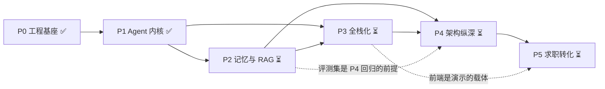

# JobPilot 开发路线图

> 这份文档解决两个问题：
> 1. **这个项目要证明什么**——把招聘 JD 的 6 条要求逐条拆到具体模块、具体文件、具体阶段，并诚实标注现在到底覆盖了多少。
> 2. **接下来怎么走**——每个阶段的目标、交付物、验收标准、工期，以及最后面试前该拿什么自查。
>
> 姊妹文档：[`01-architecture.md`](01-architecture.md) 讲**当前**架构与决策，本文讲**未来**的阶段规划。两者配合读：架构文档回答"你已经做了什么、为什么这么做"，路线图回答"你还没做什么、打算怎么做"。

> **状态快照（读之前必看）**
> 本文档的"已完成 / 未开始"判断以 **P0 + P1 的代码基线**为准（`services/api/app/` 与 `services/api/cli.py`，基线测试 70 项）。
> 撰写期间工作区里有**两股并行改动**，都不在本文的核对范围内：
> ① **P2 正在落地**：`services/api/app/rag/`（loaders / chunker / embedder / store / corpus / retriever / evaluate 等 8 个文件）、`scripts/ingest.py`、`docs/02-concepts/02-agent-loop.md`、`docs/03-journal/`；
> ② **P1 正在被加固**：`app/agent/loop.py`、`app/agent/events.py`、`app/llm/client.py`、`app/llm/types.py`、`app/tools/base.py` 与两个测试文件被就地修改（已修掉本文原稿记录的部分技术债，测试数从 70 增至 82）。
> 因此下文凡涉及"未开始 / 还缺什么"均指**相对 P1 基线**的缺口，引用的**行号锚定在基线提交**上；代码被继续修改后行号可能偏移，核对时请以**函数名/类名**为准。

---

## 0. 一句话现状

| 维度 | 现状 |
|---|---|
| 已完成 | P0 工程基座、P1 Agent 内核（手写 ReAct + Tool Use + SSE 流式 + CLI + 70 个测试） |
| 可运行证据 | `python services/api/cli.py` 端到端对话；`GET /healthz`、`GET /api/tools`、`GET /api/meta`、`POST /api/chat`、`POST /api/chat/stream`（SSE 事件序 `start → step → tool_call → tool_result → step → token → final → done`）均已实跑通 |
| 代码规模 | P1 基线：`services/api/app/` 下 13 个源文件 + `services/api/cli.py` + 3 个测试文件（不含各层 `__init__.py`）。测试：基线 **70 项**（`test_agent_loop.py` 21 / `test_stream.py` 12 / `test_tools.py` 37），P1 加固后当前已增至 **82 项**（32 / 13 / 37）。P2 的 `services/api/app/rag/` 已并行出现，未计入上述基线 |
| 最大缺口 | **前端的代码行数为 0；Planning / 缓存 / 消息队列 / 微服务全部为 0**——即 JD 第 1 条的后半段和第 4 条目前是空的，这是接下来必须优先补齐的部分 |

---

## 1. 招聘要求 × 项目落点对照表

先给结论：**6 条要求里只有第 3 条的 Agent 部分（Tool Use）是"强证据"，其余要么只覆盖了一半，要么完全是空的。** 这张表按"证据强度"分级，强度定义如下：

- **强**：有可运行代码 + 有测试 + 能当场演示
- **中**：有可运行代码但缺测试，或有完整原理文档但无代码落地
- **弱**：只有配置项 / 只有文档 / 只有口头说明
- **无**：该项目里不存在任何对应物

| JD 要求 | 项目落点（模块 / 文件 / 函数） | 阶段 | 证据强度 | 还缺什么 |
|---|---|---|---|---|
| **1. 主流前后端技术栈 + 全栈工程能力 + 需求分析→方案设计→交付→迭代优化全流程** | 后端：FastAPI 应用与组合根 `services/api/app/main.py:34`（`lifespan`）、路由与契约 `services/api/app/api/routes.py` + `services/api/app/api/schemas.py`、异步 I/O `services/api/app/llm/client.py:93`（`httpx.AsyncClient` 连接池）、超时控制 `services/api/app/tools/base.py:127`（`asyncio.wait_for`）、工程化 `services/api/pyproject.toml`（ruff `line-length=100` + mypy `strict=true` + pytest markers） | P0 / P1 已完成；前端落 P3；交付与迭代落 P4 | 后端 **强**；整体 **弱** | ①**前端一行代码都没有**（没有 `services/web/` 目录）；②没有容器化交付物（无 Dockerfile / compose）；③"迭代优化"目前没有量化依据——没有评测集、没有基线指标，无法证明"改完更好了" |
| **2. 熟练使用 AI 编程工具，能用 AI 完成业务开发与应用搭建** | 计划靠 `docs/03-journal/` 记录人机协作过程（README.md:83 引用该目录，**该目录已在并行落地**，如 `docs/03-journal/2026-09-13-P0P1-搭建记录.md`）；P0/P1 的代码本身就是 AI 参与开发的结果 | 贯穿 P0–P5 | **弱** | ①协作痕迹刚开始积累，还不足以证明"效率与质量控制"——需要补一份"AI 协作规范"（如 `AGENTS.md`），写清提示词策略、如何 review AI 产出、哪些是 AI 写错被改掉的；②这条要求的本质是"用 AI 把事做成的能力"，光有代码证明不了，得有具体案例 |
| **3. 大模型原理 + 推理部署 + RAG + Agent 原理（Tool Use / Planning / Memory）** | **Tool Use（强）**：协议类型建模 `services/api/app/llm/types.py:50`（`ToolCall.from_wire`）、JSON Schema 生成 `services/api/app/tools/base.py:95`（`json_schema`）、ReAct 循环与回灌 `services/api/app/agent/loop.py:155-191`、4 个内置工具 `services/api/app/tools/builtin.py:238`（`build_default_registry`）、系统提示词 `services/api/app/agent/prompts.py:18`；**原理文档（中）**：`docs/02-concepts/01-llm-basics.md`（71KB，含 KV Cache 显存公式 §3.2、PagedAttention §5.2、Continuous Batching §5.3、Function Calling 模型侧实现 §7）、`docs/02-concepts/03-rag.md`（78KB，含 HNSW/IVF 调参 §4、混合检索与 RRF §6.1、Rerank §6.4、评测指标 §7） | Tool Use 已完成（P1）；**Memory / RAG 落 P2**；**Planning / 多 Agent 落 P3**；推理部署实操落 P2 附带项 | Tool Use **强**；原理文档 **中**；Memory/RAG/Planning **无（P1 基线）**；推理部署 **无** | ①P1 基线里"岗位检索"是 `services/api/app/tools/builtin.py:194`（`_search_jobs`）里的**字符串 `in` 匹配**，不是 RAG——面试时必须主动说清这条界线，否则一问就露；**P2 的向量检索（`services/api/app/rag/`）已在并行落地，需等它稳定后重新评估这一行的证据强度**；②没有检索评测报告（`app/rag/evaluate.py` 已出现，但消融数字尚未产出）；③没有短期记忆/摘要压缩，多轮靠 `history` 全量重放；④原理讲义 `02-agent-loop.md` 已补齐（121KB），但**它对应的实现细节需要与代码逐条对齐**——讲义写好了不等于代码里都做到了 |
| **4. 系统设计能力：分布式系统、微服务架构、消息队列、缓存** | **当前 0 覆盖。** 唯一痕迹是"配置先行"：`.env.example:31-34` 声明了 `DATABASE_URL` / `REDIS_URL` / `REDIS_FAKE`，`services/api/app/core/config.py:107-109` 有对应字段，`services/api/pyproject.toml:14-16` 声明了 `sqlalchemy` / `aiosqlite` / `redis` 依赖——**但没有任何一行业务代码读取或使用它们**（`grep` 全仓无 `aiosqlite` / `redis` 的调用点） | **P3**（Redis 缓存、任务队列）+ **P4**（服务拆分、消息队列、限流） | **无** | 整条要求都要从零做：①缓存要讲清缓存穿透/击穿/雪崩与 `REDIS_FAKE` 到真 Redis 的切换；②消息队列要落到幂等消费与死信；③微服务要给出**拆分依据**而不是"拆了就高级"；④分布式事务、链路追踪、部署复杂度这些"拆分税"也必须能讲 |
| **5. 对 AI 前沿有浓厚兴趣，主动探索 AI 在业务场景的创新应用** | 部分工程判断已埋下伏笔：`EMBEDDING_BACKEND=tfidf` 的"先用 sklearn 建零依赖基线、再升级真实 embedding"路线（`.env.example:36-42`、`services/api/app/core/config.py:111-113`）；`docs/02-concepts/03-rag.md:1132` 提出的"rerank 分数低于阈值就拒答"在求职场景下的价值判断 | **P2–P4**，并需要新增一份 `docs/04-insights.md`（尚未创建） | **弱** | ①`EMBEDDING_BACKEND=tfidf` 的"先建基线再升级"路线已开始落地（P2 并行的 `services/api/app/rag/embedder.py` 里有 TF-IDF 实现），但**还没有任何对比数据**——"先建基线"的全部价值都在对比上，没有数字就只是两段代码；②缺少"为什么这个业务场景需要这个技术"的论证——面试官要听的恰恰是这个；③候选创新点需要挑 1–2 个做深并写出对比数据（如"拒答阈值设为多少、faithfulness 提升多少、代价是拒答率上升多少"） |
| **6. 沟通协作 + 问题解决 + 责任心 + 团队交付** | 无法用代码直接证明。当前可用的载体：本文件与 `01-architecture.md` 的 ADR 写法（每条都写"代价"，而不是只吹好处）、`docs/02-concepts/` 的 150KB 讲义、系统性记录踩坑（如 `services/api/app/core/config.py:38-43` 的 pydantic-settings 嵌套坑、`.env.example` 的环境变量坑） | 贯穿全程，P5 集中提炼 | **弱 → 中**（取决于是否真的持续写） | ①`docs/03-journal/` 已开始记录（`2026-09-13-P0P1-搭建记录.md`），但只有一天的记录，还形成不了"持续性的责任心证据"；②单人项目没有真实 code review——需要用"PR 式自我 review"或找同行交叉 review 来补；③面试时要用 STAR 把"发现问题→提出方案→说服别人→落地"讲出来，而不是罗列技术名词 |

### 一句话总结这张表

> 这个项目目前是**一个后端工程质量不错、Agent 内核能讲透、但业务纵深与架构纵深都还没开始**的半成品。第 3 条的 Agent 部分是唯一能撑住深挖的部分，第 1 条和第 4 条是最大的两个窟窿。

---

## 2. 六个阶段的详细清单

工期估算的前提（写清楚，免得被问"你怎么估的"）：**单人开发、每天投入 3–4 小时、复用已有的 P0/P1 基座、不追求视觉精美的前端**。P0/P1 已完成，下面的工期是回填的实际耗时，P2 之后是目标值。

### P0 工程基座 ✅ 已完成（实际约 2 天）

| 项 | 内容 |
|---|---|
| **目标** | 在任何业务代码之前，先把"能装、能跑、能测、能查"的地基铺好——避免后面把时间耗在环境问题上 |
| **交付物** | `.env.example`（42 行，全量配置模板 + 中文注释）；`scripts/bootstrap_env.py`（从环境变量生成 `.env`，UTF-8 无 BOM，`re.subn` 校验模板只匹配 1 处，末尾用 `get_settings.cache_clear()` 回读自检）；`services/api/pyproject.toml`（ruff + mypy strict + pytest markers）；`services/api/app/core/config.py`（`Settings` 聚合根 + `lru_cache` 单例）；`services/api/app/core/logging.py`（彩色分级日志 + 压制 httpx 噪音）；`.gitignore` / `.gitattributes`；`README.md` |
| **技能点** | 12-Factor 配置管理、pydantic-settings 的嵌套与前缀机制、mypy strict 下的动态 JSON 类型处理、Windows 中文环境的编码陷阱、虚拟环境与 `PIP_TARGET` 冲突排查 |
| **验收标准（可执行）** | ①`Remove-Item Env:PIP_TARGET` 后 `.venv\Scripts\python.exe -m pip install -e "services/api[dev]"` 成功且 `python -c "import app"` 在 `services/api` 下可用；②`python scripts/bootstrap_env.py` 在不设 `LLM_API_KEY` 时以退出码 1 失败并给出命令示例，设置后生成 `.env` 且自检打印 `is_configured=True`；③`ruff check services/api` 与 `mypy services/api/app` 均 0 错误；④故意把 `APP_ENV=prod` 且不配密钥时进程启动抛 `ValueError`（对应 `services/api/app/core/config.py:115-120`） |
| **预计工期** | 2 天（含环境排坑） |

### P1 Agent 内核 ✅ 已完成（实际约 5 天）

| 项 | 内容 |
|---|---|
| **目标** | 不依赖任何 Agent 框架，把"模型申请调用→我执行→结果回灌→模型继续"这条链子完整手写一遍，并做到可演示、可测试 |
| **交付物** | ①LLM 客户端 `services/api/app/llm/client.py`（手写 OpenAI 协议请求体、SSE 逐行解析、`tool_calls` 按 `index` 分片重组 `StreamAccumulator`、429/5xx 指数退避 + 抖动、401/400 立即失败、`response_format` 400 自动降级）；②协议类型 `services/api/app/llm/types.py`（`ChatMessage` / `ToolCall` / `Usage` / `StreamDelta`，`arguments` 非法 JSON 容错）；③工具系统 `services/api/app/tools/base.py`（Pydantic→JSON Schema、`asyncio.wait_for` 超时、8000 字符头尾截断、`ToolRegistry` 未知工具名兜底）；④4 个内置工具 `services/api/app/tools/builtin.py`（计算器用白名单 AST 求值而非 `eval`、带路径穿越防护的文件读取、岗位字符串检索、时区时间）；⑤ReAct 循环 `services/api/app/agent/loop.py`（`max_steps` 预算、SHA1 指纹死循环检测、`role=tool` + `tool_call_id` 配对回灌）；⑥事件模型 `services/api/app/agent/events.py`；⑦FastAPI + SSE `services/api/app/api/routes.py`；⑧CLI `services/api/cli.py`（流式打字机 + 工具调用可视化 + `/tools` `/clear` `/history` 命令）；⑨70 个测试 |
| **技能点** | OpenAI Chat Completions 协议细节、SSE 解析、增量聚合、异步重试与退避、Pydantic v2 的 `model_json_schema`、AST 安全求值、路径穿越防护、ReAct 范式、SSE 服务端实现 |
| **验收标准（可执行）** | ①`pytest` 输出全部通过（基线 70 项，当前 82 项，其中 `@pytest.mark.live` 的用例默认跳过，`pytest -m live` 时才真实打到 DeepSeek）；②`python services/api/cli.py -q "帮我算一下 (12000*12)*0.8"` 输出里能看到 `⚙ 调用工具 calculator`、`✓` 结果、以及 `── N 步 · 输入 x + 输出 y = z tokens`；③`POST /api/chat/stream` 的 SSE 事件序为 `start → step → tool_call → tool_result → step → token → final → done`，且 `done` 事件带 `usage.total_tokens > 0`；④把 `AGENT_MAX_STEPS` 设为 1 后提一个需要两步的问题，能拿到"已达到单轮最大步数限制"的 `error` 事件而不是异常堆栈；⑤`GET /api/tools` 返回 4 个工具且 `parameters` 是合法 JSON Schema |
| **预计工期** | 5 天 |

### P2 记忆与 RAG ⏳ 未开始（目标 6 天）

| 项 | 内容 |
|---|---|
| **目标** | 把"一次问答"变成"有记忆、有知识库"的助手。这是 JD 第 3 条的后半段，也是当前最大的能力缺口 |
| **交付物** | ①**短期记忆**：滑动窗口 + 超限时用 LLM 摘要压缩旧轮次（落在 `services/api/app/agent/` 下新增 `memory.py`）；②**token 预算**：用已安装但未使用的 `tiktoken` 估算 prompt，超预算先摘要再截断（当前只有 `services/api/app/tools/base.py:46` 的 8000 **字符**上限，不是 token）；③**文档切分与 embedding**：`EMBEDDING_BACKEND=tfidf` 先用 sklearn 建零依赖基线，再切到 `local`/`api`；④**向量存储**：SQLite + numpy 暴力检索起步，为 P4 换 pgvector 留出接口；⑤**检索工具**：新增检索类工具注册进 `build_default_registry`，让模型能主动检索而不是被动吃 prompt；⑥**混合检索 + RRF 融合 + 阈值拒答**（对照 `docs/02-concepts/03-rag.md:1131-1132` 的结论）；⑦**评测集**：≥50 条带标注的检索/回答样本 + 一份消融表（纯向量 vs 混合 vs 混合+rerank）；⑧原理讲义 `docs/02-concepts/04-memory.md`（`02-agent-loop.md` 已并行落地，需与代码逐条对齐后再算完成） |
| **技能点** | 上下文窗口管理、摘要压缩的信息损失与代价、embedding 选型与归一化、余弦/内积等价条件、chunk size 与 overlap 的权衡、BM25 与密集检索的互补性、RRF 的 k 值语义、cross-encoder 重排的成本、Recall@k / MRR / NDCG / faithfulness 的计算 |
| **验收标准（可执行）** | ①构造一段超过上下文预算的多轮对话（≥20 轮），进程不报 400 且能在 `done` 事件里看到 prompt_tokens 稳定在预算内（不随轮次线性增长）；②评测脚本能一键跑出 `Recall@5 / Recall@50 / NDCG@5 / faithfulness` 四个数字并写入 `eval/report.md`（`services/api/app/rag/evaluate.py` 已存在，需确认它真的能出这四个数）；③消融表里"混合检索 vs 纯向量"和"加 rerank vs 不加"各有至少一行数字，且能说出代价（延迟 ms、成本）；④`data/` 下放一份 100+ 段的文档（如多份 JD 与简历），提问"有哪些岗位要求 Pydantic v2"能命中正确段落并给出引用来源；⑤对知识库里不存在的问题（≥20% 评测样本）能明确回答"资料里没有"，而不是编造；⑥**新工具必须在 `/api/tools` 里可见，且模型能通过 Tool Use 主动调用**——检索能力如果只是后端内部函数而没有暴露成工具，就不算 P2 完成 |
| **预计工期** | 6 天（其中评测集标注占 1.5 天——这部分不能省，是"有评测意识"和"感觉不错"的分界线） |

### P3 全栈化 ⏳ 未开始（目标 8 天）

| 项 | 内容 |
|---|---|
| **目标** | 补上前端这个最大的窟窿，同时把 Agent 的能力边界从"单轮单工具"扩到"会规划、能并发、有缓存" |
| **交付物** | ①**前端**：React 19 + TypeScript + Vite，`services/web/`，核心不是 CRUD 表单而是**工具调用时间线可视化**（把 `start/step/tool_call/tool_result/token/final/done` 事件渲染成时间轴，能看到"模型在第 2 步调了 search_jobs，耗时 380ms，返回被截断"）；用 EventSource/fetch ReadableStream 消费 SSE；从 FastAPI 的 OpenAPI 生成 TS 类型（对应 `services/api/app/api/schemas.py:1-5` 的注释意图）；②**Redis 会话缓存**：会话历史与热点工具结果缓存，`REDIS_FAKE=true` 用 fakeredis 保证无 Redis 也能跑测试；③**异步任务队列**：长任务（批量简历分析、索引构建）走队列 + 进度查询接口；④**Planning**：Plan-and-Execute 范式（先让模型产出结构化步骤计划，再逐步执行），与现有 ReAct 模式做 A/B 对比；⑤**工具并发执行**：`asyncio.gather` 改造 `services/api/app/agent/loop.py:155` 的串行 `for call in tool_calls`，并加并发上限与失败隔离；⑥**多 Agent 编排雏形**：至少两个角色 Agent（简历改写 / 模拟面试）通过明确的消息传递协作 |
| **技能点** | SSE 在前端的消费与断线处理、React 状态机与流式渲染、TS 类型安全、Redis 数据结构选型（String/Hash/List/ZSet 各自适用场景）、缓存穿透/击穿/雪崩的三种解法、TTL 与一致性取舍、任务队列的至少一次语义与幂等键、Planning 与 ReAct 的适用边界、`asyncio.gather` 的异常传播与 `return_exceptions` |
| **验收标准（可执行）** | ①浏览器打开前端页面，输入问题后能看到 token 逐字出现、工具卡片按时间线出现、最终答案完整渲染，且刷新页面历史仍在（来自 Redis 而非内存）；②断开 Redis 后（`REDIS_FAKE=true`）`pytest` 仍全绿，说明缓存是增强而非硬依赖；③同一个会话连发 5 次相同问题，第 2 次起响应时间明显下降（缓存命中，需在响应体/事件里带 `cache_hit` 标记来证明）；④对比日志证明 Planning 模式在多步任务上的步骤数少于 ReAct（或反之，并说明为什么）；⑤一次请求并发调用 3 个互不依赖的工具，总耗时 ≈ 单个最慢工具的耗时而非三者之和（用 `tool_result.duration_ms` 与总耗时的对比作为证据）；⑥`pnpm build` 无 TS 错误，前端产物能由 FastAPI 静态托管或独立 Vite 预览访问 |
| **预计工期** | 8 天（前端 4 天——作者前端经验偏薄，这是最可能的超期项；后端 4 天） |

### P4 架构纵深 ⏳ 未开始（目标 8 天）

| 项 | 内容 |
|---|---|
| **目标** | 从"能跑"到"能讲清生产级系统设计"。这一阶段覆盖 JD 第 4 条全部，并把 JD 第 1 条的"交付与迭代优化"补成闭环 |
| **交付物** | ①**服务拆分**：`gateway`（鉴权/限流/路由）/ `agent-service`（ReAct 循环与工具编排）/ `rag-service`（索引构建与检索）/ `worker`（异步长任务），按 P1 单体里已解耦的模块边界切（`app/llm` / `app/tools` / `app/agent` 已经分层，拆分成本低）；②**Docker Compose 编排**：4 个服务 + PostgreSQL(pgvector) + Redis + 消息队列（RabbitMQ 或 Kafka，二选一并写明理由），前端用 nginx 静态托管；③**消息队列**：索引构建、批量分析走 MQ，实现消费幂等（内容 hash 做幂等键）、重试与死信队列；④**可观测**：结构化 JSON 日志（`services/api/app/core/logging.py:35` 的 `setup_logging` 目前只有彩色文本 formatter，"生产 json 模式"在 docstring 里承诺了但没实现）、`trace_id` 贯穿 HTTP→Agent→LLM→Tool 四层、OpenTelemetry span、token 成本按会话折算并打点；⑤**限流与熔断**：Redis 计数器做单用户 QPS/日 token 配额，LLM 上游失败时快速失败而非无限重试；⑥**评测与回归**：`eval/` 目录、固定 prompt 版本与 `temperature`、CI 里跑离线评测并把指标写回报告 |
| **技能点** | 服务拆分粒度（按业务能力而不是按技术分层）、同步改异步带来的分布式事务问题（Saga / 补偿 / 最终一致）、消息队列的至少一次 vs 精确一次、幂等键设计、死信与毒消息处理、分布式链路追踪的 context 传播、限流的令牌桶/滑动窗口、灰度与回滚、成本归因 |
| **验收标准（可执行）** | ①`docker compose up` 一条命令拉起全部服务，`curl /healthz` 与前端页面均可用，且 `docker compose down && up` 后数据（会话、索引）不丢；②在 MQ 消费者里**故意让处理函数抛异常**，消息进入死信队列且被重试 N 次后不再无限重试；③同一条消息重复投递 3 次，索引内容不重复（用文档条数断言）；④单个请求的日志里能用同一个 `trace_id` 串出"HTTP 入口 → Agent 第几步 → 哪次 LLM 调用 → 哪个工具执行"，跨服务也能串上；⑤压测（`k6` 或 `wrk`）给出 P50/P95/P99 与 QPS 数字，写入 `docs/`，并注明是**单机容器限流下的本地数据**；⑥离线评测跑出一张"改动前 vs 改动后"的对比表，指标劣化时 CI 失败；⑦单服务故障演练：手动停掉 `rag-service`，`agent-service` 在超时后返回降级回答而不是雪崩（限流与熔断生效） |
| **预计工期** | 8 天 |

### P5 求职转化 ⏳ 未开始（目标 3 天）

| 项 | 内容 |
|---|---|
| **目标** | 把前四个阶段的工程产出翻译成面试官能秒懂的语言。这一步不做，前面全白干 |
| **交付物** | ①**简历条目**：每段经历按"背景—动作—**可量化结果**"写，例如"手写 ReAct 内核替代 LangChain，把单轮对话的 token 消耗从 X 降到 Y，定位协议问题的平均耗时从小时级到分钟级"（数字必须来自 P1–P4 的真实记录，不许编）；②**STAR 故事**：准备 4–6 个，覆盖"踩坑并解决"（pydantic-settings 嵌套 `env_file`、`PIP_TARGET` 污染虚拟环境）、"设计取舍"（手写内核 vs 框架）、"性能优化"（工具并发、缓存命中）、"质量保障"（70 测试 + 评测回归）；③**技术深挖问答**：把第 4 节的自检表逐行答一遍，答不上来的回代码/文档补，并标注"哪一条我只能讲概念、没有实践"；④**演示脚本**：3 分钟内完成"提问→看到工具调用→看到 token 流→看到成本"的现场演示，含离线兜底（无网/无额度时用录制或 mock）；⑤**项目一页纸**：架构图 + 关键指标 + 技术亮点，作为简历附件 |
| **技能点** | 技术叙事（把实现细节转成业务价值）、量化表达、STAR 结构、诚实边界管理（明确说"这块我没做过"，比硬答安全得多）、现场演示的容错设计 |
| **验收标准（可执行）** | ①找一位非本项目的人（同事/朋友）看一页纸，5 分钟内能说清这个项目做什么、技术亮点是什么（做不到就改文档）；②自检表 25+ 行**每行都能开口讲 90 秒**，其中至少 8 行能讲到"我项目里具体哪一行代码/哪个数字"；③现场演示在断网状态下也能跑（离线兜底有效）；④简历条目里每一个数字都能追溯到某个文件、某份报告或某次压测输出，**没有一个是估的** |
| **预计工期** | 3 天 |

### 阶段依赖关系



> **关键路径**：P2 的评测集 → P4 的回归。没有 P2 建立的基线指标，P4 的"迭代优化"就只能靠嘴说。这是全项目里**唯一一个"跳过就会在面试中致命"的依赖**。

---

## 3. 学习与开发的耦合方式

这个项目不是"先学完再做"，也不是"做完再补理论"，而是**每个阶段同时产出两样东西，而且两样都要过验收**。

### 双重要求

| 要求 | 含义 | 检验方式 | 不过关的后果 |
|---|---|---|---|
| **能跑起来** | 每个阶段结束时代码是**可运行、可演示**的，不留半成品债 | 阶段验收标准里全部是命令与断言（见上一节），任何一条跑不过就不算完成 | 简历上写"实现了 RAG"，面试让你演示却报错——比不写还糟 |
| **能讲清原理** | 每个阶段同步产出一份原理讲义，讲清"为什么这么设计、备选方案是什么、代价是什么" | 讲义必须包含**对比表 + 失败模式 + 面试问答**三部分（`docs/02-concepts/` 已有的两篇就是这个格式的样板） | 只会调 API，一问"为什么"就停——这正是"用 LangChain 堆项目"的典型死法 |

### 每个阶段的"双产出"映射

| 阶段 | 可运行产物 | 原理讲义 | 二者的交叉验证点 |
|---|---|---|---|
| P0 | `scripts/bootstrap_env.py`、配置单例、日志 | 本文档 + `01-architecture.md` | 文档里的每个配置项都能在 `.env.example` 里找到，反之亦然 |
| P1 | `services/api/app/` 全套 + CLI + 70 测试 | `docs/02-concepts/01-llm-basics.md`（已有） | 讲义的 §3.2 KV Cache 公式 → 解释为什么 `LLM_MAX_TOKENS=4096` 与长上下文策略要一起考虑；§7 Function Calling → 解释 `services/api/app/llm/client.py` 为什么要处理分片与非法 JSON |
| P2 | 记忆模块 + 检索工具 + 评测脚本 | `02-agent-loop.md`（已有，需与代码对齐）+ `03-rag.md`（已有）+ `04-memory.md`（待写） | 讲义 §6.1 RRF 与 §7 评测指标 → 直接变成评测报告里的消融表 |
| P3 | React 前端 + Redis 缓存 + 队列 + Planning | `05-frontend-streaming.md` + `06-cache-and-queue.md` | 讲义里的"缓存穿透解决方案"必须在代码里有一个能复现的测试（查一个不存在的 key） |
| P4 | 4 个服务 + Compose + MQ + 可观测 | `07-distributed.md` + 架构文档的演进章节 | 讲义里的"拆分动机"必须能在架构文档里对应到一张图和一个指标（如 RAG 索引构建 P99 拖慢 API 响应） |
| P5 | 简历条目 + 演示脚本 | 自检表本身的答案稿 | 每条简历数字都能追到代码或报告——追不到就删掉 |

### 三条纪律

1. **文档与代码同一次提交**。原理讲义不是"事后补作业"，它和代码是一个交付物的两面；一旦脱节，一个月后自己都看不懂当时的取舍。
2. **每个"想做"的优化都要有前后对比**。想加缓存？先量出没有缓存的 P95。想升 embedding？先在 `tfidf` 基线上跑一遍评测。**没有基线的优化不是优化，是赌博。**
3. **允许"只讲概念、没做实践"的条目存在，但必须标注**。自检表里每一项都有"证据强度"，面试时主动划清界线（"这条我只读过论文、在项目里实验过小规模样本"）比含糊其辞安全得多——面试官最反感的是把"了解"包装成"精通"。

---

## 4. 技能自检清单（面试前逐行过）

用法：**把"自检问法"那一列当成面试官的问题，能不看资料讲 90 秒才算过。** 只有"落点"列能指到真实代码/文档的，才允许在简历上写成"实践过"；标"概念"的只能写成"了解"。

| # | 知识点 | 真正掌握于 | 落点（代码 / 文档 / 计划） | 自检问法（能答上来才算过） |
|---|---|---|---|---|
| 1 | KV Cache 原理与显存估算 | P1 读文档（已在 `01-llm-basics.md` §3.2） | `docs/02-concepts/01-llm-basics.md:308-373` | "7B 模型 32K 上下文，KV Cache 单条要多少显存？怎么反推并发数？" |
| 2 | Prefill vs Decode 的物理差异 | P1 读文档 | `docs/02-concepts/01-llm-basics.md:284-412` | "为什么 decode 阶段是 memory-bound 而不是 compute-bound？这对批处理策略有什么影响？" |
| 3 | 采样参数（temperature / top_p / 惩罚项） | P1 已实践 | `services/api/app/core/config.py:49`（`temperature` 默认 0.3）、`services/api/app/llm/client.py:117`（`_build_payload`） | "工具调用场景为什么把 temperature 压到 0.3 以下？top_p 和 temperature 同时调会发生什么？" |
| 4 | 推理优化：PagedAttention / Continuous Batching / 量化 / 投机解码 | P2 附带实操（需补本地部署） | `docs/02-concepts/01-llm-basics.md:473-644`（全文有，代码未落地） | "PagedAttention 解决了什么？Continuous Batching 相对静态批处理提升的是吞吐还是延迟？" |
| 5 | **tool_calls 协议细节**（消息配对、`arguments` 是字符串） | **P1 已实践** | `services/api/app/llm/types.py:50-139`、`services/api/app/agent/loop.py:185-191` | "模型返回的 `arguments` 为什么是字符串？`role=tool` 消息如果不带 `tool_call_id` 会怎样？" |
| 6 | **流式响应的 tool_calls 分片重组** | **P1 已实践** | `services/api/app/llm/client.py:340-399`（`StreamAccumulator.feed`，按 `index` 聚合）、`services/api/app/llm/client.py:12-23`（注释里的真实分片样例） | "流式下 `tool_calls` 的分片按什么键聚合？为什么不能按 id？usage 在哪个 chunk 里？" |
| 7 | 结构化输出的可靠性（JSON mode / 容错解析 / 自修复） | **P1 已实践** | `services/api/app/llm/types.py:59-87`（解析失败不抛异常）、`services/api/app/llm/client.py:225-234`（`response_format` 400 自动降级）、`services/api/app/tools/base.py:111-121`（校验失败把 Schema 回灌） | "模型输出了非法 JSON 你怎么办？为什么不在客户端做重试而要把错误回灌给模型？" |
| 8 | Pydantic → JSON Schema 的工具建模 | **P1 已实践** | `services/api/app/tools/base.py:95-104`、`services/api/app/tools/builtin.py:34-62` | "工具参数模型改一个字段，模型看到的东西会变吗？描述写得含糊会有什么后果？" |
| 9 | Agent 错误自愈（错误即观察结果） | **P1 已实践** | `services/api/app/tools/base.py:67-75`、`services/api/app/tools/errors.py:11-24`、`services/api/app/agent/loop.py:185-191` | "工具报错为什么不抛异常？把错误吞掉伪装成空结果会导致什么？" |
| 10 | ReAct 范式与终止条件 | **P1 已实践** | `services/api/app/agent/loop.py:99-152` | "ReAct 的循环什么时候停？`finish_reason=tool_calls` 和"消息里有 tool_calls"哪个判据更稳？" |
| 11 | Agent 成本护栏（步数预算 + 死循环检测） | **P1 已实践** | `services/api/app/core/config.py:79-85`、`services/api/app/agent/loop.py:46-49`（SHA1 指纹）、`services/api/app/agent/loop.py:137-152` | "没有 max_steps 的 Agent 在生产环境会发生什么？死循环检测为什么用参数指纹而不是只看工具名？" |
| 12 | Prompt 工程（工具使用规则、反幻觉、输出格式） | **P1 已实践** | `services/api/app/agent/prompts.py:18-53` | "为什么系统提示词要单独成模块？工具描述和系统提示词哪个对工具调用准确率影响更大？" |
| 13 | SSE 服务端实现与心跳 | **P1 已实践** | `services/api/app/api/routes.py:94-114`（`ping=15`）、`services/api/app/agent/events.py:55-57`（`to_sse`） | "SSE 和 WebSocket 怎么选？长连接被反向代理掐断怎么办？为什么用 POST 而不是 GET？" |
| 14 | 异步 I/O、超时与取消传播 | **P1 已实践** | `services/api/app/tools/base.py:127`（`wait_for`）、`services/api/app/tools/base.py:132`（`CancelledError` 透传）、`services/api/cli.py:141`（`asyncio.to_thread(input)`） | "在 async 函数里直接调 `input()` 会发生什么？`CancelledError` 为什么必须透传？" |
| 15 | 可重试 vs 不可重试的错误分类与退避策略 | **P1 已实践** | `services/api/app/llm/client.py:53-71`（异常体系）、`services/api/app/llm/client.py:156-200`（退避 + 抖动） | "429 和 401 该重试哪个？退避为什么必须加抖动？重试次数和超时怎么配合才不会拖死整个请求？" |
| 16 | 短期记忆：滑动窗口 + 摘要压缩 | P2 | 计划 `services/api/app/agent/memory.py` | "单纯截断最早的消息有什么问题？摘要压缩丢的是什么信息？怎么判断该摘要了？" |
| 17 | 上下文窗口与 token 预算 | P2 | 现状只有字符上限 `services/api/app/tools/base.py:46`；计划用已安装的 `tiktoken` | "8000 字符大约是多少 token？为什么不按字符控制预算？" |
| 18 | Embedding 选型、归一化与相似度度量 | P2 | `docs/02-concepts/03-rag.md:201-360`；（代码待做） | "归一化后内积和余弦相似度等价吗？中文小模型选型的依据是什么？维度砍半会损失什么？" |
| 19 | 向量索引：HNSW 与 IVF 的参数与权衡 | P2 | `docs/02-concepts/03-rag.md:361-467` | "`M` 和 `ef_search` 分别影响什么？HNSW 的召回率和内存怎么权衡？什么时候该用 IVF？" |
| 20 | 混合检索与 RRF 融合 | P2 | `docs/02-concepts/03-rag.md:569-600` | "为什么招聘语料要混合检索？RRF 的 k 值语义是什么？为什么它比加权求和更省调参？" |
| 21 | Rerank（cross-encoder）与阈值拒答 | P2 | `docs/02-concepts/03-rag.md:671-710`、`03-rag.md:1132` | "召回 30 条 rerank 到 5 条，延迟增加多少？为什么在求职场景下"拒答"比"编一个答案"更好？" |
| 22 | RAG 评测指标与消融实验 | **P2（全项目最关键的一环）** | `docs/02-concepts/03-rag.md:750-901` | "Recall@k 和 MRR 分别衡量什么？怎么搭一个最小评测集？为什么必须包含"不可回答"的样本？" |
| 23 | 缓存穿透 / 击穿 / 雪崩与 TTL 设计 | P3 | `.env.example:31-34`、`services/api/app/core/config.py:108-109`（配置已声明，代码待做） | "三者的区别是什么？各自怎么解？缓存和数据库的一致性你打算怎么保证？" |
| 24 | Redis 数据结构选型 | P3 | 同上（待做） | "会话历史、限流计数、排行榜分别用什么结构？为什么不用一把 String 全塞 JSON？" |
| 25 | 消息队列：至少一次语义、幂等、死信 | P4 | 待做（README.md:26 已规划） | "重复消费怎么保证幂等？消息消费失败重试几次后去哪？顺序性怎么保证？" |
| 26 | 微服务拆分粒度与分布式事务 | P4 | `01-architecture.md` 的演进章节（计划） | "为什么按业务能力而不是按技术分层拆？拆完跨服务的两个写操作怎么保证一致？" |
| 27 | 限流（令牌桶 / 滑动窗口）与熔断 | P4 | 待做 | "令牌桶和漏桶的区别？为什么要在网关而不是在每个服务里限流？LLM 上游挂了怎么降级？" |
| 28 | 可观测：trace_id 贯穿与链路追踪 | P4 | 现状只有彩色文本日志 `services/api/app/core/logging.py:35-54`（`setup_logging` 的 docstring 提到 json 模式但未实现）；计划 OpenTelemetry | "一次请求要经过 HTTP→Agent→LLM→Tool 四跳，你怎么定位是哪一跳慢了？span 的粒度怎么设计？" |
| 29 | 成本核算与归因 | P3 部分（usage 已埋）+ P4（折算与配额） | `services/api/app/llm/types.py:142-154`（`Usage.__add__`）、`services/api/app/agent/loop.py:118`（累计）、`services/api/app/llm/client.py:149-150`（`stream_options.include_usage`） | "流式调用怎么拿到 usage？一次多步 Agent 的 prompt 为什么随步数近似平方增长？单次对话成本怎么算？" |
| 30 | 工具并发执行与失败隔离 | P3 | 现状串行：`services/api/app/agent/loop.py:155`；计划 `asyncio.gather` | "3 个互不依赖的工具串行 3T、并发 1T，那为什么不一上来就并发？并发后一个失败怎么办？" |
| 31 | 工程规范：lint / 类型 / 测试分层 | **P0/P1 已实践** | `services/api/pyproject.toml:24-83`（ruff 规则集含 `ASYNC`、mypy `strict`、pytest markers `live`/`slow`）、`services/api/tests/` 三文件 70 用例 | "为什么要开 ruff 的 `ASYNC` 规则？`live` marker 的意义是什么？测试里怎么避免真的调用大模型？" |

### 自检表的诚实用法

- **能讲透的行**（#5 #6 #7 #9 #11 #13 #15 #31 等）：这些是 P1 的真实产出，简历和面试都可以往这里引导——**主动把话题引到自己有把握的地方，是面试里最重要的技巧之一**。
- **只能讲概念的行**（#1 #2 #4 #18 #19 #20 #21）：`docs/02-concepts/` 已经有很扎实的讲义，但**没有代码落地**。面试时说"我系统读过并写了讲义，项目里还没落地"是加分的诚实；说"我用过 Milvus 做过千万级检索"就是自爆。
- **完全空白的行**（#23 #24 #25 #26 #27 #28）：P3/P4 之前不要在简历上出现"微服务""消息队列""缓存"这些词——JD 第 4 条要求的是"了解"，但写进简历就等于承诺"实践过"。

---

## 5. 风险与取舍

### 5.1 作为求职作品集的真实短板

| # | 短板 | 为什么是硬伤 | 弥补动作 | 面试怎么说（原则：**不装、给出替代证据**） |
|---|---|---|---|---|
| 1 | **没有真实线上流量** | 没有 QPS、没有真实用户、没有真实 P99，任何性能数字都是本地压测 | P4 用 `k6`/`wrk` 做本地压测并把原始输出留存；所有数字标注"单机容器、N 并发"前提；用 `seed/jobs.json` 的 6 条样本之外的公开岗位数据做一次 100+ 文档规模的离线评测 | "这个项目没有线上用户，我的所有性能数字都是本地压测，前提是 X。我能讲清的是**在压力下哪些设计会先崩**——比如单请求最坏耗时是 `max_steps(12) × (LLM 超时 120s + 工具超时 30s) ≈ 30 分钟`，这个数量级的问题我是算过并留了护栏的。" |
| 2 | **没有真实分布式环境** | 单机 Docker Compose 不是分布式系统；多副本、网络分区、时钟偏移都没验证过 | P4 用 Compose 起多副本 + `toxiproxy` 注入延迟/断连做故障演练；把"至少一次投递 + 幂等"的语义验证成测试用例（重复投递 3 次断言不重复） | "我验证的是**分布式语义**而不是分布式规模：幂等键、死信、重试上限、超时降级这些用单机也能验证对错。真正没做过的是多节点下的取舍（如跨机房延迟对分片策略的影响），这部分我只有理论。" |
| 3 | **前端经验偏薄** | JD 第 1 条明确要"前后端技术栈"，React 是硬指标 | P3 把前端做出**一个别人没有的东西**（工具调用时间线可视化），而不是又一套聊天框；前端代码量目标明确（≥15 个组件、状态管理选型写出理由） | "我的主战场是后端和 Agent 内核。前端我能独立完成 AI 交互界面——最难的流式状态机（`start/step/tool_call/tool_result/token/final/done` 七个状态乱序到达时的渲染）是我自己设计的；但复杂动效和大型前端工程化我确实不专业。"（主动划边界远比含糊过关安全） |
| 4 | **知识库规模小 + 演示数据不可分发** | ①`services/api/seed/jobs.json` 只有 6 条岗位，"这能叫知识库？"；②`data/resume.md` 现在是**真实简历**（由 `scripts/ingest.py` 从 PDF 解析生成，含真实个人信息），而 `.gitignore:36` 的 `data/` 规则把它排除在版本库外——**结果是别人 clone 下来后 `read_resume` 必然失败**（`builtin.py:173-175` 会返回"未找到简历文件"），演示跑不通 | ①P2 用公开岗位数据把知识库扩到 100+ 文档并保留来源说明；②**补一个可提交的 `data/resume.sample.md`** 并把 `_read_resume` 改成"找不到真实简历时回退到示例文件"，让 clone 即跑通；③真实简历永不入库（PII），演示时说明用的是脱敏样本 | "种子岗位数据是我造的脱敏样本；简历是真实 PDF 解析来的，因为**这是我给自己用的工具**——含我个人信息，所以我用 `.gitignore` 把它挡在仓库外，并提供了一个示例文件保证别人能跑起来。知识库规模小这件事我承认，所以我的评测结论只对**这个规模**成立。" |
| 5 | **单人项目，没有真实 code review** | JD 第 6 条要"沟通协作"，单人项目拿不出协作证据 | P0–P4 走 PR 式自我 review（每个 PR 写清楚"改了什么、为什么、怎么验证"），`docs/03-journal/` 记录决策与踩坑；尽量找一位同行做交叉 review 并留存评论 | "我没有团队协作的证据，但我有**可被审查的决策记录**：这个项目的 12 条 ADR 每条都写了代价，不是只写好处。另外我在简历里写着"熟悉 XX"的地方，都能当场打开代码给你看。" |
| 6 | **成本数据样本量小** | 只跑过个人额度的少量调用，统计意义不足 | P1–P4 持续记录 `usage`，给出**单次对话成本公式**（含"prompt 随步数近似平方增长"这一项），并写明假设与当前单价来源 | "我没有百万级调用的成本数据。但我能给出成本结构：哪一部分是 system prompt（固定）、哪一部分是工具观察结果累积（随步数增长）、哪一部分是历史重放（随轮次增长），以及每一部分我做了什么去压。**结构比数字更重要**。" |
| 7 | **LLM 的非确定性让"回归测试"变难** | 同样的输入输出会变，没法像传统服务一样断言输出相等 | 固定 prompt 版本与 `temperature`；断言**结构**（事件序列、工具名、schema 合法性）而不是自然语言内容；把自然语言质量交给评测集打分 | "我的 70 个测试里，绝大部分断言的是**协议与流程**（事件序、`tool_call_id` 配对、非法参数回灌），而不是"模型答得对不对"——因为前者可以自动化、后者要靠评测集打分。这两类测试的边界我是分清的。" |

### 5.2 有意为之的取舍（这些不是短板，是选择——但必须能解释）

| 取舍 | 选了 | 放弃了 | 理由 | 代价（要能主动说） |
|---|---|---|---|---|
| 内核手写 vs 用 LangChain | 手写（`services/api/app/` 零框架依赖） | 开发速度、现成的生态工具（回调、记忆、各种 loader） | 理解了协议才能讲清 `tool_calls` 分片、消息配对、错误回灌——JD 第 3 条考的就是这个 | 写多了约 400 行代码；缺少成熟框架的边界处理经验（这需要在面试里明说） |
| 检索先 `tfidf` 再升级 embedding | `EMBEDDING_BACKEND=tfidf`（`.env.example:36-42`） | 直接上向量库的"高级感" | 先建立**零依赖、可复现的基线**，后面每一项升级都有对比对象；否则"效果变好了"无法证明 | 前两天的产出看起来"不够 AI"；必须主动解释这是刻意的 |
| 模块化单体 vs 一上来微服务 | P1 单体（`services/api/`） | 早期就练分布式拆分 | 时间应该花在**业务纵深**（RAG/记忆/Planning）上；没有真实拆分动机的微服务只是把复杂度提前 | 简历上"微服务经验"要等到 P4；面试中要能说清"为什么现在不拆" |
| SQLite(dev) vs 直接上 PostgreSQL+pgvector | 配置声明 `sqlite+aiosqlite`（`.env.example:31`） | 一步到位 | 本地零依赖起步，接口抽象好，P4 换 pgvector 只改连接串与索引实现 | 向量检索性能数据在 SQLite 上不具参考性，P4 需要重跑 |
| 暂不做鉴权 | 无 API key 校验、无用户体系 | —— | 单人本地项目，做鉴权是纯开销 | **这是真实风险**：一旦把 demo 部署到公网，任何人可以消耗我的额度。已在技术债里登记（见 `01-architecture.md`），P3 补 |
| 工具串行而非并发 | `services/api/app/agent/loop.py:155` | 多工具场景的延迟 | 串行最简单、最容易讲清、也最容易调试 | 3 个独立工具的延迟是 3T 而不是 1T；P3 用 `asyncio.gather` 改造（已在代码注释里标注为 P3 优化项） |

### 5.3 最大的三个风险（按杀伤力排序）

1. **广度摊薄**：6 个阶段 × 每个都要出代码 + 文档，很容易做成一堆半成品。**对策**：坚持"每个阶段结束时代码必须能演示"，宁可砍掉阶段内的次要项（如多 Agent 编排），也不留跑不起来的东西。
2. **前端超期**：作者前端经验薄，P3 的 8 天里前端占 4 天，很可能超。**对策**：前端功能优先级砍到只有"流式对话 + 工具时间线"两件事，不追设计稿；先用最朴素的原生 fetch + SSE，不上状态管理库，直到确实需要。
3. **讲不清 > 做不出**：真实面试里，代码写得好但说不清取舍的人，会被判成"跟着教程做的"。**对策**：P5 的自检表必须真的逐行开口讲一遍，并且每一条都要指到"项目里哪一行代码"——这也是本文档第 4 节存在的唯一理由。

---

## 附录 A. 本机环境事实与命令备忘

> 这些是 P0 阶段实测确认的事实，换机器时需要重新确认。

| 项 | 事实 |
|---|---|
| Python 解释器 | `E:\anaconda3\python.exe` = 3.12.3；项目虚拟环境在 `.venv\Scripts\python.exe`。**`E:\Python\Python39`（3.9）是废弃环境，不要用** |
| **环境变量陷阱 1** | 用户级 `PIP_TARGET=E:\Python\Python39\Lib\site-packages` 会让**所有** pip 调用无视虚拟环境，把包装进废弃的 3.9 里。装依赖前必须先 `Remove-Item Env:PIP_TARGET`（PowerShell），装完检查包是否落在 `.venv\Lib\site-packages` |
| **环境变量陷阱 2** | pip 默认缓存 `%LOCALAPPDATA%\pip\Cache` 会被文件沙箱拒绝，需把 `PIP_CACHE_DIR` 指到项目内（`.pip-cache/`，已在 `.gitignore:45` 忽略） |
| 前端工具链 | Node 24.20.0 + pnpm 10.12.1 已就绪（P3 使用） |
| 容器 | Docker Desktop 已安装但**守护进程未启动**（P4 使用前需先启动） |
| 测试现状 | 基线 70 项全部通过，其中 1 项是 `@pytest.mark.live`（真实调用 DeepSeek，默认通过 marker 跳过）；P1 加固后当前收集到 82 项 |
| 依赖版本（实测） | fastapi 0.141.1 / uvicorn 0.52.4 / pydantic 2.13.5 / pydantic-settings 2.15.0 / sse-starlette 2.4.1 / httpx 0.28.1 / sqlalchemy 2.0.52 / aiosqlite / alembic / redis / fakeredis / numpy 2.5.3 / scikit-learn 1.9.1 / tiktoken / openai / pytest 8.4.2 / pytest-asyncio / ruff 0.16.7 / mypy 1.20.2 |

常用命令：

```powershell
# 装/更新依赖前：必须先清掉这个变量，否则装错地方
Remove-Item Env:PIP_TARGET -ErrorAction SilentlyContinue
$env:PIP_CACHE_DIR = "$PWD\.pip-cache"

# 静态检查与测试（在 services/api 下执行）
.venv\Scripts\python.exe -m ruff check .          # lint
.venv\Scripts\python.exe -m ruff format .         # format
.venv\Scripts\python.exe -m mypy app              # 类型检查（strict）
.venv\Scripts\python.exe -m pytest -q             # 全部通过（live 用例跳过；基线 70 项 / 当前 82 项）
.venv\Scripts\python.exe -m pytest -m live -q     # 显式跑真实 API 用例（花额度）

# 端到端演示
.venv\Scripts\python.exe services\api\cli.py -q "帮我算一下 (12000*12)*0.8"
.venv\Scripts\python.exe -m uvicorn app.main:app --reload --app-dir services/api
```

## 附录 B. 文档地图（含尚未创建的）

| 文档 | 状态 | 内容 |
|---|---|---|
| `docs/00-roadmap.md` | ✅ 本文档 | 阶段路线、招聘对照、自检清单、风险 |
| `docs/01-architecture.md` | ✅ 已写 | 当前架构、目录说明、ADR、时序、演进、技术债 |
| `docs/02-concepts/01-llm-basics.md` | ✅ 已有（71KB） | Transformer / 对齐 / 推理 mechanics / KV Cache / 部署 / Function Calling |
| `docs/02-concepts/02-agent-loop.md` | ✅ 已有（121KB，并行落地） | ReAct 循环、事件模型、`max_steps` 与死循环检测、错误自愈 —— **待与 `app/agent/loop.py` 逐条对齐** |
| `docs/02-concepts/03-rag.md` | ✅ 已有（78KB） | 切分 / embedding / HNSW / 混合检索 / rerank / 评测 |
| `docs/02-concepts/04-memory.md` | ❌ 缺 | 短期（滑窗+摘要）与长期（向量）记忆 | P2 |
| `docs/03-journal/` | ✅ 已建（`2026-09-13-P0P1-搭建记录.md`） | 开发日志：每天踩的坑与决策 —— 这是 JD 第 2、6 条最关键的物证，**必须持续写，只写一天等于没有** |
| `docs/04-insights.md` | ❌ 缺 | 业务场景创新点与对比数据（JD 第 5 条） | P3–P4 |
