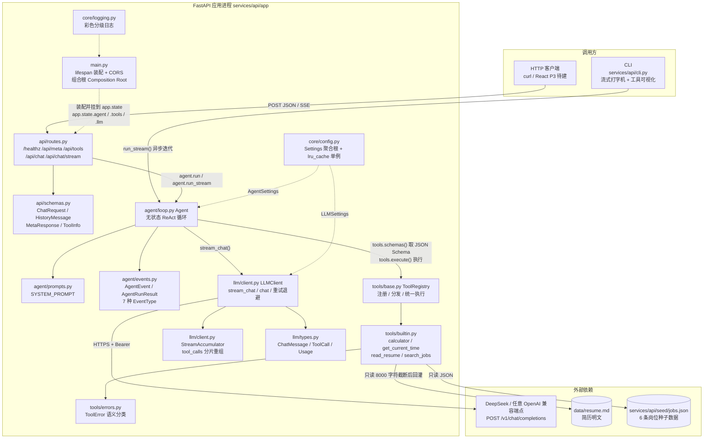
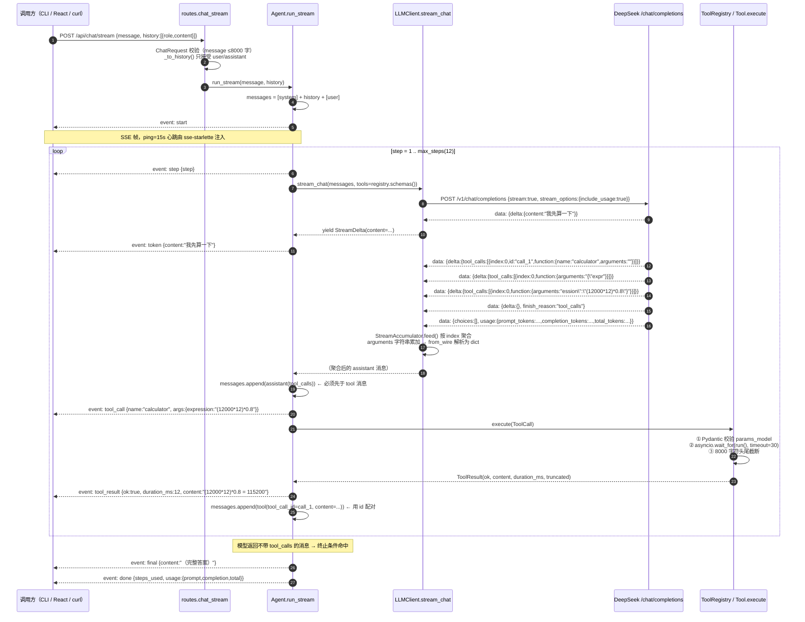
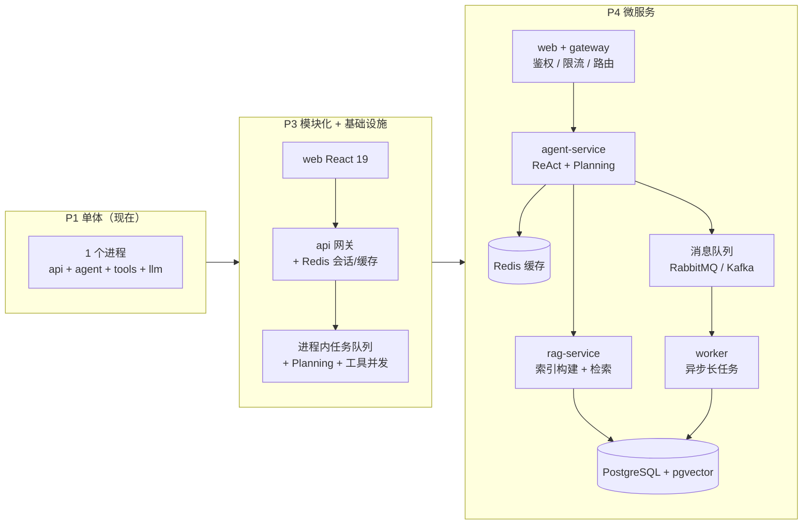

# Legacy 架构设计

> 本文档描述 **P1 阶段已经落地的真实架构**（不是设想），并给出到 P4 的演进依据。
> 所有引用的文件与行号都可在仓库中直接打开核对。
>
> 姊妹文档：[`00-roadmap.md`](00-roadmap.md) 讲未来怎么做，本文讲现在是什么样、以及每个设计为什么长成这样。
>
> **阅读建议**：想快速理解项目看第 1、2、4 节；想评审设计取舍看第 3 节（12 条 ADR）；想知道哪里还不够好看第 8、9 节（技术债）——**最后两节才是这份文档最诚实、也最有面试价值的部分**。
>
> **状态快照（读之前必看）**
> 本文档描述的是 **P0 + P1 的代码基线**：`services/api/app/` 下的 `core / llm / tools / agent / api` 五层、`services/api/cli.py`、`scripts/bootstrap_env.py`、70 个测试。文中每个文件与行号都在这个基线上逐一核对过，**所有 `文件:行号` 引用均锚定在该基线**。
> 撰写期间工作区里有**两股并行改动**，都不在本文的核对范围内：
> ① **P2 正在落地**：`services/api/app/rag/`（`loaders` / `chunker` / `embedder` / `store` / `corpus` / `retriever` / `evaluate`）、`scripts/ingest.py`、`docs/02-concepts/02-agent-loop.md`、`docs/03-journal/`。本文第 1 节的架构图因此仍是 P1 形态——**描述正在施工的代码，比不描述过期得更快**。
> ② **P1 正在被加固**（`loop.py` / `events.py` / `client.py` / `types.py` / `base.py` 被就地修改，测试 70 → 82）。已确认的改动包括：`AgentEvent` 新增 `stopped_reason`（即本文原稿记录的债务 T10 已修）、流式分片改为 `tool_call_deltas` 列表（T13 已修）、同步工具改走 `asyncio.to_thread`、失败路径也记录 `duration_ms`、最后一步不再执行工具。**因此行号可能偏移，核对时以函数名/类名为准**；第 8 节已把这几项标注为"已修"。

---

## 1. 系统上下文与当前架构

### 1.1 P1 基线架构（已逐一核对代码的真实模块关系）



### 1.2 三条关键纵向切面

**切面 A：一次请求的依赖方向是单向的**

```
CLI / HTTP  →  Agent  →  { LLMClient , ToolRegistry }
                              ↓             ↓
                        OpenAI 协议      本地文件 / 岗位库
```

`Agent` 只依赖两个抽象入口：`LLMClient.stream_chat()`（产出 `StreamDelta`）与 `ToolRegistry.execute()`（产出 `ToolResult`）。**它不知道 HTTP 的存在，也不知道 httpx 的存在**——这正是 `services/api/cli.py` 和 `services/api/app/api/routes.py` 能共用同一个内核的原因（`cli.py:82` 与 `routes.py:107` 调的是同一个 `run_stream`）。

**切面 B：事件是内核与外部世界的唯一契约**

`services/api/app/agent/events.py` 定义了 7 种事件（`start` / `step` / `token` / `tool_call` / `tool_result` / `final` / `error` / `done`，其中 `error` 与 `done` 可同时出现）。CLI 把它渲染成终端动画（`cli.py:89-122`），HTTP 它在 `routes.py:108` 通过 `event.to_sse()` 转成 SSE。**换前端只改消费者，不动内核。**

**切面 C：配置与依赖装配只有一处**

`services/api/app/core/config.py:133` 的 `get_settings()`（`lru_cache` 单例）+ `services/api/app/main.py:34-68` 的 `lifespan` 是唯一的装配点。所有单例挂到 `app.state`（`main.py:51-54`），测试可以直接替换 `app.state.agent` 注入假 Agent。

### 1.3 当前的边界与"不是"什么

| 容易误解的点 | 事实 |
|---|---|
| "有岗位检索，所以有 RAG" | **在 P1 基线里没有。** `services/api/app/tools/builtin.py:194` 的 `_search_jobs` 是关键词 `in` 匹配 + 城市过滤，**没有 embedding、没有向量、没有语义相似度**。P2 的 `services/api/app/rag/`（numpy 内存向量库 + TF-IDF/embedding 抽象）正在并行落地，但它**尚未注册成工具**——只要模型还不能通过工具主动调用它，Agent 的检索能力就仍未打通（这条已写进 P2 的验收标准） |
| "有 Redis 配置，所以有缓存" | **没有。** `REDIS_URL` / `REDIS_FAKE` 只在 `.env.example:32-34` 与 `config.py:108-109` 里声明，**全仓无任何代码读取它们**（已用 `grep -E "redis\|aiosqlite\|sqlalchemy"` 在 `services/` 下验证：只命中 `pyproject.toml` 的依赖声明与 `config.py` 的字段声明，零处调用） |
| "有 `database_url`，所以有持久化" | **没有。** `config.py:107` 声明了字段，`pyproject.toml:14-15` 声明了 `sqlalchemy`/`aiosqlite`，但没有一行代码用它；P2 的 `app/rag/store.py` 也是 numpy 内存实现，**不落盘**。当前**所有状态都在内存**，进程重启即丢 |
| "手写内核 = 闭门造车" | 相反：`services/api/app/llm/types.py:7-32` 把 wire format 显式建模并写了协议样例，`services/api/app/llm/client.py:12-23` 记录了流式分片的真实报文形状。手写是为了**能讲清协议**，不是为了标新立异 |
| "有鉴权/限流" | **没有。** 没有 API key 校验、没有 rate limit、没有用户概念。本地单人使用没问题，**一旦部署到公网，任何人都能消耗你的 API 额度**（见第 9 节技术债 T03/T04） |

---

## 2. 完整目录结构说明

### 2.1 磁盘真实结构（不含 `.venv/`、`node_modules/`、各类缓存）

```
MyAgent/
├── .env                          # 本地真实配置（.gitignore:2 已排除，不进仓库）
├── .env.example                  # 配置模板：42 行，含每个参数的注释与边界说明
├── .gitignore                    # 排除密钥/虚拟环境/缓存/data
├── .gitattributes
├── README.md                     # 项目门面：痛点表、技术栈、演进路线、快速开始
├── .venv/                        # 虚拟环境（.venv\Scripts\python.exe = 3.12.3）
├── .pip-cache/                   # 本机 pip 缓存重定向目标（.gitignore:45）
├── .pnpm-store/                  # pnpm store（P3 前端用，.gitignore:28）
├── data/
│   └── resume.md                 # 简历正文（由 scripts/ingest.py 从 PDF 解析生成，含真实个人信息，
│                                 #  被 .gitignore:36 的 data/ 规则排除 → 不进仓库），read_resume 的数据源
├── docs/
│   ├── 00-roadmap.md             # 路线图与招聘要求对照
│   ├── 01-architecture.md        # 本文档
│   ├── 02-concepts/
│   │   ├── 01-llm-basics.md      # 71KB 讲义：Transformer / 对齐 / KV Cache / 部署 / Function Calling
│   │   ├── 02-agent-loop.md      # 121KB 讲义：ReAct 循环与事件模型（P2 并行落地，未纳入本文核对范围）
│   │   └── 03-rag.md             # 78KB 讲义：切分 / embedding / HNSW / 混合检索 / rerank / 评测
│   └── 03-journal/
│       └── 2026-09-13-P0P1-搭建记录.md   # 开发日志（P0/P1 搭建记录）
├── docker/
│   └── Dockerfile                # 单镜像多入口：api / rag / worker 三种角色共用（见 6.3 的理由）
├── docker-compose.yml            # P4 拆分编排：redis / rag / api / worker + 拓扑自洽性测试
├── .dockerignore                 # 排除 .env 与 data/（简历属于个人信息，必须挂载而非打包）
├── scripts/
│   ├── bootstrap_env.py          # 从环境变量生成 .env（UTF-8 无 BOM，末尾自检）
│   ├── ingest.py                 # P2 语料入库脚本
│   ├── dev.ps1                   # 开发便捷脚本（含 rag / worker / serve-split / verify-split）
│   ├── fix_ps1_bom.py            # 给 .ps1 补 UTF-8 BOM 并用 PS 解析器验证（见下）
│   ├── verify_split.py           # P4 跨进程验证：去 RAG 服务自己的指标端点确认请求真的到了
│   └── list_tools.py             # 列出已注册工具
└── services/
    └── api/                      # 后端服务（三种进程角色共用这一份代码）
        ├── pyproject.toml        # 依赖 + ruff + mypy strict + pytest 配置
        ├── cli.py                # 命令行入口：流式渲染 + /tools /clear /history
        ├── seed/
        │   └── jobs.json         # 6 条岗位种子数据（job-001 ~ job-006，含 JD 原文）
        ├── app/
        │   ├── __init__.py       # __version__ = "0.1.0"
        │   ├── main.py           # FastAPI 应用、lifespan 装配、CORS、trace 中间件
        │   ├── worker_main.py    # P4：独立任务 worker 进程入口（backend≠redis 时退出码 2）
        │   ├── core/
        │   │   ├── __init__.py
        │   │   ├── config.py     # Settings 聚合根 / PROJECT_ROOT / 生产自检 / rag_service_url
        │   │   ├── logging.py    # 彩色分级日志 + trace_id 注入 + 压制第三方噪音
        │   │   └── telemetry.py  # trace id / 计数器 / 直方图 / Prometheus 渲染
        │   ├── llm/
        │   │   ├── __init__.py
        │   │   ├── types.py      # 协议类型：ChatMessage / ToolCall / Usage / StreamDelta
        │   │   └── client.py     # LLMClient（请求/流式/重试）+ StreamAccumulator
        │   ├── tools/
        │   │   ├── __init__.py
        │   │   ├── base.py       # Tool 抽象 / ToolResult / ToolRegistry / 截断
        │   │   ├── errors.py     # ToolError 语义分类
        │   │   ├── knowledge.py  # P2：search_knowledge —— **只依赖 KnowledgeBackend 接口**
        │   │   └── builtin.py    # 内置工具 + build_default_registry
        │   ├── agent/
        │   │   ├── __init__.py
        │   │   ├── events.py     # AgentEvent / EventType / AgentRunResult
        │   │   ├── prompts.py    # SYSTEM_PROMPT（能力边界 / 工具规则 / 诚实性 / 风格）
        │   │   ├── loop.py       # Agent.run_stream（流式）/ Agent.run（非流式）
        │   │   ├── planning.py   # PlanAndExecuteAgent（规划-执行-重规划）
        │   │   ├── multi.py      # SupervisorAgent（主管-专家委派）
        │   │   └── memory.py     # 短期滑窗+摘要 / 长期事实
        │   ├── rag/              # P2 检索链路
        │   │   ├── backend.py    # P4 拆分的关键：KnowledgeBackend 显式契约 + 本地/远程两种实现
        │   │   ├── loaders.py    # 文档加载与 DocType
        │   │   ├── chunker.py    # 章节切分 / 小块合并 / citation
        │   │   ├── embedder.py   # TF-IDF（零依赖基线）
        │   │   ├── bm25.py       # 手写 BM25 倒排
        │   │   ├── store.py      # 内存向量库 + SearchHit
        │   │   ├── fusion.py     # RRF 排名融合
        │   │   ├── rerank.py     # Lexical / LLM listwise 重排
        │   │   ├── retriever.py  # 混合召回 → 闸门 → 重排
        │   │   ├── corpus.py     # 默认语料装配
        │   │   ├── evaluate.py   # Recall@k / MRR / NDCG 评测
        │   │   └── factory.py    # 共享单例与配置驱动装配
        │   ├── rag_service/
        │   │   └── main.py       # P4：独立检索服务的 ASGI app（/retrieve /context /reindex）
        │   ├── session/          # P3 会话存储（memory / fakeredis / redis）
        │   ├── tasks/            # P3 异步任务队列（memory / redis）+ 处理器
        │   └── api/
        │       ├── __init__.py
        │       ├── schemas.py    # HTTP 请求响应模型（含 rag_backend 等拓扑字段）
        │       └── routes.py     # 端点：chat / stream / sessions / tasks / metrics / meta
        └── tests/                # 563 项，含 test_service_split.py（拆分契约与编排自洽性）
```

> **关于目录表的边界**：P0/P1 基线部分我逐行读过并负责；`rag/`、`session/`、`tasks/`、前端等
> 目录是在后续阶段快速迭代的，**我只在它们稳定后才把设计写进本文**——一份描述正在施工中的
> 代码的架构文档，比不写更快过期。P4 的拆分（`rag/backend.py`、`rag_service/`、
> `worker_main.py`、`docker-compose.yml`）已在 6.3 节说明其设计与取舍。
>
> **一个本机特有的坑（已加回归门禁）**：`scripts/*.ps1` 必须带 UTF-8 BOM。本机 PowerShell 是
> **5.1**，只在见到 BOM 时才按 UTF-8 解码 `.ps1`，否则按 GBK 解码。GBK 解码 UTF-8 中文时，
> 中文字的第三字节（0x80–0xBF）会单独成字并**继续吞掉后面那个字节**（常常是换行或引号），
> 导致行号错位、引号断开、语法树崩溃——而报错位置指向的行往往只是一句中文注释，
> 排查方向被彻底带偏。这个坑在给 `dev.ps1` 加几个函数后真实触发了，由
> `TestPowerShellEncoding` 把关，修复脚本是 `scripts/fix_ps1_bom.py`。

### 2.2 每个文件干什么（逐文件职责）

| 文件 | 职责 | 关键符号（已核对存在） |
|---|---|---|
| `services/api/app/__init__.py` | 版本号唯一来源 | `__version__ = "0.1.0"`（被 `routes.py:17` 与 `main.py:23` 引用） |
| `services/api/app/main.py` | 应用入口 + 组合根：日志初始化、密钥缺失告警、构造 `LLMClient`/`ToolRegistry`/`Agent`、挂 `app.state`、CORS、`__main__` 起 uvicorn | `lifespan`（:34）、`app`（:71）、`CORSMiddleware`（:79-85） |
| `services/api/app/core/config.py` | 全项目唯一配置入口；12-Factor；启动即校验；分组配置 `LLMSettings` / `AgentSettings` | `PROJECT_ROOT`（:20）、`LLMSettings`（:31）、`AgentSettings`（:69）、`Settings`（:88）、`_check_prod_safety`（:115）、`get_settings`（:133） |
| `services/api/app/core/logging.py` | 彩色分级日志；幂等配置（`_CONFIGURED` 哨兵）；压制 httpx/httpcore 等噪音 | `_ColorFormatter`（:16）、`setup_logging`（:35） |
| `services/api/app/llm/types.py` | OpenAI 兼容协议的显式建模；`arguments` 非法 JSON 容错；`Usage` 可累加；空字段序列化时省略 | `Role`、`ToolCall.from_wire`（:59）、`ChatMessage.to_wire`（:128）、`Usage.__add__`（:149）、`ChatResponse.wants_tools`（:170） |
| `services/api/app/llm/client.py` | 手写 HTTP 客户端：连接池、请求体构造、非流式重试退避、SSE 逐行解析、`response_format` 降级 | 异常体系（:53-71）、`_build_payload`（:117）、`_post_with_retry`（:156）、`chat`（:206）、`stream_chat`（:270）、`_parse_chunk`（:314）、`StreamAccumulator`（:340） |
| `services/api/app/tools/errors.py` | 工具失败语义分类（业务失败 / 参数非法 / 超时 / 越权），决定"回灌还是终止" | `ToolError`、`ToolValidationError`、`ToolTimeout`、`ToolPermissionError` |
| `services/api/app/tools/base.py` | 工具抽象：Pydantic→JSON Schema、三段式执行（校验→超时执行→截断）、统一 `ToolResult`、注册表与未知工具兜底 | `MAX_OBSERVATION_CHARS=8000`（:46）、`ToolResult.as_observation`（:67）、`Tool.json_schema`（:95）、`Tool.execute`（:106）、`_truncate`（:146）、`ToolRegistry.execute`（:218） |
| `services/api/app/tools/builtin.py` | 4 个内置工具 + 注册入口：白名单 AST 计算器、时区时间、简历读取（含路径穿越防护）、岗位检索 | `_eval_node`（:69）、`_clean_number`（:98）、`_safe_resolve`（:158）、`_read_resume`（:170）、`_search_jobs`（:194）、`build_default_registry`（:238） |
| `services/api/app/agent/events.py` | 内核与前端唯一契约：8 种事件类型、SSE 序列化、非流式结果结构 | `EventType`（:27）、`AgentEvent.to_sse`（:55）、`AgentRunResult`（:60） |
| `services/api/app/agent/prompts.py` | 系统提示词：能力边界、工具使用强制规则、诚实性要求、输出风格 | `SYSTEM_PROMPT`（:18） |
| `services/api/app/agent/loop.py` | 手写 ReAct 内核：上下文组装、流式取模型输出、`max_steps` 预算、SHA1 指纹死循环检测、工具串行执行、`role=tool` 回灌 | `_call_signature`（:46）、`Agent`（:52）、`run_stream`（:76）、`run`（:206） |
| `services/api/app/api/schemas.py` | HTTP 契约：请求体限制长度、历史角色收窄为 `user|assistant` | `HistoryMessage`（:16）、`ChatRequest`（:28）、`ChatResponse`（:35）、`MetaResponse`（:50） |
| `services/api/app/api/routes.py` | 5 个端点：`/healthz`、`/api/meta`、`/api/tools`、`/api/chat`、`/api/chat/stream` | `_to_history`（:40）、`healthz`（:45）、`chat_stream`（:95）、`ping=15`（:114） |
| `services/api/cli.py` | 命令行客户端：流式打字机、工具调用/结果可视化、`--show-raw`、`-q` 单次模式、REPL 命令、只把 user+assistant 写入历史 | `CLI.ask`（:74）、历史裁剪（:127-131）、`repl`（:133）、`asyncio.to_thread(input, …)`（:141） |
| `services/api/seed/jobs.json` | 6 条岗位种子数据（含那段 6 条要求的 JD 原文），供 `search_jobs` 读取 | `job-001` ~ `job-006` |
| `services/api/tests/*` | 70 项测试，覆盖协议层、循环层、工具层 | 见上表分文件说明 |
| `scripts/bootstrap_env.py` | 从环境变量生成 `.env`：优先 `LLM_API_KEY`，兼容 `DEEPSEEK_API_KEY`/`OPENAI_API_KEY`；不覆盖已存在的 `.env`（除非 `--force`）；UTF-8 无 BOM 写入；末尾回读自检 | `KEY_SOURCES`（:37）、`re.subn` 单处匹配校验（:80-82）、自检（:96-104） |
| `data/resume.md` | 简历正文（当前由 `scripts/ingest.py` 从 PDF 解析生成，含真实个人信息）。因 `.gitignore:36` 的 `data/` 规则**不进仓库**，所以 clone 后 `read_resume` 会返回"未找到简历文件"（`builtin.py:173-175`）——需要一个可提交的示例文件来保证 demo 可复现 | 被 `builtin.py:171` 拼接为 `_DATA_DIR / "resume.md"` |

---

## 3. 关键设计决策（ADR）

格式：**背景 / 备选方案 / 决策 / 理由 / 代价**。代价一栏不是免责声明，而是面试时最容易被追问的地方——每一条都请准备一个具体例子。

### ADR-001 手写 Agent 内核，不引入 LangChain

| 项 | 内容 |
|---|---|
| **背景** | 需要 ReAct 循环、工具调用、流式输出、消息管理。主流做法是 `LangChain` / `LlamaIndex` / `openai` SDK 的 agents API，几十行就能跑通 |
| **备选方案** | ①全用 LangChain（最快）；②用 `openai` SDK（半封装，自己写循环）；③手写 HTTP + 自研循环（最慢）；④混合：核心手写、外围（文档解析等）用库 |
| **决策** | ③：`services/api/app/llm/client.py` 直接用 `httpx.AsyncClient` 发 `/chat/completions`，连 `openai` SDK 都没用（虽然它已装在环境里） |
| **理由** | ①面试考察的是"Agent 原理"，框架调用者答不出 `tool_calls` 的 `index` 聚合、`role=tool` 的 `tool_call_id` 配对、`arguments` 是 JSON 字符串这些细节；②框架会吞掉关键错误（把 400 包装成自己的异常），排障时反而更慢；③手写后看任何框架源码都能秒懂；④协议解耦后换模型只改 `LLM_BASE_URL`（`config.py:46`），不依赖任何 SDK 的版本兼容性 |
| **代价** | 多写了约 400 行代码；缺少成熟框架在边界情况上的积累（如各家服务端 `tool_calls` 返回格式的细微差异）；**这一条必须在面试里主动说**："我知道 LangChain 能省 80% 的代码，我是故意不用它来学协议的。" 否则会被误判为"不会用框架" |

### ADR-002 用 Pydantic 模型自动生成工具的 JSON Schema

| 项 | 内容 |
|---|---|
| **背景** | OpenAI 协议要求每个工具提供 `parameters` 字段（JSON Schema），用来约束模型输出的参数 |
| **备选方案** | ①手写 JSON Schema 字典；②从函数签名用 `inspect` 反射生成；③用 Pydantic 模型 `model_json_schema()`（`tools/base.py:102`）；④不声明 schema，让模型自由发挥 |
| **决策** | ③ |
| **理由** | ①**一处定义双向受益**：同一份 `CalculatorParams`（`builtin.py:34`）既生成给模型看的 schema，又用于校验模型返回的参数（`base.py:112`），永远不会脱节；②手写 schema 迟早和函数签名不一致，而且这种 bug 只在模型调用时才暴露，极难排查；③Pydantic 的 `Field(description=...)` 直接变成 schema 里的 `description`，写参数文档和写代码是同一件事；④④（放弃）不可行：没有 schema 时模型参数准确率会显著下降 |
| **代价** | 工具参数必须能用 Pydantic 表达（嵌套/联合类型要小心）；生成的 schema 包含 `title` 等冗余字段，多消耗一点 token；Pydantic 校验失败的报错对模型太啰嗦，必须手动精简——这就是 `base.py:115-121` 那段把 `ValidationError` 压成"字段 x: 消息"并**把 schema 一起回灌**的原因 |

### ADR-003 工具错误转成观察结果回灌，而不是抛异常

| 项 | 内容 |
|---|---|
| **背景** | 工具执行可能因为参数错误、数据不存在、超时、越权而失败。传统做法是抛异常交给上层 try/except |
| **备选方案** | ①抛异常让 Agent 循环终止；②捕获后返回空结果（假装成功）；③捕获后返回错误文本作为观察结果；④自动重试同一工具 N 次 |
| **决策** | ③：所有失败路径都返回 `ToolResult.failure(...)`（`base.py:64`），由 `as_observation()`（`base.py:67-75`）转成明确文本回灌给模型 |
| **理由** | ①**模型能看到错误就能自我修正**：参数名写错、少了必填字段、城市写错——这些它自己下一轮就能改对，这就是 Agent 与"调一次 API"的本质区别（self-healing）；②②的危害最大：把失败伪装成空结果，模型会以为"这个工具什么都查不到"，然后陷入重复调用同一工具的循环——这是 Agent 死循环最常见的成因；③①太脆：一个工具的一次失败不该让整轮对话崩掉；④④会重复消耗额度，且无法针对性地修正参数 |
| **代价** | 错误信息会进入上下文并占用 token（所以 `base.py:118-121` 只保留前 5 条错误）；**模型也可能反复修正失败**——因此必须配合 `max_steps` 与死循环检测（ADR-009）才安全；另外错误文本现在是面向模型的中文自然语言，不是结构化错误码，做机器可读的失败归因（如统计"参数错误占比"）时需要额外改造 |

### ADR-004 流式与非流式复用同一份循环逻辑

| 项 | 内容 |
|---|---|
| **背景** | 需要两种消费方式：SSE 流式（前端打字机效果）与一次性返回（脚本、测试、`POST /api/chat`） |
| **备选方案** | ①两套实现（流式一套、非流式一套）；②只实现流式，非流式在调用方把流收集起来；③只实现非流式，流式由 HTTP 层假装（一次性返回后切片推送）；④流式为核心实现，非流式是对它的纯函数式归约 |
| **决策** | ④：`Agent.run()`（`loop.py:206-245`）内部 `async for event in self.run_stream(...)`，把事件序列归约成 `AgentRunResult` |
| **理由** | ①**单一事实来源**：如果两套实现，那么 `max_steps` 的边界、死循环判定的窗口、usage 累加的位置迟早会在两边不一致，而这类 bug 极难发现（"非流式正常、流式下偶尔多调一次工具"）；②③的问题是非流式场景拿不到中间过程（测试就无法断言事件序列，而 `tests/test_agent_loop.py` 整套测试正是靠事件序列工作的）；③流式是更"细"的抽象，非流式是它的聚合结果，这个方向的信息损失最小 |
| **代价** | 非流式调用必须先把整个事件流跑完才能返回，无法做"提前短路"；`AgentRunResult.stopped_reason` 只能从事件里反推——**原稿记录的这个问题（T10）在 P1 加固中已修**：`AgentEvent` 增加了 `stopped_reason` 字段，由 `done` 事件权威携带，`Agent.run()` 直接读取它，不再靠"有没有 ERROR 事件"猜测；事件对象的构造有一点额外开销（单次对话可忽略） |

### ADR-005 Agent 无状态，对话历史由调用方保存

| 项 | 内容 |
|---|---|
| **背景** | Agent 需要多轮上下文。历史可以存在 Agent 实例里，也可以由调用方传入 |
| **备选方案** | ①Agent 内部持有 `self.history`；②每个会话一个 Agent 实例（`sessions: dict[str, Agent]`）；③Agent 完全无状态，`run_stream(user_input, history)` 由调用方传历史、存历史 |
| **决策** | ③，并在 `loop.py:52-58` 的类 docstring 里写明"同一个 Agent 实例可以安全地服务多个会话" |
| **理由** | ①①在并发下直接是 bug（两个请求会互相污染历史）；②内存随会话数无界增长，且进程重启全丢；③把状态推给调用方后，P3 要换成 Redis 存储只改调用方（HTTP 层加一个会话存储），**内核一行不用动**；④与本项目的另一条设计一致：`Agent` 的依赖（`LLMClient`、`ToolRegistry`、`AgentSettings`）全部构造注入，没有隐藏的全局状态，测试可以直接 `Agent(fake_llm, registry, settings)` |
| **代价** | 调用方必须自己管历史——`cli.py:52` 用 `self.history`，`routes.py:40` 用 `_to_history()`，两处都要各自保证"只写 user/assistant"（ADR-006）。这形成了重复约定，理想做法是抽一个 `SessionStore` 接口。**目前没有持久化**，进程重启历史即丢（技术债 T02） |

### ADR-006 只把 user / assistant 写入历史，丢弃 tool 消息

| 项 | 内容 |
|---|---|
| **背景** | 一轮对话内部会产生大量 `assistant(tool_calls)` 与 `role=tool` 消息。这些消息要不要进入下一轮的历史？ |
| **备选方案** | ①全量保留（含 tool 消息）作为历史；②只保留 user 与最终 assistant 文本；③保留工具调用的**摘要**（如"本轮查询了北京 Agent 岗位，命中 3 条"）；④保留全量但做压缩 |
| **决策** | ②，并且是**双处强制**：`cli.py:127-131` 只 append 两条消息；`services/api/app/api/schemas.py:16-26` 的 `HistoryMessage.role` 用 `Literal["user","assistant"]` 让 HTTP 层**在类型上就无法接收 tool 角色** |
| **理由** | ①tool 消息是"思考过程"，对后续轮次没有价值——用户下一句问的通常是"那薪资呢"，而不是"把刚才那个 JSON 再给我看一遍"；②保留 tool 消息会让历史长度爆炸（一次多步对话可能产生 12 组 assistant+tool），每一轮都重放，**token 成本线性甚至超线性增长**；③更危险的是：tool 消息必须与 `tool_call_id` 严格配对，历史被裁剪或重排后极易出现"tool 消息找不到父节点"，服务端直接 400（这正是 `llm/client.py:22-23` 警告的坑）；④在 schema 层用 `Literal` 收窄，比在文档里写"请不要传 tool"有效得多——**类型系统是最强的一致性保障** |
| **代价** | **模型记不住上一轮做过什么**。用户说"刚才那三个岗位里第二个的薪资是多少"，模型得重新调 `search_jobs`。这是当前最明显的体验缺陷，也是 P2 要解决的核心问题：用"结构化摘要"（备选③）替代全量 tool 消息，既保留上下文又不炸 token。**面试时这是一个很好的"我知道我的取舍代价是什么"的例子** |

### ADR-007 嵌套的 `BaseSettings` 必须各自声明 `env_file`（真实踩坑）

| 项 | 内容 |
|---|---|
| **背景** | 配置按关注点分成三组：全局 `Settings`、`LLMSettings`、`AgentSettings`，嵌套在 `Settings` 里（`config.py:104-105`）。`.env` 里写了 `LLM_API_KEY=sk-xxx`、`AGENT_MAX_STEPS=12` |
| **现象** | `Settings.llm.is_configured` 为 `False`，报"未配置密钥"；`agent.max_steps` 永远是默认 12 而不是 `.env` 里的值。**`.env` 明明存在且格式正确** |
| **备选方案** | ①把所有字段拍平到单个 `Settings` 类（用 `validation_alias` 处理不同前缀）；②嵌套但不读 `.env`，只在启动时用 `dotenv.load_dotenv()` 灌进 `os.environ`；③在每个嵌套类上重复声明 `env_file`；④嵌套类通过父类的 `_env_file` 参数显式传入 |
| **决策** | ③，并在 `config.py:38-43` 写下这段注释作为永久记录：`LLMSettings` 与 `AgentSettings` 各自声明 `model_config = SettingsConfigDict(env_prefix=..., env_file=PROJECT_ROOT / ".env", ...)` |
| **理由** | ①pydantic-settings 的 `env_file` **不会被子类化的嵌套 `BaseSettings` 继承**——父类的 `SettingsConfigDict` 只作用于父类自己。这是该库最经典的陷阱，表现为"配置没生效但也不报错"，排查成本很高（很容易怀疑成 `.env` 路径、编码、dotenv 版本问题）；②方案①会破坏分组（`LLMClient` 现在直接接收 `LLMSettings` 而未必要接收全局配置，分组让依赖注入更精确）；③方案②污染 `os.environ`，测试里难清理，也违背 12-Factor 的显式原则 |
| **代价** | 三处重复的 `env_file=PROJECT_ROOT / ".env"`，**新增配置组时极易忘记**，且症状是静默的（不报错，只是读不到值）。缓解措施：①代码里保留了这段注释（`config.py:38-40`）；②`PROJECT_ROOT` 只在 `config.py:20` 定义一次（`parents[4]`），所有嵌套类引用同一个常量；③**待补的防护**：加一个测试，断言 `.env.example` 里出现的每一个非注释键，都能在 `Settings` 上找到对应字段——这个测试目前还没写（技术债 T16） |

### ADR-008 从模块化单体起步，而不是一上来就微服务

| 项 | 内容 |
|---|---|
| **背景** | JD 第 4 条要求"了解分布式系统、微服务架构、消息队列、缓存"。一个常见做法是开局就把服务拆好 |
| **备选方案** | ①一开始就拆成 gateway/agent/rag/worker 四个服务 + MQ + 缓存；②模块化单体，按业务能力分模块，接口清晰；③单体但预留 RPC 边界（如把模块内部调用写成接口） |
| **决策** | ②，即当前形态：单个 FastAPI 进程，内部按 `llm` / `tools` / `agent` / `api` / `core` 五层切分，**模块之间的依赖方向单向且已解耦**（`llm` 不知道 `tools` 存在，见 `llm/client.py:73-76` 的注释"与 tools 模块解耦，避免循环依赖"） |
| **理由** | ①拆分是有成本的：跨进程调用带来序列化、超时、重试、链路追踪、分布式事务、部署编排、本地开发复杂度——在没有真实压力的情况下，这些成本全是纯损耗；②**时间应该花在业务纵深上**：JD 第 3 条的 RAG/Memory/Planning 还没做，先花一周搭空壳微服务是本末倒置；③模块化单体是这个项目的**正确前置态**，因为它把"拆分成本"压到了最低——现有模块边界就是未来的服务边界；④面试中"我为什么现在不拆"是一个比"我拆了四个服务"更能体现判断力的问题 |
| **代价** | 简历上暂时不能写"微服务经验"；P4 拆分时仍会遇到真实痛点（跨服务一致性、链路追踪），这些痛点**没有提前被验证过**；另外单体的资源竞争是真实存在的——RAG 索引构建这类 CPU 密集任务会拖慢 API 响应（这正是 P4 要拆的第一个动机，见第 7 节）。缓解：P3 先用"进程内任务队列 + 并发限制"过渡，保留"任务执行"这个抽象，P4 换成真 MQ 时改动集中在适配层 |

### ADR-009 `max_steps` 与死循环检测是必需的（成本性质，不是优化）

| 项 | 内容 |
|---|---|
| **背景** | ReAct 循环的理论终止条件是"模型不再请求工具"。但模型会犯错：把任务拆得过碎、反复调用同一个工具、拿到空结果继续重试 |
| **备选方案** | ①不设上限（相信模型）；②只设时间上限（如整轮 120 秒）；③只设步数上限；④步数上限 + 调用指纹去重检测；⑤步数上限 + 令牌成本上限 + 指纹检测 |
| **决策** | ④，并同时实现两者：`AgentSettings.max_steps`（默认 12，范围 1–50）与 `AgentSettings.loop_guard`（默认 3），后者用 `_call_signature()`（`loop.py:46-49`，SHA1 取前 16 位）对 `[tool_name, arguments]` 做规范化哈希，最近 N 次指纹全相同即中止；**加固版还额外做了两件事**：①`functools` 之外，参数解析失败时指纹退回 `f"{name}\|{raw_arguments}"`——否则非法 JSON 的调用会因 `arguments` 退化成空 dict 而**共享同一指纹，把"模型需要自我修正"误判成"死循环"**；②第 `max_steps` 步只做预算检查、**不再执行工具**（观察结果已经没机会回灌给模型，执行纯属浪费） |
| **理由** | ①**成本结构决定的**：一次对话里，每一步都要把之前所有步骤的 assistant 消息与工具观察结果重新放进 prompt。工具观察结果上限 8000 字符（`base.py:46`），于是 prompt 长度**随步数近似平方增长**：第 1 步可能只有 1–2k token，第 12 步可能到数万 token。没有上限时一个"帮我分析一下我的职业规划"这种模糊问题就能让单次请求的成本从"几分钱"变成"几块钱"；②只看工具名不够：模型可能每次都用同一个工具但参数不同（换关键词），那不是死循环而是合理探索；反过来参数完全相同才是明确的卡死信号——所以指纹必须包含 `arguments`；③用 SHA1 而不是直接比较字典，是为了让比较逻辑与参数顺序无关（`sort_keys=True`）且指纹长度恒定，便于在日志里打印；④②（只看时间）不够：一次慢但不循环的请求会被误杀；⑤⑤（成本上限）是更精确的方案，但需要精确的 token 计数（P2 才会用 `tiktoken` 引入） |
| **代价** | `max_steps=12` 是拍的经验值，**没有数据支撑**——复杂任务（如"分析 10 个岗位并逐个匹配我的简历"）可能被硬性截断，用户体验上表现为"答到一半说步数用完了"；`loop_guard=3` 也可能误判（模型确实需要连续 3 次调用同一工具、参数相同，但每次结果不同——比如查询时间）；`_call_signature` 对参数做 JSON 序列化，如果参数里含大文本会有哈希开销。真正的问题是**这两个值和 `LLM_TIMEOUT=120`、工具 `timeout=30` 组合出的最坏情况**：单请求最坏耗时 ≈ `11 × (120 + 30) + 120 ≈ 1770` 秒（约 29 分钟，加固后最后一步不再执行工具，所以工具最多执行 11 次），目前**没有请求级的整体超时预算**（技术债 T15） |

### ADR-010 工具输出必须截断，且保留首尾

| 项 | 内容 |
|---|---|
| **背景** | `read_resume` 读一个文件、未来 `search_jobs` 返回 100 条结果，都可能产生极长的观察结果。上下文窗口有限，token 有成本 |
| **备选方案** | ①不截断（相信工具作者）；②只保留头部 N 字符；③头部 + 尾部各 N/2；④智能压缩（用 LLM 总结）；⑤截断 + 在结果里标记省略 |
| **决策** | ③+⑤：`_truncate()`（`base.py:146-152`）上限 `MAX_OBSERVATION_CHARS = 8000`，保留前后各 4000 字符，中间替换为 `... [已省略 N 字符] ...`，并返回 `truncated=True` 写入 `ToolResult` |
| **理由** | ①**首尾信息密度最高**：文件的头部通常有标题与概要，尾部通常有结论/联系方式；中间往往是重复的正文；②明确的省略标记会让模型知道"信息不全"，从而在回答里说明或改用其他方式获取完整数据——这比静默截断导致的"模型自信地基于残缺信息作答"安全得多；③截断放在 `Tool.execute()` 的第 3 阶段（`base.py:138-143`）而不是各工具内部，**所有工具自动获得这个保护**，新增工具时不需要记得处理；④④（LLM 总结）成本更高、延迟更大，且引入新的失败点，不适合作默认行为 |
| **代价** | 8000 是**字符数不是 token 数**（中文约 1 字 ≈ 0.6–1 token，所以上限大致落在 5k–8k token，明显偏大；`tiktoken` 已经装好了但没用，技术债 T09）；**`truncated` 标记目前没有进事件流**——`AgentEvent`（`events.py:38-53`）里没有这个字段，`loop.py:175-182` 也没传，所以 UI 看到的观察结果被截断了却不知道（技术债 T08，一行代码的改动）；而 `as_observation()`（`base.py:67`）对成功结果直接返回 `content`，不会再追加"内容已被截断"的提示，所以**模型也不知道自己被截断了**——这是当前最值得修的一处 |

### ADR-011 配置单例用 `lru_cache`，依赖装配集中在 `lifespan`

| 项 | 内容 |
|---|---|
| **背景** | `Settings` 需要被路由、CLI、脚本多处使用；`LLMClient` 内部的 `httpx.AsyncClient` 必须在事件循环启动后创建、退出前关闭 |
| **备选方案** | ①模块级全局变量 `settings = Settings()`；②每次调用都新建 `Settings()`；③`@lru_cache` 单例 + 显式 `cache_clear()`；④依赖注入框架（如 `dependency-injector`） |
| **决策** | ③ + `app.state`：`get_settings()`（`config.py:133-136`）带 `lru_cache(maxsize=1)`；`main.py:34-68` 的 `lifespan` 里创建 `LLMClient`/`ToolRegistry`/`Agent` 并挂到 `app.state`，退出时 `await llm_client.aclose()` |
| **理由** | ①每次新建 `Settings()` 会重复读 `.env` 与解析校验，且不同实例的修改互不可见，是隐蔽的 bug 来源；②模块级全局变量在导入时就执行，测试里无法替换，且会掩盖循环依赖；③`lru_cache` 兼得"默认单例"与"测试可重置"（测试里 `get_settings.cache_clear()` 即可，`scripts/bootstrap_env.py:100` 的自检就用了这一招）；④**连接池的生死必须绑定在事件循环生命周期上**：全局创建 `httpx.AsyncClient` 会触发 "Event loop is closed"（`main.py:4-6` 的注释记录了这一点）；⑤`app.state` 让测试可以注入假 Agent，不必启动真模型 |
| **代价** | `lru_cache` 是**进程级全局状态**：如果以后要支持"每个租户一套 LLM 配置"（多租户），这个单例就会成为障碍，届时需要改成按租户缓存或显式传递；`app.state` 是字符串键的动态属性，**没有类型检查**（`routes.py:36` 的 `_get_agent` 里的类型标注是人工保证的，mypy 无法验证 `app.state.agent` 真的存在）；`lifespan` 里的装配顺序是隐式的——未来加入数据库连接池、Redis 客户端后，这个函数会变成一长串装配代码，需要拆成 `build_container()` |

### ADR-012 LLM 异常按"可重试性"分层，而不是统一笼统的 `LLMError`

| 项 | 内容 |
|---|---|
| **背景** | 调用大模型会遇到各种失败：网络抖动、429 限流、5xx、401 密钥错误、400 请求不合法 |
| **备选方案** | ①统一抛 `LLMError`，调用方自己判断；②全部重试 N 次；③按状态码分层的异常体系 + 差异化重试策略 |
| **决策** | ③：`client.py:53-71` 定义 `LLMConfigError` / `LLMAuthError`（401/403，不重试）/ `LLMTransientError`（429、5xx、超时、连接错误，可重试）/ `LLMBadRequestError`（400，不重试但暴露细节）；`_post_with_retry`（:156-200）只对最后一类做指数退避 + 抖动（`min(2**attempt, 20) + random.uniform(0, 0.5)`，:190） |
| **理由** | ①**重试错误的类型是纯粹的浪费与风险**：401（密钥错）重试 3 次只是浪费 7 秒并可能触发风控；400（请求体不合法）重试必然还是 400；②退避**必须加抖动**：多个实例同时被限流时，整齐的 1s/2s/4s 会让它们在同一时刻再次撞上服务端，形成同步的重试风暴（thundering herd）；③**上限 20 秒**避免退避无限增长把请求拖死；④**区分 400 与 5xx 让"降级"成为可能**：`chat()`（:225-234）捕获 `LLMBadRequestError` 后自动去掉 `response_format` 重试一次——因为 JSON mode 不是所有兼容端点都支持，服务端会用 400 告诉你"我不认识这个字段"。这是唯一一处**合法的、有针对性的重试** |
| **代价** | 异常层级是需要维护的契约（新增错误类型要决定归类）；`LLMBadRequestError` 的消息里直接带服务端响应体前 500 字符（:176），**可能包含敏感的回显内容**（如请求体片段），生产环境需要脱敏；`stream_chat()`（:270-312）的非 2xx 分支**没有走重试逻辑**（流式请求一旦开始就不能重试，因为客户端已经消费了部分字节），所以流式下的 429 是直接失败的——这是一个不对称性，需要在上层（P3 的网关）做统一兜底 |

---

## 4. 数据流时序图：一次带工具调用的流式对话

### 4.1 端到端时序



### 4.2 每一步 `messages` 数组的真实变化

以"帮我算一下 25K×14 是多少，顺便看看北京的 Agent 岗位"为例（缩写：`S`=system，`U`=user，`A`=assistant，`T`=tool）：

| 时点 | `messages` 内容 | 代码位置与说明 |
|---|---|---|
| 请求前 | `S` | `prompts.py:18` 的 `SYSTEM_PROMPT`，固定不变（**这很重要：固定前缀有利于服务端的前缀缓存**） |
| 组装完成 | `S, (history…), U` | `loop.py:88-91`。历史来自调用方，最多包含 user/assistant（ADR-006） |
| 第 1 步请求 | 同上，另带 `tools=[4 个工具的 JSON Schema]` | `loop.py:105-107`。`tools.schemas() or None`——空注册表时不传 `tools` 字段（`client.py:139` 说明：部分服务端对空数组报错） |
| 第 1 步响应 | `S, U, A{tool_calls:[call_1:calculator, call_2:search_jobs]}` | `loop.py:119-122`。**`assistant` 消息必须入列**，否则下一步的 tool 消息没有配对父节点 → 服务端 400 |
| 第 1 步重灌 | `S, U, A{tool_calls:[call_1, call_2]}, T{tool_call_id:call_1}, T{tool_call_id:call_2}` | `loop.py:155-191`。工具**串行**执行（`loop.py:155` 的 `for call in tool_calls`），每个结果用 `call.id` 配对。两个 `T` 的顺序必须与 `A.tool_calls` 一致 |
| 第 2 步请求 | 同上（现在有 5 条消息） | 注意：**prompt 从这一步开始变长**——之前所有步骤的 A/T 消息都在里面，这是 ADR-009 讨论的平方增长来源 |
| 第 2 步响应 | `…, A{content:"25K×14 是 35 万，北京的 Agent 岗位有…"}`（无 `tool_calls`） | `loop.py:127-134`。`if not tool_calls` → 命中正常终止条件，产出 `final` + `done` |
| 返回给调用方 | 只有 `final` 的文本 | `loop.py:132`。**本轮内部的 A/T 消息不返回**，由 ADR-006 保证不会污染下一轮历史 |

### 4.3 三个容易讲错的细节

1. **`arguments` 是字符串，而且是分片到达的。** `client.py:12-23` 用真实报文记录了这一点。聚合键是 `index` 而不是 `id`——`id` 与 `name` 只出现在第一个分片里。`StreamAccumulator.feed()`（`client.py:356-374`）对 `arguments` 做**字符串累加**（`slot["arguments"] += args`），最后才在 `tool_calls()`（:380-392）里交给 `ToolCall.from_wire` 解析。拼接时丢掉 `id` 会导致服务端 400。
2. **`usage` 通常只在最后一个 chunk 出现，且此时 `choices` 可能是空数组。** 这就是 `_parse_chunk`（`client.py:314-334`）要写 `(chunk.get("choices") or [{}])[0]` 的原因——直接索引 `[0]` 会 `IndexError`。`tests/test_stream.py:114` 专门测了这个用例。而流式下要拿到 `usage`，必须在请求体里显式带 `stream_options: {"include_usage": true}`（`client.py:149-150`）——不加的话，流式调用**完全没有 token 统计**，成本可观测性直接归零。
3. **HTTP 层的异常处理受限于"响应已开始"。** `routes.py:105-113` 在生成器里 try/except：流一旦开始，HTTP 状态码已经发出去了，**无法再改成 500**，只能以 `error` 事件的形态告知前端。这就是为什么 `AgentEvent` 要设计 `error` 与 `done` 分开（`events.py:34-35`），而不是用异常贯穿。

---

## 5. 事件与接口契约

### 5.1 事件协议（`agent/events.py`）

| 事件类型 | 触发位置 | 关键字段 | 前端用途 |
|---|---|---|---|
| `start` | `loop.py:97` | `content` = 用户输入 | 清空当前气泡、开始新时间线 |
| `step` | `loop.py:100` | `step`（从 1 开始） | 显示"第 N 步思考"分隔 |
| `token` | `loop.py:111` | `content`（增量文本，非累计） | 打字机追加渲染 |
| `tool_call` | `loop.py:156-161` | `tool_name`、`tool_args` | 渲染工具卡片（待执行） |
| `tool_result` | `loop.py:175-182` | `tool_name`、`tool_ok`、`content`、`duration_ms` | 工具卡片结算（成功/失败 + 耗时） |
| `final` | `loop.py:132` | `content` = 完整答案 | **权威答案**，覆盖此前 token 拼接结果 |
| `error` | `loop.py:114/148/200` | `content` = 人类可读原因 | 红色提示条 |
| `done` | `loop.py:115/133/150/201` | `steps_used`、`usage`、`stopped_reason`（加固后新增） | 结束态；显示 token 用量与终止原因 |

> `to_sse()`（`events.py:55-57`）用 `model_dump_json(exclude_none=True)` 序列化，因此**未使用的字段不会出现在帧里**（前端按 `type` 做字段判别即可）。`final` 是权威答案这一点很关键：`Agent.run()`（`loop.py:228`）用 `answer_parts = [event.content]` 直接覆盖增量拼接结果，避免"token 拼出来"和"final"不一致时产生歧义。

### 5.2 HTTP 端点

| 方法 | 路径 | 说明 | 代码 |
|---|---|---|---|
| GET | `/healthz` | 返回 `status/env/llm_configured/model/tools` | `routes.py:45-53` |
| GET | `/api/meta` | 服务元信息（版本、模型、`max_steps`、工具数） | `routes.py:57-66` |
| GET | `/api/tools` | 列出已注册工具及其 JSON Schema（**前端可据此动态渲染工具卡片**） | `routes.py:70-77` |
| POST | `/api/chat` | 非流式，返回 `ChatResponse` | `routes.py:81-91` |
| POST | `/api/chat/stream` | SSE 流式，`ping=15` 心跳 | `routes.py:95-114` |

**为什么流式端点用 POST 而不是 GET**：消息内容与历史放在请求体里更自然，不受 URL 长度限制（`routes.py:98-99` 的注释说明了这一点）；代价是浏览器原生 `EventSource` **只支持 GET**，前端必须用 `fetch` + `ReadableStream` 手动解析 SSE——这是 P3 要处理的具体工程问题，不是纸面选择。

---

## 6. 架构演进路线：P1 单体 → P3 模块化 → P4 微服务



### 6.1 P1 → P3：加"外部状态"和"前端"，仍不拆进程

| 动机 | 不拆会疼在哪 | 引入的新问题 |
|---|---|---|
| 会话历史需要跨进程重启存活、多实例共享 | 现在历史在调用方内存（`cli.py:52` / HTTP 层），进程重启即丢；多副本部署时同一会话打到不同实例就"失忆" | 缓存与数据库的一致性；序列化成本；Redis 挂了要有降级策略（`REDIS_FAKE` 就是为此预留的开关） |
| SSE 长连接需要"重连后继续" | 现在断线即丢（`routes.py:105-113` 无法回放） | 需要把事件流落成可回放的结构（Redis Stream / 列表），引入游标与幂等 |
| 长任务（批量简历分析、索引构建）不能占着 HTTP 连接 | 现在所有工作都在请求内同步完成，一个 60 秒的索引构建会占满 worker 并可能被网关超时切断 | 任务状态机、进度上报、失败重试、幂等 |
| 多工具串行导致延迟叠加 | `loop.py:155` 串行执行，3 个独立工具 = 3T | `asyncio.gather` 后的异常传播、并发上限、取消传播（`base.py:132` 已经为此把 `CancelledError` 透传好了） |

### 6.2 P3 → P4：按业务能力拆进程

**拆分的三个动机（每一个都能说出"不拆会疼在哪"）：**

1. **RAG 索引构建是 CPU 密集，会拖慢 API 响应。**
   文档切分、embedding 计算、索引写入是长时间 CPU/网络密集任务，放在同一个进程里会与在线请求争抢事件循环与 CPU（`asyncio` 只能缓解 I/O 阻塞，**CPU 密集会真正卡住事件循环**）。拆出 `rag-service` + `worker`，让索引构建走 MQ 削峰，在线请求的 P99 不再受它影响。**这是最真实、最容易讲清的拆分动机。**
2. **不同部分对扩缩容的需求完全不同。**
   `gateway` 是 I/O 密集、要抗连接数；`agent-service` 受上游 LLM 的 TPM/RPM 限制，扩容不解决问题；`worker` 是无状态的批处理，最适合横向扩展+错峰。**耦合在一起就只能整体扩容，浪费且无效。**
3. **故障隔离与资源隔离。**
   现在是"一个容器全包"：一旦索引构建 OOM 或某个工具卡死，**整个服务连 `/healthz` 一起挂**，可观测性和可恢复性都没有。拆开后 `rag-service` 故障可以降级为"检索不可用但对话仍可用"。

**拆分带来的新问题（必须一并讲，否则显得只会拆不会想）：**

| 新问题 | 具体表现 | 应对 |
|---|---|---|
| **分布式事务 / 一致性** | "简历入库"与"建立索引"变成两个服务的两个写操作，可能出现"简历写成功但索引没建" | 用 Saga / 本地消息表 / 最终一致：先写主库并把事件写入 outbox，消费者幂等建索引；对求职场景而言，**允许秒级的可见性延迟**，不追求强一致 |
| **链路追踪** | 一次请求跨 3 个进程，"哪一跳慢了"靠时间戳猜不出来 | OpenTelemetry + `trace_id` 在 HTTP header 与 MQ 消息属性里传播；每跳打结构化 JSON 日志 |
| **接口兼容与版本** | 服务间契约变更需要协调发布 | MQ 消息用 schema 版本字段；HTTP 接口用 OpenAPI 契约测试 |
| **部署复杂度** | `docker compose up` 从 1 个服务变成 7 个组件，本地开发变重 | 保留"单体模式"开关：`COMPOSE_PROFILES=monolith` 时只起 api（内部用适配层的本地实现），避免开发时每次都起全栈 |
| **重复的横切逻辑** | 鉴权、限流、日志、错误格式在 4 个服务里各写一遍 | 下沉到 `gateway`；服务内只保留最小必需的中间件 |
| **调试难度上升** | 不能再用 pdb 单进程断点 | 完善可观测（第 7 节）+ 契约测试 + 本地 compose 复现路径 |

**拆分粒度原则**（面试可直接答）：**按业务能力（business capability）拆，不按技术分层拆。** 反例是拆成 `llm-service` / `tool-service` / `prompt-service`——这会把一次对话变成 5 次网络往返，每个业务改动都要改 3 个服务，是典型的分布式单体。正例是 `rag-service`：它有自己的数据（向量库）、自己的扩缩容曲线、自己的故障语义，是一个内聚的能力单元。

---

### 6.3 P4 实际做了什么（以及为什么和上面的计划不一样）

上面 6.2 是**设计时的计划**。实际落地的范围明显更小，这个差异本身比计划更有价值：

| 计划 | 实际 | 为什么 |
|---|---|---|
| 拆 `gateway` / `agent-service` / `rag-service` / `worker` 四个服务 | 拆**三个进程角色**：`api` / `rag` / `worker`（镜像同一个） | 没有鉴权、限流、多租户需求时，`gateway` 只做转发。**多一跳网络换来零个能力**。等真正需要统一鉴权/限流时再加，那时它才有理由存在 |
| 用 MQ + outbox 保证"简历入库 → 建索引"最终一致 | 沿用既有任务队列（Redis BRPOP），**未加 outbox** | outbox 解决的是"两个写操作跨服务跨库"的一致性问题。当前"入库"和"建索引"共用同一份 `data/` 卷，根本不存在双写。**为不存在的问题加复杂度是最常见的过度设计** |
| OpenTelemetry + 结构化 JSON 日志 | 手写 `ContextVar` trace id，在 HTTP header 里跨服务透传 | 三个服务、单一进程内传播，OTel 的 collector/exporter/sampling 全套基础设施**成本远大于收益**。已经能回答"哪一跳慢了"这个问题 |
| `COMPOSE_PROFILES=monolith` 保留单体模式 | **`RAG_SERVICE_URL` 为空即单体**（一个变量，无 profile） | 用"空值即单体"这样一个变量同时表达"在哪"和"是否远程"，就不可能出现"模式=远程但地址为空"这种需要额外校验的非法组合 |
| 代码拆到独立仓库/独立包 | **同一代码库、同一镜像、不同入口** | 见下 |

**"同一代码库"不是偷懒，是顺序问题。** 拆分应该分三步走，而且必须按这个顺序：

```
1. 进程边界    让它能在独立进程里跑起来        ← 本步已完成
2. 接口边界    让它走网络调用，契约显式化        ← 本步已完成
3. 仓库边界    最后才把代码搬开
```

理由很实际：如果第 1 步就同时搬代码，出问题时你**无法判断是"拆分设计有问题"还是"搬运时漏了什么"**——两个变量同时变，排障只能靠猜。

**第 2 步才是真正有技术含量的那一步，也是唯一不可省略的。** 拆分失败的根源几乎都在这里：原来 `KnowledgeSearchTool` 和 `Retriever` 之间有一个**隐式契约**（`len(retriever.chunks) == 0` 表示语料为空），它在同进程里永远成立，一跨网络就彻底失效。所以实际做法是：

1. 先把契约写成显式接口 `KnowledgeBackend`（`rag/backend.py`），只有 `context()` + `stats()` 两个方法；
2. 让工具只依赖这个接口；
3. **然后**才加 `RemoteKnowledgeBackend`。

做完前两步，第三步几乎是免费的。反过来（先写 HTTP 客户端再想接口）会得到一个又宽又别扭的接口，每个调用点都要特判。

**"知识库为空"这个语义是这次拆分中最值得讲的一个点。** 它在进程内靠 `len(chunks) == 0` 就能看出来；跨进程之后，调用方**没有任何办法**自己判断。所以必须由服务端把它说出来——HTTP 503 + 明确 detail，客户端再还原成 `EmptyKnowledgeBase` 异常。降级成一个 200 + 空结果的话，"该去准备简历"和"该换个问法"这两种完全不同的用户动作就会被压成同一句提示，用户会一直换问法而永远解决不了问题。**网络边界上的沉默会被错误解读。**

**拆分付出的真实代价（都有对应代码与测试）：**

| 代价 | 具体表现 | 应对 |
|---|---|---|
| **拓扑静默失效** | 忘了设 `RAG_SERVICE_URL`，agent 会在自己进程里另建一份索引——服务健康、回答正确，但资源隔离与独立扩容全部失效 | `/healthz` 与 `/api/meta` 暴露 `rag_backend` / `task_backend` / `task_workers_in_api`；三者共同点是**配错了不报错** |
| **启动组合不自洽** | `TASK_RUN_WORKERS_IN_API=false` + 进程内队列 = 任务永远 pending 而服务完全健康 | `build_task_queue` 直接拒绝启动并说明正确组合；`worker_main` 在 backend≠redis 时以退出码 2 明确退出，而不是对着空队列静默空转 |
| **连接失败与响应慢被混淆** | `httpx.ConnectTimeout` 同时继承 `TimeoutException` 与 `TransportError`，分支写反会把"服务没起来"报成"服务过载" | 异常分支按**具体→宽泛**排序；测试固定住两者的诊断措辞 |
| **级联故障** | 让 `/healthz` 去 ping 下游依赖：RAG 变慢 → agent 副本被判定不健康 → 全部摘除 → 整个对话服务挂掉 | 健康检查**只读配置、永远常数时间**；探活属于就绪/依赖探针，单独端点 |
| **连接建立成本** | 每次请求新建 `AsyncClient` 会重新握手，把刚拿到的毫秒级延迟又还回去 | 客户端惰性创建并复用（连接池） |

**验证方式（这是本步最有说服力的部分）**：`scripts/verify_split.py` 不满足于"有结果返回"，而是去 RAG 服务**自己的指标端点**确认请求计数真的涨了——

> 有结果 ≠ 请求真的到达了那个进程

实测：一次真实 `/api/chat` 让 RAG 服务的 `legacy_rag_request_ms_count` 从 13 涨到 16，返回的答案带 `[1]` 引用。这同时证明了四件事：HTTP 调用真实发生、语料在服务端被检索、引用标注跨进程回传、agent 进程没有偷偷走本地路径。

`tests/test_service_split.py` 里的 `TestContractAgainstRealServer` 则用 `ASGITransport` 让**真实客户端**调用**真实服务端 app**：不起进程、不占端口，但完整走一遍 HTTP 序列化与状态码。这填上了"单体单元测试"与"线上联调"之间的那个缺口——只在两端各自 mock 的测试里，字段名不一致（客户端发 `top_k`、服务端读 `k`）会同时"全绿"。

**编排层的检查也做成了测试**（`TestComposeTopology`）：拆服务的事故绝大部分不是代码错，而是配置组合不自洽，这类错误在代码里没有任何痕迹——`docker-compose.yml` 里那些"必须成对出现"的变量（`RAG_SERVICE_URL` 的主机名必须是真实服务、`TASK_RUN_WORKERS_IN_API=false` 必须配 `worker` 服务、api/rag/worker 必须挂同一份 `data/`）都由测试把关。

---

### 6.4 熔断与限流：拆分的收尾（也是它暴露出的新问题）

拆出 RAG 服务之后引入了一个单体模式**根本不存在**的失败模式：

> RAG 服务挂掉 → agent 每次检索都要**等满 15 秒超时**

后果不是"检索变慢"，而是 **agent 自己被拖死**：待处理请求越堆越多，内存与连接数一起涨，最后连不依赖检索的对话也一起不可用。**一个非核心依赖的故障，就这样传染成整个系统的故障。**

熔断器（`core/resilience.py`）的做法极简：连续失败 N 次后**直接不再调用下游**，微秒级返回失败；等 `recovery_timeout` 后放少量探测请求，成功则恢复。代价是"下游恢复的那一瞬间我们还在拒绝请求"，收益是"下游挂掉时我们活着"——**这个交换在绝大多数系统里都划算**。

**熔断不能只测"状态变没变"。** 一个有 bug 的实现完全可以把状态标成 `open` 然后继续傻等超时——状态断言照样通过，而熔断一点作用都没有。所以测试断言的是**真实耗时**：

| 验证 | 实测 |
|---|---|
| 熔断后 20 次调用的总耗时 | **< 50ms**（若未短路则需 1.0s） |
| 熔断后 10 次调用（真实不可达地址） | **< 50ms** |

**熔断器最容易写错的地方不是算法，而是"什么算失败"。** `EmptyKnowledgeBase`（知识库为空）是**正常业务状态**，不是故障。如果它计入失败次数，一个"语料还没准备好"的部署会在 5 次检索后把自己的熔断器打开，之后所有请求都报"知识库服务不可用"——而服务完全健康，只是没有数据，运维会去查"服务为什么挂了"，方向从一开始就是错的。**故障（fault）与业务状态（state）必须分开统计**，这一点由 `count_as_failure` 显式表达，并有专门的测试固定。

同理，工具层对"熔断"和"下游故障"必须给出**不同的**提示：前者要明确告诉模型**不要重试**（我们根本没发起调用，重试必然失败），后者才值得换个方式再试一次。把两者混为一谈，模型就会去重试——而重试恰好是熔断器最想阻止的行为。

**限流**（`TokenBucket`）管的是另一个阶段：限流管"量"（保护自己），熔断管"害"（保护调用方和下游）。

- 用**令牌桶**而不是"每秒 N 次"计数器：固定窗口有临界问题（0.99s 与 1.01s 各 100 次 = 0.02 秒内 200 次），令牌桶用 `rate + burst` 两个参数同时表达"长期平均"与"允许的瞬时突发"。
- 限流 key 是**会话**而非 IP：LLM 成本按会话产生，而一个 IP 后面可能是很多人（公司出口、移动网络），按 IP 会误伤别人。IP 还有 `X-Forwarded-For` 可伪造的问题——**信任一个客户端可伪造的头，等于把限流 key 交给攻击者**。
- 拒绝时返回 **429 + `Retry-After`**：429 是唯一语义明确表示"你太快了"的状态码（403 会让人去查鉴权，503 会让人去查服务状态）。不带 `Retry-After` 则等于逼调用方猜重试节奏，**猜出来的节奏通常比原来更糟**。
- 默认**关闭**：阈值强依赖业务容量，设错会直接拒掉正常用户——**没有标定过的阈值比没有阈值更危险**。

### 6.5 压测实测（单机本地，非生产能力数据）

`scripts/loadtest.py`（自写，本机没有 k6/wrk；自写还便于**同时发起干扰负载**）：

| 场景 | QPS | P50 | P95 | P99 |
|---|---|---|---|---|
| `/healthz`（纯框架基线） | 393.9 | 13.0ms | 15.6ms | 18.0ms |
| RAG `/context`（混合召回 + 词法重排） | 109.9 | 71.7ms | 80.9ms | 86.8ms |
| RAG `/context`（**重建索引进行中**） | 73.0 | 110.5ms | 124.3ms | 169.0ms |

**第三行就是"为什么要拆 RAG 服务"的直接证据**：检索与索引重建都是纯 CPU 计算，同时发生时 **P95 放大 1.5×（80.9 → 124.3ms）、P99 放大 1.95×（86.8 → 169.0ms）**。这正是把 CPU 密集的检索拆到独立进程、可以单独扩容的量化理由——而不是"架构上更优雅"。

⚠ **这两条必须一起说**：以上是**单机本地**数据（无网络延迟、无跨可用区、无真实流量分布），且**压测进程与被测服务同机**，并发越高、测出来的延迟越偏悲观。写进任何材料时都要带上这个前提，否则等于在暗示一个不存在的生产能力。

---

### 6.6 Query 改写：P5 补上的最后一个 RAG 空白

**动机来自一条一直失败的查询。** 评测集里「我适合投递哪些岗位」始终只召回岗位块，
简历侧一块都进不了前 5。原因不是算法不够好，而是**一个查询只有一个向量** ——
这句话与"Kafka 使用经验""ClickHouse 位图索引"之间既无词汇重叠、也无足够语义桥梁，
它在向量空间里落在一个很泛的位置，**谁也召不回来**。这是「单一查询」的固有局限，
加多少召回路数都救不了。

**实现上几乎没有新算法。** 混合检索是「1 个查询 → 2 路排名 → RRF」，
多查询是「N 个查询 → 2N 路排名 → RRF」。`reciprocal_rank_fusion` 本来就只关心
"有几路排名"，不关心路是怎么来的 —— 所以直接复用，一行新算法都没写。
**一个抽象切得对不对，看的就是新需求来时能不能不改它。**

#### 实测（公开评测集 14 条查询，混合召回基线 Recall@5=0.869 / MRR=0.657）

| 管线 | Recall@5 | MRR | NDCG@5 | 命中率 |
|---|---|---|---|---|
| R1 混合（对照组） | 0.869 | 0.657 | 0.720 | 92.9% |
| R2 混合 + Multi-Query | 0.869 | **0.72~0.75** | 0.758 | 92.9% |
| R3 混合 + HyDE | **0.964** | **0.70~0.80** | **0.774~0.843** | **100%** |
| R4 混合+重排（对照组） | 0.821 | 0.685 | 0.717 | 85.7% |
| R5 混合+重排 + Multi-Query | 0.821 | 0.685 | 0.717 | 85.7% |
| R6 混合+重排 + HyDE | 0.821 | 0.685 | 0.717 | 85.7% |

#### 三个结论，第二个最重要

**1. Multi-Query 改善排序但不扩大召回。** 它的三条改写与原查询语义相近，
召回的还是同一批文档 —— 所以 Recall 一点没动，但多路排名融合让前几名更稳，MRR 上去了。
**HyDE 反过来**：Recall@5 从 0.869 涨到 0.964，命中率从 92.9% 到 100%（14 条全部至少命中一条）。

**HyDE 在词法检索上生效的机制，和它出名的那个理由不是同一件事。**
它原本是为**稠密神经 embedding** 设计的（"假想答案的向量更接近真实答案"）。
但我们用的是 TF-IDF / BM25 —— 这里它起的作用是**词汇注入**：
用户的问题里没有 "Kafka"、"Flink"、"后端开发工程师"，而这些都是语料里的实际用词；
假想片段把它们补了进来，正好治的是词法检索的"查询-文档词不匹配"病。
**同一个技术在不同检索后端上生效的机制可以完全不同** —— 这点被追问时很能说明理解深度。

**2. 改写与词法重排相互抵消 —— 这是我事先没想到的。**
R3（HyDE 不重排）Recall 0.964，加上重排后的 R6 反而跌回 0.821，**与完全不开改写时一样**。

机制：重排**锚定在原查询**上打分（这是刻意的，见下），而 HyDE 召回的恰恰是
"与原始短查询词汇重叠低"的那批文档 —— 词法重排按词汇重叠打分，于是把它们全扔了。
**召回层与重排层的目标在这里正好相反。**

这个交互只有把四种组合都跑一遍才会发现，靠推理想不到。工程结论也很直接：
**要开 Query 改写，就不该同时开词法重排。**

**3. 改写结果是非确定性的。** 改写由模型生成，MRR 在两次运行间从 0.746 变到 0.723（Multi-Query）、
0.800 变到 0.702（HyDE）。**Recall 相对稳定（两次都是 0.964），排序类指标不能当精确值引用。**
所以上表里 MRR/NDCG 写成区间而不是单点 —— 把一个会漂的数字写成精确值，
面试时被要求复现就会很难看。

#### 两条设计纪律（写在代码里）

**原查询永远在第一位，且权重最高。** 改写是**增加**召回路径，不是替换。
模型完全可能吐出一堆跑偏的改写 —— 如果它们替换了原查询，一次坏的生成就让检索彻底失效。
**绝不能用一个有损变换去替换源数据。**

**闸门与重排始终锚定原查询。** 闸门问的是"**用户问的这件事**，语料里到底有没有相关内容"。
用改写真去算，会把"我猜你可能想问 X"的相关性当成"你问的这件事"的相关性 ——
于是拒答失效，用户拿到一堆他根本没问的内容。
（而这也正是上面那个"相互抵消"的根源 —— **一个决定同时带来了正确性和新的权衡**，
这类取舍没办法只赚不赔。）

#### 一个差点导致错误结论的教训

实现这个功能时，我**连续踩了三个同类错误**，每一个都被降级逻辑吞掉：

1. 方法名猜错：写了 `llm.complete(...)`，实际接口是 `chat(...)`
2. 参数类型猜错：传了裸 dict，实际要 `ChatMessage` 对象（它要调 `msg.to_wire()`）
3. 字段名猜错：读了 `resp.content`，实际是 `resp.message.content`

三次的表现**完全一样**：不报错、不崩溃，只是消融实验里"加了改写"和"不加改写"的
指标一模一样。我当时差点据此写下"Query 改写对本项目没有收益" ——
而真相是这个功能**从未执行过一次**。

修法不只是改代码，还包括改设计：`QueryRewriter` 现在统计 `calls` / `failures` / `generated`，
`CachingRewriter` 把内层统计透传出来，`Retriever.stats()` 暴露出去。

> **降级在生产上是对的（增强件不该拖垮基础能力），但降级必须留下痕迹。**
> 否则你无法区分"没效果"和"没执行" —— 而前者会给出一个**看起来权威的负数结论**，
> 比根本不测更糟。

#### 默认仍然关闭

与 `RAG_RERANKER`、`RAG_MIN_SCORE` 同一条纪律：**没有数字支持的默认值不开**。
现在数字有了（HyDE 的 Recall 确实涨了），但代价是每次查询多一次 LLM 调用，
而且与默认开启的词法重排相互抵消 —— 所以它保持可选，由使用方按场景决定。

---

## 7. 可观测性与成本

### 7.1 现在已埋的点（都有代码位置）

| 观测项 | 落点 | 说明 |
|---|---|---|
| token 用量（prompt / completion / total） | `llm/types.py:142-154`（`Usage.__add__`）、`loop.py:118`（逐步累加）、`loop.py:133`（`done` 事件携带）、`test_agent_loop.py` 有断言 | 一次对话的累计用量随 `done` 事件返回；CLI 会打印（`cli.py:117-122`） |
| **流式下的 usage** | `llm/client.py:149-150` | 显式带 `stream_options.include_usage`，否则流式调用拿不到任何 token 数据——这是一个很容易漏掉的协议细节 |
| 工具耗时 | `tools/base.py:139`（`duration_ms`）、`events.py:49`、`loop.py:181` | 每个 `tool_result` 事件都带耗时，前端可直接画性能条。**加固后所有 return 路径（含超时/校验失败）都会记录耗时**——原实现在失败路径上 `duration_ms` 恒为 0，一个跑了 30 秒才超时的工具在观测里显示 0ms，会把排查带偏 |
| 工具成功/失败 | `tools/base.py:52`（`ok`）、`loop.py:178`（`tool_ok`） | 失败率可以从前端时间线直接看出 |
| 截断标记 | `tools/base.py:57`（`truncated`）、`base.py:140-142` | **已被计算，但没有进入事件流**（技术债 T08） |
| 工具内部异常 | `tools/base.py:135`（`logger.exception`） | 带完整堆栈，便于定位工具 bug |
| LLM 重试过程 | `llm/client.py:191-197` | 每次重试都打印"第 N/M 次 + 原因 + 退避秒数" |
| 护栏触发告警 | `loop.py:147`（死循环）、`loop.py:199`（步数耗尽） | `logger.warning` 并写明已调用的工具链 |
| 服务启动自检 | `main.py:39`、`main.py:56-62` | 打印版本、环境、模型、工具清单、`max_steps`；缺密钥时给出明确指引（`main.py:41-45`） |
| 健康检查 | `routes.py:45-53` | 暴露 `llm_configured`（能立刻区分"服务挂了"还是"密钥没配"） |
| 日志分级与噪音压制 | `core/logging.py:19-25`、`:53` | httpx/httpcore 压到 WARNING，避免每跳请求刷屏 |

### 7.2 P4 要补的

| 缺口 | 现状 | P4 方案 | 为什么重要 |
|---|---|---|---|
| **结构化日志** | `logging.py:16` 的 docstring 写着"生产环境（json 模式）不带颜色"，但**只实现了彩色文本 formatter，没有 JSON formatter** | 实现 `_JsonFormatter`（`logging.py:44` 已有 `colorful: bool` 开关，扩展成 `format_kind: "text" \| "json"`）；字段含 `trace_id`/`session_id`/`step`/`event`/`duration_ms`/`tokens` | 文本日志无法聚合查询。"今天 429 重试了多少次"这种问题用日志文件 grep 是猜，用结构化日志是一句聚合 |
| **trace id 贯穿** | 完全没有 | 入口生成 `trace_id`（HTTP header 透传或自动生成），随 `AgentEvent` 与日志上下文传播，跨服务走 MQ 消息属性 | 一次请求涉及 HTTP → Agent(多步) → LLM → Tool 四层，**没有 trace id 时排障只能靠时间戳相邻性猜测** |
| **成本折算与归因** | 只有 token 计数，没有金额 | 维护单价表（放配置，标注来源与生效日期），把 `usage` 折算为金额并按 `session_id` / 用户累计；单会话超预算时熔断 | token 数对业务方没有直觉，"这次对话花了 0.08 元"才是决策依据。**注意：单价会变，必须配置化并注明取值日期** |
| **延迟指标** | 只有工具耗时，没有端到端与 TTFT | 记录首 token 时间（TTFT）与总时长；暴露 Prometheus 指标（`/metrics`）：QPS、P50/P95/P99、LLM 调用成功率、工具失败率 | `tool_result.duration_ms` 只能看到工具这一跳，看不到"模型思考了 8 秒" |
| **请求级整体超时预算** | 无（最坏 ≈ 30 分钟，见 ADR-009） | 给每次 `run_stream` 一个总 deadline，每次 LLM/工具调用用 `min(单项超时, 剩余预算)` | 这是当前最危险的可靠性缺口：一个卡死的请求会长期占着连接与额度 |
| **配额与限流指标** | 无 | Redis 计数 + 指标导出 | 配合鉴权（技术债 T03/T04）才能公开部署 |

### 7.3 成本结构（可以直接讲的版本）

一次多步 Agent 对话的 prompt 由四部分组成：

| 组成 | 增长规律 | 当前控制手段 |
|---|---|---|
| system prompt | 固定（约 700 字） | 固定在最前面不作动态拼接——**这有利于服务端的前缀缓存**（结论与实测数字见 `docs/02-concepts/01-llm-basics.md:759`：开 `--enable-prefix-caching` 后 TTFT 可从 800ms 降到 150ms 量级） |
| 历史对话 | 随轮次线性增长 | 目前**无限增长**（`cli.py:129-131`）；P2 用滑动窗口 + 摘要压缩 |
| 本轮工具观察结果 | 随步数累加 → **整体近似平方增长** | `base.py:46` 的 8000 字符截断；`max_steps=12` 封顶步数 |
| 本轮 assistant 消息 | 与步数同阶 | 无额外控制 |

> **平方增长的直觉**：每一步都要把"之前所有步骤的 assistant + tool 消息"重新放进 prompt，所以第 n 步的 prompt ≈ 前 n−1 步累积的观察结果之和，总消耗是 n 的平方量级。这就是为什么"没有 `max_steps` 的 Agent 是定时炸弹"（ADR-009），也是为什么"优先减少工具返回的冗余信息"比"换一个更便宜的模型"更能省钱——**价格是线性的，上下文是平方的**。

---

## 8. 已知技术债

按"影响面 × 修复成本"排序。**这张表建议直接背下来**：面试官问"你这个项目有什么不足"，照着讲比临时想靠谱得多，而且展示的是"我知道我的取舍代价"。

| # | 技术债 | 影响 | 现在的表现 / 绕过方式 | 解决阶段 |
|---|---|---|---|---|
| T01 | **工具串行执行**（`loop.py:155` 的 `for call in tool_calls`） | 多个互不依赖的工具调用延迟线性叠加（3T 而非 1T） | 代码注释里已标注为 P3 优化项；目前靠减少工具数量规避 | P3（`asyncio.gather` + 并发上限 + 失败隔离） |
| T02 | **无持久化**：`config.py:107` 声明了 `database_url`，但没有任何代码使用；会话历史只在调用方内存（P2 的 `app/rag/store.py` 同样是 numpy 内存实现，不落盘） | 进程重启历史与索引全丢；无法做会话回放、无法做评测数据留存 | HTTP 依赖前端自己存历史并回传（`schemas.py:30`） | P2（SQLite 起步）/ P4（PostgreSQL + pgvector） |
| T03 | **无鉴权**：没有 API key 校验、没有用户体系，`/api/chat` 完全开放 | **一旦公开部署，任何人都能刷光你的 API 额度** | 只在本机 `127.0.0.1` 运行（`config.py:98` 的默认值） | P3（简单 API key）/ P4（网关统一鉴权） |
| T04 | **无限流与配额**：无 IP/用户级 QPS 限制、无单会话 token 预算 | 单个循环请求即可造成显著成本；且成本随步数平方增长（第 7.3 节） | 只有 `max_steps=12` 与死循环检测两道护栏 | P3（Redis 计数器）/ P4（网关限流 + 预算熔断） |
| T05 | **无 trace id / 无结构化日志**：`logging.py` 只实现了彩色文本 formatter，"生产 json 模式"写在 docstring 里但没实现 | 多跳请求排障只能靠时间戳相邻性猜测；日志无法聚合查询 | 临时用 `--show-raw`（`cli.py:83-87`）看事件流排查 | P4（OpenTelemetry + JSON formatter） |
| T06 | **没有 HTTP 层测试**：`tests/` 只有 `test_agent_loop.py` / `test_stream.py` / `test_tools.py`，**没有任何一处导入 `app.api` 或 `app.main`**（已验证：`grep -E "TestClient\|ASGITransport\|from app.api\|from app.main"` 在 tests 下零命中） | 路由签名、SSE 契约、状态码、CORS 行为全靠手工 curl 验证；改动 `routes.py` 无自动化保护 | 已手工验证 5 个端点可用（见 `00-roadmap.md` 第 0 节） | **P1.5（成本最低、收益最高，建议优先做）** |
| T07 | **tool 消息不入历史**（ADR-006 的代价） | 多轮对话里模型"记不住上一轮查过什么"，会重复调用工具，既慢又费 token | `schemas.py:24` 用 `Literal` 从类型上禁止；`cli.py:129-131` 只写两条消息 | P2（改为保留结构化摘要） |
| T08 | **`truncated` 标记未进事件流**：`base.py:57` 算了、`loop.py:175-182` 没传、`events.py:38-53` 没这个字段 | UI 与调用方都不知道观察结果被截断了（模型自己也不知道，因为 `as_observation()` 对成功结果不追加提示） | 无（静默截断） | **P2（约 3 行代码改动，建议顺手修）——截至本文写作仍存在** |
| T09 | **上下文无 token 计数**：`MAX_OBSERVATION_CHARS = 8000` 是**字符**数；`tiktoken` 已安装但全仓未使用 | 中文场景下 8000 字符约 5k–8k token，明显偏大；无法做真正的 token 预算与超窗保护 | 靠 8000 字符的保守上限兜底 | P2（tiktoken 估算 + 动态预算） |
| ~~T10~~ | ~~`stopped_reason` 语义丢失~~（`max_steps` / `loop_detected` 被统一吞成 `error`） | —— | —— | ✅ **已在 P1 加固中修复**：`AgentEvent.stopped_reason` + `done` 事件权威携带 |
| T11 | **流式错误事件的 data 不是合法 JSON**：`routes.py:112` 用 f-string + `exc!r` 手工拼 JSON | 前端 `JSON.parse` 会抛异常（Python `repr` 用单引号、且未做转义），错误提示直接丢失 | 目前只在极端异常路径触发 | **P1.5（一行改成 `AgentEvent(type=EventType.ERROR, content=str(exc)).to_sse()`）** |
| T12 | **CLI 访问私有属性**：`cli.py:174` 的 `agent._tools` 从外部读取受保护成员 | 破坏封装；`Agent` 想重构内部结构时会连带破坏 CLI | 无 | P1.5（`Agent` 暴露只读的 `tool_briefs()` 属性） |
| ~~T13~~ | ~~`_parse_chunk` 只取 `delta.tool_calls[0]`~~ | 单个 delta 携带多个分片时静默丢弃其余调用 | —— | ✅ **已在 P1 加固中修复**：`StreamDelta.tool_call_deltas` 改为列表，`StreamAccumulator.feed` 遍历聚合 |
| T14 | **CORS 放行任意 localhost 端口**（`main.py:81` 的 `allow_origin_regex`） | 开发方便，但生产环境若沿用则允许任意本地页面调用；配合 T03（无鉴权）风险叠加 | 代码注释已标注"生产环境应改为精确白名单" | P4（配置化白名单） |
| T15 | **无请求级整体超时预算** | 最坏情况单请求 ≈ `max_steps(12) × (LLM 120s + 工具 30s) ≈ 30 分钟`；长期占用连接与额度 | 无（只有单跳超时） | P3（总 deadline + 剩余预算传递） |
| T16 | **缺"配置项覆盖测试"** | ADR-007 的那个坑（嵌套 `env_file`）未来仍可能重犯，且症状静默 | 靠 `config.py:38-43` 的注释提醒 | P1.5（断言 `.env.example` 的每个键都能被 `Settings` 读到） |
| T17 | **依赖未锁定**：`pyproject.toml` 只有 `>=` 下限，没有 lock 文件；且实际环境已装但未声明 `alembic` / `fakeredis` / `tiktoken` / `openai` | 别人 clone 后装出来的版本可能与本机不同，"在我机器上是好的"；P4 会用到的依赖没进清单 | 本机环境已固化（版本记录在 `00-roadmap.md` 附录 A） | P2（补声明）/ P4（lock 文件 + CI） |
| T18 | **README 与代码不同步**：`README.md:69-70` 仍写着 P0"🔄 进行中"、P1"⏳"，而两者实际都已完成（70 测试通过、5 个端点验证可用） | 项目门面对读者的第一印象就是"过期的"——面试官打开仓库第一眼看的就是 README 的进度表 | 本文件与 `00-roadmap.md` 已按真实状态编写；`docs/03-journal/` 与 `docs/02-concepts/02-agent-loop.md` 也已补齐 | 立即（更新 README 进度表，10 分钟的事） |
| T19 | **`error` 事件与 `done` 事件的配对靠约定**：`loop.py` 的四个 return 分支各自保证"先 error 再 done" | 新增分支时容易漏发 `done`，前端会一直等（无终态） | 目前 4 处都正确（`loop.py:115`、`:133`、`:150`、`:201`） | P2（把事件产出收敛到一个 `finish()` 辅助函数） |
| T20 | **clone 后 demo 跑不通 + 演示数据含 PII**：`read_resume` 读的是 `data/resume.md`，而 `.gitignore:36` 的 `data/` 把整个 `data/` 排除在版本库外 | 任何人 clone 后第一次问简历相关问题，`read_resume` 必然返回"未找到简历文件"（`builtin.py:173-175`）——**这是一个求职作品集最不该有的第一印象**；反过来若把真实简历提交，就泄露手机号与邮箱 | 只有本机有真实简历；面试演示也只能在本机做 | **立即**：①补一个可提交的 `data/resume.sample.md`（脱敏、虚构内容）；②`_read_resume` 找不到真实简历时回退到示例文件并在观察结果里说明"当前为示例简历"；③在 README 里写清这一点 |

### 已在 P1 加固中修掉的（原稿记录过，现已不复存在）

保留这张表是为了说明一件事：**这些 bug 都不是"写错了"，而是"没被想到"**——它们全都有一个共同特征：**静默失真**（数据看起来正常，实际是错的），因此只有靠对协议的精确理解才能发现。面试里这类例子比"我用过什么技术"有说服力得多。

| 原问题 | 为什么危险 | 修法 |
|---|---|---|
| 同步工具直接在事件循环里跑（`FunctionTool.run` 原实现：`self._fn(params)` 后 `if inspect.isawaitable(...)`） | `asyncio.wait_for` **只能放弃等待协程，无法中断同步代码**——`calculator` / `read_resume` / `search_jobs` 全是同步函数，读大文件时整个服务（含 `/healthz`、其他请求、心跳）一起停摆，而 `timeout=30` 形同虚设 | 按 `inspect.iscoroutinefunction` 分流：同步函数走 `asyncio.to_thread`，与 `cli.py:141` 处理 `input()` 是同一套路 |
| 失败路径的 `duration_ms` 恒为 0 | 一个跑了 30 秒才超时的工具在观测里显示 0ms，**排障会被假数据带偏** | 抽出 `stamp()`，所有 return 路径（校验失败 / 超时 / ToolError / 未知异常）统一记时 |
| `_call_signature` 只哈希已解析的 `arguments` | 模型吐出非法 JSON 时 `arguments` 退化成空 dict，于是**参数完全不同的非法调用共享同一指纹**，被误判为"死循环"提前中止——本该触发自我修正的场景反而变成硬失败 | 解析失败时退回 `f"{name}\|{raw_arguments}"` |
| 最后一步仍然执行工具 | 观察结果已不可能回灌给模型，执行它纯属浪费（读大文件、调外部 API 都可能很贵） | `step >= max_steps` 时直接 `break` 到预算耗尽分支，顺带让终止原因更准确 |
| 流式分片只取 `delta.tool_calls[0]`（T13） | 一个 chunk 携带多个工具调用时会**静默丢掉其余调用**，表现为"模型明明要调两个工具，只执行了一个" | `StreamDelta.tool_call_deltas` 改为列表，`StreamAccumulator.feed` 遍历聚合 |
| `stopped_reason` 语义丢失（T10） | `max_steps` / `loop_detected` 被统一吞成 `error`，"正常预算终止"被算进"错误率" | `AgentEvent.stopped_reason` 由 `done` 事件权威携带，`Agent.run()` 直接读取 |

### 建议的修复顺序（按性价比）

1. **T20（示例简历回退）** —— 一小时以内，但直接决定"别人 clone 下来能不能跑通"，**优先级最高**。
2. **T11 + T08（各 1–5 行）** —— 一个下午，修掉两个"静默失败"。
3. **T06（HTTP 层测试）** —— 半天，从此 `routes.py` 有回归保护。
4. **T18（README 进度表）** —— 十分钟，直接影响项目第一印象。
5. **T02 + T09 + T07（P2 一组）** —— 持久化、token 预算、摘要历史，是 P2 的主线。
6. **其余按阶段推进**。

---

## 9. 一页速查

| 问题 | 一句话答案 |
|---|---|
| 内核在哪？ | `services/api/app/agent/loop.py` 的 `Agent.run_stream()`（:76），非流式是它的归约（:206） |
| 工具怎么被"看懂"？ | Pydantic 模型 → `model_json_schema()`（`tools/base.py:95`）→ 放进请求体 `tools` 字段 |
| 工具失败会怎样？ | 变成 `ToolResult.failure` → `as_observation()` 的中文错误文本 → 回灌给模型让它自己改（`base.py:67`） |
| 循环怎么停？ | 模型不返回 `tool_calls`（正常）/ `max_steps` 耗尽 / 连续 `loop_guard` 次调用指纹相同 / 异常 |
| 流式下怎么拿到工具参数？ | 按 `index` 聚合分片，`arguments` 字符串累加后统一 `json.loads`（`client.py:356-392`） |
| `role=tool` 凭什么配对？ | `tool_call_id`，且 `assistant(tool_calls)` 必须先入列（`loop.py:120`、`:185-191`） |
| 历史为什么没有 tool 消息？ | 过程性信息，留着持续烧 token，且易造成配对 400（ADR-006，代价见 T07） |
| 最大的风险是什么？ | 无鉴权（T03）+ 无限流（T04）+ 无请求级超时（T15）——**所以现在只能跑在本机** |
| 最该先修的？ | T20（clone 后 demo 跑不通）→ T11/T08 两个静默失败 → T06 HTTP 层测试（都是小改动大收益） |
| 为什么不用 LangChain？ | 见 ADR-001。一句话："为了能当场讲清 `tool_calls` 的分片与配对，我手写了协议层。" |
