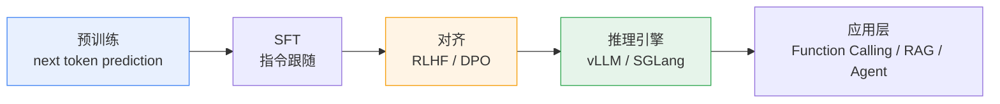
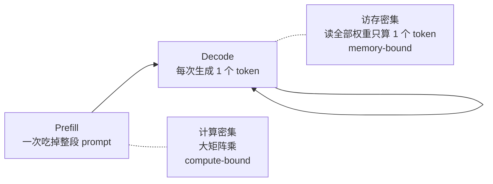
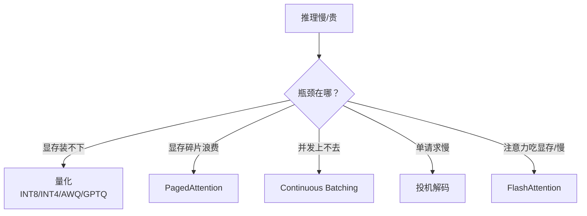
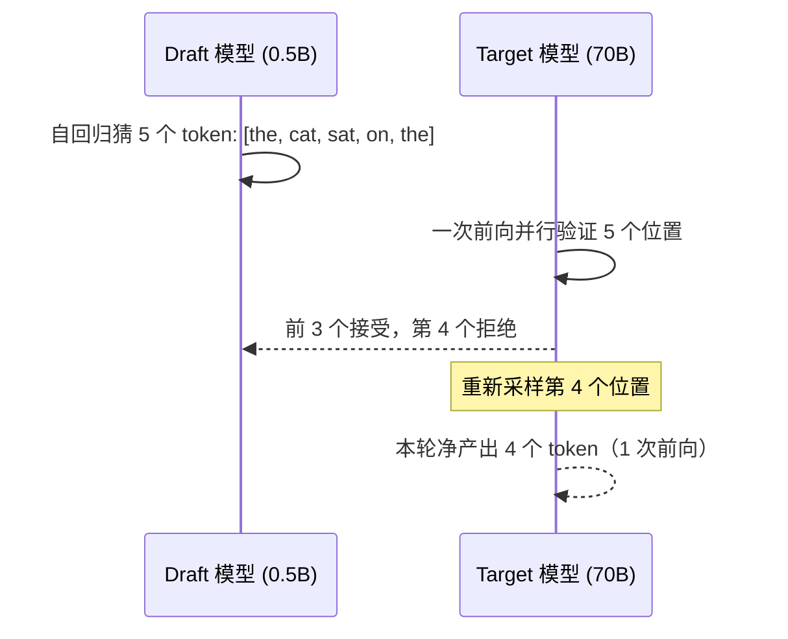
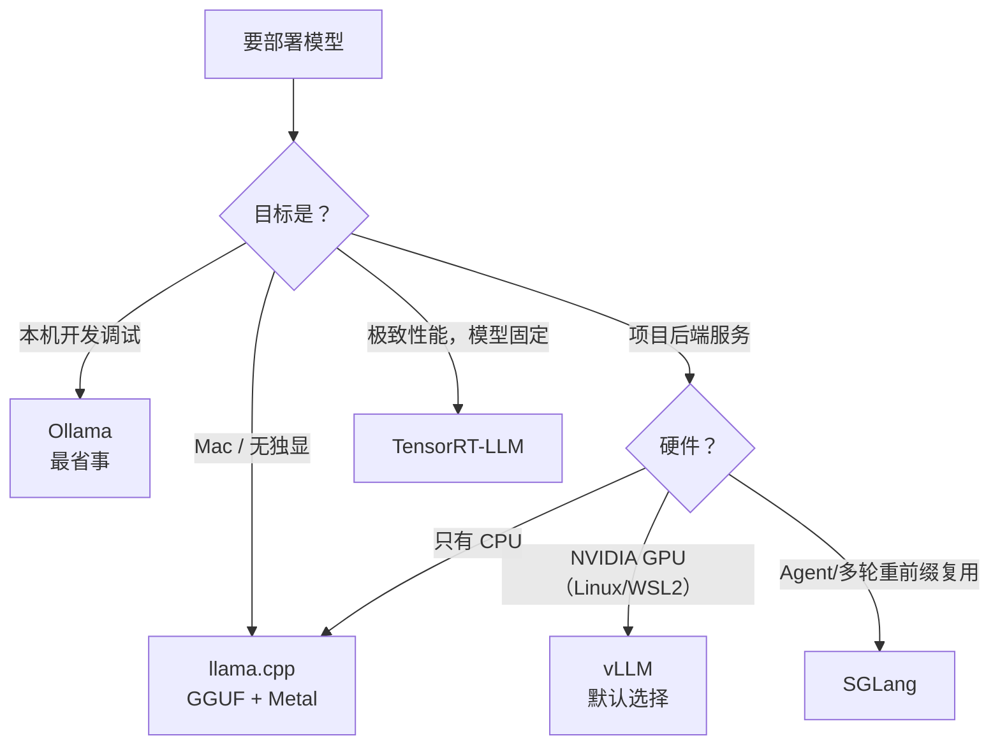
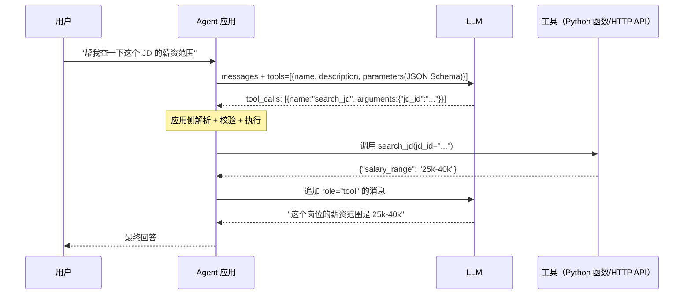

# 01 · 大模型基本原理与推理部署

> **这一篇写给谁**：写 JobPilot 的我自己，以及会翻这份文档的面试官。
> **目标**：不是背概念，而是能在白板上把 attention 写出来、能手算 KV Cache 显存、能在「本机跑 7B」这种具体问题上给出可执行方案，并且在被追问「为什么」的时候答得下去。
> **前置知识**：会写 Python，知道 softmax 和矩阵乘法，了解 HTTP API 基本形态。
> **建议阅读时间**：90 分钟；面试前一天只看第 3、5、6、9 节。

---

## 0. 先建立一张全局地图

LLM 相关的知识可以粗暴分成三层，面试官的问题基本都落在这三层里：

| 层 | 关心什么 | 典型问题 | 本篇对应章节 |
| --- | --- | --- | --- |
| 模型层 | 参数怎么算的、怎么训出来的 | self-attention 公式、RoPE、DPO 和 RLHF 区别 | 1、2 |
| 推理层 | 显存、延迟、吞吐、采样 | KV Cache 多大、为什么 decode 慢、temperature 怎么调 | 3、4、5 |
| 部署与应用层 | 选什么框架、怎么接工具、长文本怎么办 | vLLM 和 Ollama 区别、Function Calling 怎么实现 | 6、7、8 |



一个很实用的心智模型：**预训练决定「知道什么」，SFT 决定「怎么答」，对齐决定「答得多合适」，推理引擎决定「多快多便宜」，应用层决定「能不能干活」。** 面试里被问「某功能怎么做」，先定位它属于哪一层，答案就不会跑偏。

---

## 1. Transformer 架构要点

### 1.1 它到底解决了什么问题

在 Transformer 之前，序列建模靠 RNN/LSTM。两个硬伤：

1. **串行**：h_t 依赖 h_{t-1}，无法并行，训练长序列时 GPU 利用率极低。
2. **长距离依赖衰减**：信息要经过 t 步传递，梯度容易消失，实际有效记忆长度也就几百个 token。

Attention 的思路很直接：**别传递了，任意两个位置直接相连**。代价是复杂度从 O(n) 变成 O(n²)，但换来的是全并行 + 全局感受野。这在 GPU 算力便宜、带宽昂贵的年代是划算的（后面会看到，这个 tradeoff 在长上下文时代又被翻出来了，见第 8 节）。

### 1.2 Self-Attention 的数学形式与直觉

输入是一个 token 序列，每个 token 先查表拿到 embedding `X ∈ R^{n×d}`（n 是序列长度，d 是隐层维度）。然后用三个线性投影得到：

```text
Q = X W_Q      W_Q ∈ R^{d×d_k}   # Query：我在找什么
K = X W_K      W_K ∈ R^{d×d_k}   # Key：我能被什么匹配到
V = X W_V      W_V ∈ R^{d×d_v}   # Value：我实际提供的内容
```

注意力输出：

```text
Attention(Q, K, V) = softmax( Q Kᵀ / sqrt(d_k) + M ) V
```

逐项拆开看：

- `Q Kᵀ ∈ R^{n×n}`：第 (i, j) 个元素是「第 i 个 token 的 query 和第 j 个 token 的 key 有多像」，就是一个 n×n 的**关系矩阵**。
- **除以 `sqrt(d_k)`**：这是面试高频点。假设 Q、K 的每个分量独立同分布、均值 0 方差 1，那么点积 `q·k = Σ q_i k_i` 的方差是 `d_k`。d_k 一大（比如 128），logits 的方差就是 128，标准差约 11.3，不同位置的分数差距会被放大，softmax 输出会**极度尖锐**（接近 one-hot），于是：

  ```text
  ∂softmax/∂logits → 趋近 0   ⇒   梯度消失，训练不稳
  ```

  除以 `sqrt(d_k)` 把方差重新归一化到 1，让 softmax 工作在梯度健康的区间。**注意它是缩放不是归一化，只是把尺度拉回，不改变相对顺序。**
- **`M` 是 mask**：decoder-only 模型用上三角 mask，`M[i][j] = -inf (j > i)`，保证第 i 个位置只能看到 ≤ i 的信息。softmax 里 `exp(-inf) = 0`，所以未来的位置权重严格为 0。这就是「因果（causal）」的来源，也是训练时能一次并行算出所有位置、而推理时又必须自回归的根本原因。
- **`V` 的加权求和**：输出的第 i 行是「按注意力权重对所有位置 value 的加权平均」。所以 attention 本质是一个**内容寻址的软查表**：query 是钥匙，key 是锁孔，value 是柜子里的东西。

复杂度：`QKᵀ` 是 `O(n² d_k)`，softmax 是 `O(n²)`，乘 V 是 `O(n² d_v)`。合起来 `O(n² d)` 时间、`O(n²)` 的注意力矩阵显存（FlashAttention 把这部分干掉，见 5.5）。

一份最小实现（理解用，别拿它跑生产）：

```python
import math
import torch
import torch.nn.functional as F

def self_attention(x, W_q, W_k, W_v, causal=True):
    # x: (batch, seq, d_model)
    q, k, v = x @ W_q, x @ W_k, x @ W_v          # (B, S, d_k) / (B, S, d_v)
    d_k = q.size(-1)
    scores = q @ k.transpose(-2, -1) / math.sqrt(d_k)   # (B, S, S)
    if causal:
        S = x.size(1)
        mask = torch.triu(torch.ones(S, S, dtype=torch.bool, device=x.device), diagonal=1)
        scores = scores.masked_fill(mask, float("-inf"))
    attn = F.softmax(scores, dim=-1)
    return attn @ v, attn      # 返回注意力矩阵便于调试（生产里别留，n² 显存杀手）
```

### 1.3 多头注意力：为什么要多头

单头注意力只能学出**一种**关系模式。但语言里的关系是多样的：语法依存（主谓一致）、指代（"它"指向哪个名词）、语义相似、位置邻近……

做法：把 d_model 切成 h 份，每份独立做一次 attention，最后拼接再投影。

```text
head_i = Attention(X W_Q^i, X W_K^i, X W_V^i)
MHA(X) = Concat(head_1, ..., head_h) W_O
```

几个容易答错的点：

- **总计算量和单头几乎一样**。因为 `h × d_head = d_model`，head 变多但每个 head 的维度变小，FLOPs 基本不变（`h × n² × d_head = n² × d_model`）。多头不是靠增加算力换表达力，而是靠**并行多组子空间**。
- **参数量**：`W_Q, W_K, W_V` 各 `d_model × d_model`，`W_O` 也是，合计 `4 d_model²`（不含 bias）。
- **不同 head 确实分工**。可解释性研究里能看到明显模式：有的 head 专盯前一个 token（previous-token head），有的专做句法依存，大量 head 可以被剪掉而性能几乎不掉（结构化剪枝能砍 20-40% head）。
- **head_dim 的工程经验值**：64 或 128。这不是学术结论而是硬件结论——head_dim 太小则 GEMM 的矩阵太瘦，Tensor Core 利用率上不去；太大则寄存器压力大、FlashAttention 的 tile 不好切。

**MQA / GQA**（面试常连着问）：这是为了省 KV Cache 而做的变体。

| 变体 | K/V head 数 | KV Cache 相对大小 | 代表模型 | 质量代价 |
| --- | --- | --- | --- | --- |
| MHA | = Q head 数 | 1× | GPT-3、Llama-2-7B | 基线 |
| GQA | 1 < h_kv < h_q（常见 1/4~1/8） | 1/4 ~ 1/8 | Llama-3、Qwen2.5、Mistral | 几乎无损 |
| MQA | 1 | 1/h_q | PaLM、Falcon | 略有下降 |

GQA 是现在的默认选择，因为它是「显存 / 质量」曲线上性价比最高的点。

### 1.4 位置编码：从正弦到 RoPE

Attention 本身是**置换不变**的：把输入 token 打乱，`softmax(QKᵀ)V` 的输出只是跟着重排，模型无法区分「猫追狗」和「狗追猫」。所以必须显式注入位置信息。

三代方案：

| 方案 | 做法 | 问题 |
| --- | --- | --- |
| 正弦/余弦编码 | 用不同频率的 sin/cos 加到 embedding 上 | 是绝对位置，外推能力差；现在基本没人用 |
| 可学习绝对位置 | 每个位置一个可训练向量 | 训练时见过 max_len 之外的位置直接没定义，无法外推 |
| **RoPE（旋转位置编码）** | 对 Q、K 做与位置相关的**旋转** | 目前主流 |

**RoPE 的核心思想**：不把位置「加」进去，而是把位置信息「转」进去——在二维子空间里旋转一个角度，角度与位置成正比。

把 `d_head` 维向量两两配对成 `d_head/2` 个二维平面。对位置 m 的向量 x，每一对 `(x_{2i}, x_{2i+1})` 乘以一个旋转矩阵：

```text
R(m, θ_i) = [[cos(mθ_i), -sin(mθ_i)],
             [sin(mθ_i),  cos(mθ_i)]]

θ_i = base^(-2i/d),   base = 10000（常见还有 500000、1000000）
```

关键性质——**内积只依赖相对位置**：

```text
⟨R(m,θ) q , R(n,θ) k⟩ = ⟨q, R(n-m, θ) k⟩ = f(q, k, n - m)
```

推导很简单：旋转矩阵是正交矩阵，`R(m)ᵀ R(n) = R(n-m)`。也就是说，attention 分数天然只跟 `n - m`（相对距离）有关，**绝对位置信息被彻底编码成了相对位置**。这正是 RoPE 泛化好、能支撑长上下文微调的根本原因。

工程细节：实际实现里不显式构造旋转矩阵（那是 d×d 的稠密矩阵，太贵），而是用 element-wise 的乘加：

```python
def apply_rope(x, cos, sin):
    # x: (B, H, S, D)，cos/sin: (S, D/2) 预算好
    x1, x2 = x[..., 0::2], x[..., 1::2]
    out = torch.stack([x1 * cos - x2 * sin,
                       x1 * sin + x2 * cos], dim=-1)
    return out.flatten(-2)
```

vLLM/FlashAttention 里都会把它 fuse 进 kernel，避免额外的读写。

**注意**：RoPE 的旋转频率是按维度分层的——低维（i 小）频率高、旋转快，负责**局部**位置；高维频率低、几乎不转，负责**全局**位置。这个「频率分层」是理解 YaRN、NTK 外推的关键（第 8 节）。

### 1.5 除了 attention，还有这些东西

容易被忽略但面试爱问：

- **FFN / MLP**：`FFN(x) = W_2 · act(W_1 x)`，中间维度通常是 `8/3 × d_model`。**参数量占整个模型的约 2/3**（attention 只占 1/3 左右）。所以「大模型的知识存在哪」——主流观点认为主要在 FFN 的权重里（FFN 可以看作 key-value memory）。
- **SwiGLU**：`Swish(W_1 x) ⊙ (W_3 x)` 再投影。比 ReLU/GELU 效果更好，代价是多一个矩阵，所以把中间维度从 4× 降到 8/3× 来补偿参数量。Llama 系列标配。
- **RMSNorm**：只做缩放不做中心化，`x / sqrt(mean(x²) + ε) · γ`。比 LayerNorm 少一次均值计算和一次减，快 5-10%，效果不掉。
- **Pre-LN**：Norm 放在子层**前面**（`x + Sublayer(Norm(x))`）。Post-LN 在深层需要 warmup 且容易训崩，Pre-LN 稳定得多，是现代默认。代价是最后要加一个 final norm。
- **残差连接**：没有它，几十层的网络没法训。它保证梯度有一条「恒等高速公路」直达底层。

### 1.6 为什么是 decoder-only

三种架构的对比：

| 架构 | 代表 | 注意力 | 训练目标 | 现状 |
| --- | --- | --- | --- | --- |
| Encoder-only | BERT | 双向 | MLM（完形填空） | 做 embedding/分类/NER 仍有用，不再做大模型底座 |
| Encoder-Decoder | T5、BART | 编码器双向 + 解码器因果交叉注意力 | span corruption | 翻译、摘要等 seq2seq 场景仍在用 |
| **Decoder-only** | GPT、Llama、Qwen | 因果（下三角 mask） | next token prediction | 事实标准 |

为什么 decoder-only 赢了：

1. **训练目标统一且无监督**：一个 loss（预测下一个 token）就能吃下所有文本，不需要造 mask 或 span，数据利用率最高。任何文本都是训练数据，这是 scaling 的前提。
2. **Zero-shot / few-shot 泛化**：把任务写进 prompt 就能做，不需要为每个任务改结构。in-context learning 是 decoder-only 的「意外收获」。
3. **工程上最友好**：
   - 训练时一个前向就能对所有位置算 loss（teacher forcing + mask），**没有 Encoder-Decoder 那种两段式结构**。
   - 推理时只用 KV Cache 缓存自回归前缀，缓存逻辑单一。
   - 结构对称、超参少，一个 recipe 能放大到 100 倍参数不崩。
4. **Emergence**：在足够规模下，next-token prediction 这个「简单」目标涌现出推理、代码、翻译等能力，说明它隐式地逼模型学到了更深的结构。

一句话版本：**不是 decoder-only 在设计上更「聪明」，而是它在「同一个简单目标 + 无限数据 + 可无限放大」这三点上最省事，而大模型的胜负手恰好就是规模。**

---

## 2. 从预训练到对齐

### 2.1 预训练：next token prediction

目标函数就是最大似然：

```text
L = - (1/N) Σ_{t=1..N} log P(x_t | x_1, ..., x_{t-1}; θ)
```

也就是交叉熵。工程上常看到的技术点：

- **Teacher forcing + 因果 mask**：一次前向得到所有位置的 logits，并行算 loss。等价于 n 个独立的预测任务，GPU 利用率拉满。
- **Perplexity（困惑度）**：`PPL = exp(L)`。可以理解成「模型在每一步平均在多少个候选词之间犹豫」。PPL=10 大致相当于每步在 10 个词里挑。**这是最常用的定量评估指标，也是量化/微调后掉不掉点的第一道体检。**
- **Scaling Law**：loss 与参数量 N、数据量 D、算力 C 呈幂律关系；Chinchilla 的最优比例大致是 `D ≈ 20N`（token 数约为参数量的 20 倍）。现在实践普遍**过度训练**（Llama-3-8B 用了 15T token，远超 20×8B=160B），因为推理成本比训练成本重要——多花的训练算力换更小的模型，长期推理更便宜。这是一个很好的面试加分点。
- **数据质量 > 数据数量**：去重（MinHash/SimHash 近似去重）、质量打分过滤（用分类器筛「像教科书的内容」）、领域配比。这个环节对最终效果的影响经常比架构改动还大。

### 2.2 SFT：教会模型「按格式答」

预训练出来的模型是个「文本续写器」：你问「北京的首都是」，它可能续「哪里？」，因为它没见过「提问-回答」这种分布。

SFT（Supervised Fine-Tuning）就是拿几万到几十万条 `(instruction, response)` 对做同样的 next-token 监督训练。要点：

- **Loss mask（最关键也最常被忽略）**：只在 **assistant 回复部分**算 loss，`system` 和 `user` 部分置为 -100 忽略。如果对整段算 loss，模型会去学「怎么生成用户的问题」，出现奇怪的复读行为。
- **Chat template**：模型见的格式必须和推理时一致。`<|im_start|>user\n...<|im_end|>` 这类特殊 token 是**一等公民**，训错了表现为「模型不停输出用户的话」或「不停止生成」。
- **LoRA / QLoRA**：全量微调 7B 要 8×A100；LoRA 只训低秩旁路矩阵 `ΔW = BA`（rank 8-64），可训练参数量降到 0.1-1%，单卡 24G 能跑。QLoRA 再把基座量化成 NF4，7B 在 16G 显存上可训。**个人开发者基本只用这条路。**
- **数据量经验值**：风格/格式对齐 1k-10k 条就够；注入新知识要 10k-100k 条且不如 RAG（见 RAG 那篇的决策表）。**SFT 擅长「学会怎么答」，不擅长「记住新事实」。**

### 2.3 RLHF：让模型对齐人类偏好

SFT 的天花板是「模仿标注者的平均水准」，而且「什么算好回答」很难用监督信号表达（有用 vs 无害 vs 诚实之间的权衡）。

RLHF 三步：

1. **SFT** 得到基础策略 π_SFT。
2. **训 Reward Model**：给同一个 prompt 的多个回答让人排序（A > B），用 Bradley-Terry 模型建模 `P(A ≻ B) = σ(r(A) - r(B))`，用 pairwise loss 训练打分模型。
3. **PPO 强化学习**：让策略最大化 `E[r(x, y)]`，同时加 **KL 惩罚**约束不能偏离 π_SFT 太远：

```text
objective = E[ r(x, y) ] - β · KL( π_θ(y|x) ‖ π_ref(y|x) )
```

KL 惩罚为什么必须存在：**Reward Hacking**。RM 只是个有缺陷的代理目标，策略会找到 RM 的漏洞，输出一堆「看起来很棒」但空洞或谄媚的内容（sycophancy）。没有 KL 约束，几十步内模型就开始输出重复的彩虹屁。

工程代价：PPO 同时在显存里放 4 个模型（policy、reference、reward、critic value），7B 级别要 4×A100-80G 起步，且超参极其难调（advantage 归一化、GAE、clip ratio、KL 系数）。这就是 DPO 出现的原因。

### 2.4 DPO：把 RL 变成分类问题

DPO 的核心洞察：在 KL 约束下的最优策略有闭式解

```text
π*(y|x) ∝ π_ref(y|x) · exp( r(x,y) / β )
```

反解出 `r(x,y) = β log(π*/π_ref) + const`，代回 Bradley-Terry 偏好损失，reward model 就被消掉了，只剩策略本身：

```text
L_DPO = - E_{(x, y_w, y_l)} [ log σ( β log(π_θ(y_w|x)/π_ref(y_w|x))
                                  - β log(π_θ(y_l|x)/π_ref(y_l|x)) ) ]
```

直觉读法：**提高「好回答」相对于参考模型的概率，压低「坏回答」的概率**，β（0.1~0.5）控制偏离参考模型的强度。

| 维度 | RLHF (PPO) | DPO |
| --- | --- | --- |
| 需要 Reward Model | 需要，单独训练 | 不需要 |
| 显存中的模型数 | 4（policy/ref/reward/critic） | 2（policy/ref，ref 可离线算 logprob） |
| 训练稳定性 | 差，超参敏感 | 好，就是监督学习 |
| 数据要求 | 偏好对 + 在线采样 | 离线偏好对即可 |
| 效果上限 | 通常更高（能探索） | 略低，但差距在缩小 |
| 实践推荐 | 有资源、追求极致 | **个人项目首选** |

**面试可讲的延伸**：DPO 的已知问题是对「偏好数据的分布」敏感，离线数据无法覆盖策略自己产生的错误；后续的 IPO / KTO / SimPO / ORPO 都在打补丁。如果面试官问到 2024 年之后的东西，可以提 **GRPO**（DeepSeek 用的，去掉 critic，对一组采样结果做组内归一化算 advantage，显存省一半）和 **RLVR**（用可验证奖励，比如数学题答案对错、代码测试是否通过，绕开 RM 的 reward hacking）。这两条是当前最热的方向。

---

## 3. 推理阶段 mechanics（面试重灾区）

### 3.1 Prefill 与 Decode：两个阶段，两套物理规律

自回归生成分两段：



| 维度 | Prefill | Decode |
| --- | --- | --- |
| 处理 token 数 | 全部 prompt（如 2000） | 1 个 |
| 并行度 | 高，整段并行 | 无法并行（依赖上一步输出） |
| 主导瓶颈 | 算力（FLOPs） | 显存带宽（Bytes） |
| GPU 利用率 | 常见 60-90% | 常见 5-20% |
| 对应指标 | TTFT（首 token 延迟） | TPOT / ITL（每 token 间隔） |
| 优化手段 | FlashAttention、FP8、chunked prefill | KV Cache、量化、投机解码、Continuous Batching |

这两个阶段的性能特征完全不同，所以**「我的模型多少 tok/s」这个说法没有意义**——必须区分 TTFT 和 TPOT。一个常见现象：prefill 3 秒、之后每秒 40 token，用户感觉「启动慢但吐字快」；反过来就是「秒回但卡」。工程上要分开优化。

### 3.2 KV Cache：原理与显存公式

**不加缓存**的话，生成第 t 个 token 要重算整段前缀的 K、V，总计算量 `O(n³)`（每步 n² 的注意力 × n 步）。加了缓存后，每步只需要算**新 token** 的 Q、K、V，然后与缓存拼接，计算量降到 `O(n²)`。

代价是显存。公式：

```text
KV Cache 字节数 = 2 × L × H_kv × D_head × S × B × bytes_per_elem
                  ↑   ↑     ↑        ↑      ↑   ↑
                  K和V 层数  KV头数   头维度  序列长 批大小
```

**数字例子（务必能当场手算）：**

Llama-3-8B：`L=32`，GQA 下 `H_kv=8`，`D_head=128`，fp16（2 bytes）

```text
单 token 单层 = 2 × 8 × 128 × 2 = 4096 B = 4 KB
单 token 全层 = 4 KB × 32 = 128 KB          ← 记住这个数
8192 token   = 128 KB × 8192 ≈ 1.0 GB
batch=16     = 16 GB                        ← 比模型权重（16GB）还大
```

对比一下 MHA（`H_kv=32`）：单 token 全层 = `2×32×128×2×32 = 512 KB`，8K 上下文单条就是 **4 GB**，是 GQA 的 4 倍。**这就是 GQA 被发明出来的全部理由。**

再看 Qwen2.5-7B（`L=28`, `H_kv=4`, `D_head=128`）：

```text
单 token 全层 = 2 × 4 × 128 × 2 × 28 = 57,344 B ≈ 56 KB
常用 32K 上下文单条 = 56 KB × 32768 ≈ 1.8 GB
```

**这张表要背下来（单条序列、含权重）：**

| 场景 | 权重 | KV Cache | 合计 | 能不能放进 24GB |
| --- | --- | --- | --- | --- |
| Llama-3-8B fp16, 4K ctx | 16 GB | 0.5 GB | 16.5 GB | 能 |
| Llama-3-8B fp16, 32K ctx | 16 GB | 4.0 GB | 20 GB | 勉强，batch 只能 1 |
| Llama-3-8B AWQ-INT4, 32K ctx | 5 GB | 4.0 GB | 9 GB | 能，batch 3-4 |
| Qwen2.5-7B fp16, 32K ctx | 15 GB | 1.8 GB | 17 GB | 能 |
| Qwen2.5-32B AWQ-INT4, 8K | 19 GB | 2.5 GB | 21.5 GB | 勉强单条 |

几个工程结论：
- **上下文越长，KV Cache 越可能成为显存主项**，而不是权重。128K 上下文的 8B 模型 KV 能到 16GB，跟权重一样大。
- **并发数是被 KV Cache 卡死的**，不是被算力卡死的。`max_num_seqs` 本质上是显存预算问题。
- 降 KV 显存的四条路：GQA（改架构）、KV 量化（fp16→fp8/int8，省一半，质量几乎无损）、PagedAttention（消除碎片浪费，见 5.2）、prefix caching（共享系统提示词，见 5.2）。

一个可直接用的估算脚本：

```python
def kv_cache_gb(layers, kv_heads, head_dim, seq_len, batch=1, bytes_per_elem=2):
    """返回 KV Cache 显存占用（GB）"""
    total_bytes = 2 * layers * kv_heads * head_dim * seq_len * batch * bytes_per_elem
    return total_bytes / 1024**3

print(kv_cache_gb(32, 8, 128, 8192))            # Llama-3-8B 8K  -> ~1.0 GB
print(kv_cache_gb(28, 4, 128, 32768))           # Qwen2.5-7B 32K -> ~1.8 GB
print(kv_cache_gb(32, 8, 128, 131072, batch=8)) # 8 并发 128K    -> ~16.0 GB

def weights_gb(params_b, bits):                 # 权重显存
    return params_b * 1e9 * bits / 8 / 1024**3

print(weights_gb(8, 16), weights_gb(8, 4))      # fp16 14.9GB / int4 3.7GB
```

### 3.3 为什么 decode 是 memory-bound

这是整篇文档里最值得讲清楚的一点。

Decode 阶段生成 1 个 token 时，GPU 做了什么？它必须把**全部模型权重**从 HBM 读进计算单元（矩阵乘的每一行都要参与），然后每个权重只做大约 2 次浮点运算（一次乘、一次加）。所以：

```text
算术强度 (Arithmetic Intensity) = FLOPs / Bytes
                                ≈ 2N / (2N) = 2 FLOP/Byte   (fp16, batch=1)
```

对照硬件的「拐点（ridge point）」——也就是峰值算力除以显存带宽：

| GPU | FP16 算力 | 显存带宽 | Ridge Point | decode 的 AI | 差距 |
| --- | --- | --- | --- | --- | --- |
| A100-80G | 312 TFLOPS | 2.0 TB/s | ~156 FLOP/B | 2 | **78×** 低于拐点 |
| H100 | 990 TFLOPS | 3.35 TB/s | ~295 FLOP/B | 2 | **148×** |
| RTX 4090 | 165 TFLOPS | 1.0 TB/s | ~165 FLOP/B | 2 | **82×** |

结论：**decode 的算力利用率上限只有 1-3%，剩下的时间全在等数据从显存搬过来。** 所以正确的性能模型是带宽公式而不是算力公式：

```text
理论最大 decode 速度 ≈ 显存带宽 / 需要读取的字节数

RTX 4090 跑 Llama-3-8B:
  fp16:  1.0 TB/s ÷ 16 GB  ≈ 62 token/s   (实测通常 35-45)
  int4:  1.0 TB/s ÷ 4.5 GB ≈ 222 token/s  (实测通常 90-130)
```

这就解释了一堆「反直觉」现象，全部是面试加分点：

1. **为什么量化 INT4 能大幅提速？** 权重从 16GB 变 4.5GB，带宽瓶颈下的搬运量减少 3.5 倍。**提速来自省带宽，不是省算力。**
2. **为什么 batch 变大能提升吞吐？** 权重只读一次却算了 B 次，算术强度提到 `2B`。`B=64` 时 AI 到 128，接近拐点，算力才真正被用起来。**这是 Continuous Batching 有效的物理基础。**
3. **为什么投机解码在 batch=1 时很香、batch=32 时几乎无用？** 因为 batch 大了之后瓶颈从带宽转向算力，投机解码多做的无效计算就成了纯开销。
4. **为什么 MQA/GQA 提速明显？** KV Cache 读得少了，而 decode 阶段读取 KV 的字节数在大 batch / 长上下文时占比很高。
5. **为什么「把模型放在内存里跑」很慢？** DDR5 带宽约 50-100 GB/s，是 HBM 的 1/20~1/40。7B INT4（4GB）在 CPU 上理论只有 10-25 token/s，实测更低。

---

## 4. 采样参数：原理与调参经验

模型输出的不是词，是 logits（词表上未归一化的分数，Qwen 词表 15 万+）。**采样策略就是把 logits 变成下一个 token 的过程**，决定了输出的多样性、稳定性和「像不像在说人话」。

### 4.1 各参数的原理

**Temperature**：在 softmax 前除一下。

```text
p_i = exp(z_i / T) / Σ_j exp(z_j / T)
```

- `T → 0`：分布变成 one-hot，退化为 argmax（贪心）。
- `T = 1`：原始分布。
- `T > 1`：分布被压平，低概率词得到机会，更随机也更容易胡说。
- 数学上的意义：`T` 是分布的「熵控制器」。T=0.7 时，一个原本 p=0.5 的 token 大概会被放大到 0.7 左右。

**Top-k**：只在概率最高的 k 个词里采样。问题：k 是固定值，但分布是动态的——有些位置模型极其确定（下一个词只能是「。」），有些位置很发散（开头写什么风格）。k=50 在这两种情况下都不合适。

**Top-p**（nucleus sampling，核采样）：**动态**地取累积概率达到 p 的最小词集合。

```text
取最小的集合 S 使得 Σ_{i∈S} p_i ≥ p，然后只在 S 里重新归一化后采样。
```

p=0.9 意味着「排除所有尾部不确定性」。这是目前**最推荐的默认采样方式**，因为它自适应分布的陡峭程度。

**Min-p**（较新，2024 年后流行）：只保留 `p_i ≥ min_p × p_max` 的 token。相比 top-p 更不容易在「模型非常确定」时引入噪声，`min_p=0.05` 是比较好的起点。

**Repetition penalty**：对已经出现过的 token 降权。CTRL 论文原始形式是按出现次数除 logits：

```text
if z > 0:  z = z / penalty
else:      z = z × penalty      # penalty 通常 1.0-1.3
```

实现坑点：**很多实现是对「prompt 中出现的 token」也算惩罚的**，导致模型无法正常引用用户的话。OpenAI 后来拆成了两个更细的：

- `presence_penalty`：只要出现过就扣固定分（鼓励引入新话题）
- `frequency_penalty`：按出现次数成比例扣分（强压重复词）

**经验值（可以直接抄进配置文件）：**

| 场景 | temperature | top_p | top_k | 重复惩罚 | 说明 |
| --- | --- | --- | --- | --- | --- |
| Function Calling / JSON 输出 | 0 ~ 0.1 | 0.8 | 20 | 1.0 | 要的是结构正确，不要创造性 |
| RAG 事实问答 | 0 ~ 0.3 | 0.9 | - | 1.05 | 越低越不容易脱离检索内容 |
| 代码生成 | 0.1 ~ 0.3 | 0.95 | - | 1.0 | 太高会写出不存在的 API |
| 通用助手 / 摘要 | 0.3 ~ 0.7 | 0.9 | - | 1.05 | 默认区间 |
| 头脑风暴 / 面试题生成 | 0.8 ~ 1.0 | 0.95 | - | 1.1 | 要多样性 |
| 翻译 / 抽取 | 0 | 1.0 | - | 1.0 | 确定性优先 |

### 4.2 踩坑经验

- **`temperature=0` 不等于完全可复现**。GPU 上的浮点归约顺序不确定、batch 里有其他请求导致 kernel 不同、beam/flash attention 的非确定性，都会让输出有微小差异。要严格可复现只能固定 batch 组合 + 关掉非确定性 kernel（会很慢）。工程上正确的做法是**用足够低的温度 + schema 校验**，而不是指望 bit 级复现。
- **两个参数联动调，别单调**。一般固定 top_p=0.9，只调 temperature；同时改两个会失去控制感。
- **重复惩罚是双刃剑**。调到 1.3 以上，模型会开始生造同义词、把专有名词写错。中文模型尤其明显（「的」「了」被强行压制）。
- **「复读机」问题的真正解法**通常是三件事之一：调整 chat template（最常见）、降低 repetition penalty、或者把 prompt 里的指令写得更明确。**调 temperature 通常治不了复读。**

---

## 5. 关键推理优化技术

统一用「解决什么问题」来串。



### 5.1 量化：解决「显存装不下 + 带宽不够」

本质：用更少 bit 表示权重（有时还有激活）。fp16 每个权重 2 字节，int4 是 0.5 字节，**显存直接降 4 倍**；在 decode 这种带宽瓶颈场景下，速度也接近成正比提升。

先分两个维度：

- **按量化对象**：weight-only（W4A16，只量化权重，激活保持 fp16）vs weight+activation（W8A8、W4A4）。
- **按时机**：PTQ（训练后量化，主流）vs QAT（量化感知训练，成本高，极低位宽才需要）。

**主流方法对比（面试重点）：**

| 方法 | 位宽 | 核心思想 | 优点 | 缺点 |
| --- | --- | --- | --- | --- |
| **RTN**（round-to-nearest） | INT8/INT4 | 直接四舍五入到最近网格点 | 零成本 | 4bit 下掉点明显 |
| **LLM.int8()**（bitsandbytes） | INT8 | 按列对激活做 INT8，但**检测出 outlier 特征维度（幅度大 20 倍以上）保持 fp16 计算** | 开箱即用，无需校准集 | 慢（混合精度 kernel 开销），只压到 8bit |
| **GPTQ** | INT3/4 | 逐层做，用校准集的二阶信息（Hessian，近似为 `XXᵀ`）算每个权重的量化误差，量化一个就把误差补偿到剩余的未量化权重上（OBS/OBQ 系列思路） | 4bit 质量好，生态成熟 | 需要校准集 + 量化耗时（7B 约 10-30 分钟）；推理时需要 group-wise 反量化，prefill 可能变慢 |
| **AWQ** | INT4 | 观察到一个现象：**只有约 1% 的权重是「显著」的（对应激活幅度大的通道）**，量化时按激活幅度做 per-channel 缩放保护它们，其余放手压 | 精度普遍优于 GPTQ，尤其小模型；量化快（分钟级）；vLLM 默认推荐 | 同样是 W4A16，激活仍要反量化 |
| **GGUF k-quants** | 2-8bit | llama.cpp 生态的混合位宽格式，Q4_K_M 对不同层/张量用不同精度 | CPU/Apple Silicon 上的事实标准，粒度可调 | 主要面向 llama.cpp，不是 GPU 高并发首选 |
| **NF4** | 4bit | 假设权重近似正态分布，按分位数间隔取网格（information-theoretically optimal for Gaussian） | QLoRA 的基座量化方案 | 主要用于训练场景 |

**质量损失的经验数据（以 PPL / 下游任务为准，非绝对）：**

| 精度 | 质量损失 | 7B 权重显存 | 说明 |
| --- | --- | --- | --- |
| FP16 | 基线 | 15 GB | |
| FP8 | < 0.5% | 7.5 GB | H100 原生支持，越来越主流 |
| INT8 | ~0.1-0.5% | 7.5 GB | 基本无损，最安全的选择 |
| **INT4 (AWQ/GPTQ)** | **~1-3%** | **4 GB** | 性价比甜点，生产常用 |
| INT3 | 5-15% | 3 GB | 开始明显掉点 |
| INT2 | 崩 | 2 GB | 只有极特殊场景可用 |

**必须知道的坑：**
1. **量化省的是显存和带宽，不是算力**。batch 大、上下文长时，瓶颈转向算力，INT4 反而不如 FP16（反量化有开销）。
2. **KV Cache 量化是独立开关**，收益很大（长上下文场景省一半显存）且质量损失小，但要用 `fp8_e5m2` / `fp8_e4m3` 这类专门为 KV 设计的方案。
3. **量化后一定要重新评测**，不能只看「能跑起来」。至少跑一遍自己的 RAG 评测集，看 faithfulness 有没有掉。
4. **AWQ/GPTQ 权重和 llama.cpp GGUF 是两套格式，不能混用**。GitHub 上很多低质量量化仓库直接用 RTN，别随便下载，自己 AWQ 一遍或选官方/知名量化者（如 TheBloke、bartowski）的产物。

### 5.2 PagedAttention：解决「KV Cache 显存碎片化」

**问题**：传统实现给每个请求预分配 `max_seq_len` 连续显存。但实际生成长度不可预测，结果：

- **内部碎片**：请求只生成 200 token，却占了 4096 的槽位 → 浪费
- **外部碎片**：显存被切成不连续的空洞，装不下新请求
- **无法共享**：多个请求共享同一个 system prompt，却各存一份 KV

实测浪费率能到 **60-80%**。含义很直接：**你的显卡 80% 的 KV 显存是白扔的，有效并发只有理论值的 1/4。**

**方案**：借鉴操作系统的虚拟内存分页。把 KV Cache 切成固定大小的 **block**（vLLM 默认 16 个 token），逻辑上连续、物理上可以不连续，用一张 block table 做映射。

```text
逻辑序列 [t0 ... t31]  →  block table: [7, 3]

物理显存块池：
  block 3: [t16..t31]
  block 7: [t0..t15]
  block 9: (空闲，可分配给新请求)
```

三个直接收益：

1. **浪费率降到 < 4%**（只有最后一个 block 可能没填满），有效并发提升 2-4 倍。
2. **前缀共享（prefix caching）**：所有请求的系统提示词 block 指向同一份物理显存，用引用计数管理，写时复制（copy-on-write）。RAG 场景下同一个长 system prompt + 不同问题，**KV 复用直接省掉重复的 prefill 计算**，TTFT 大幅下降。
3. **支持 beam search / 并行采样**：多个候选序列共享前缀，只在分叉处复制 block。

这是 vLLM 的招牌能力，也是它比 naive HF `generate()` 快 10-20 倍的主因之一。

### 5.3 Continuous Batching：解决「GPU 空转」

**问题**：传统 request-level batching（也叫 static batching）把一批请求凑齐后一起跑，**必须等这批里最长的那个生成完**才能接下一批。短请求早就结束了，GPU 上那个槽位还在空转等长请求。

**方案**：把调度粒度从「请求级」降到「迭代级（iteration-level）」。每生成一个 token 就重新调度一次：谁生成完了（EOS）立刻踢出，队列里等待的请求立刻补进来。

```text
静态批处理:  [A A A A A A A A A]  ← B 早结束，槽位空转 7 步
             [B B B . . . . . .]
             [C C C C C . . . .]

连续批处理:  [A A A A A A A A A]
             [B B B D D D D D D]  ← B 一结束，D 立刻补位
             [C C C C C E E E E E]  ← C 结束，E 补位
```

| | 静态批处理 | 连续批处理 |
| --- | --- | --- |
| 调度粒度 | 请求级 | 迭代级（每个 token） |
| 吞吐（混合长短请求） | 基线 | **2-20×** |
| 短请求延迟 | 被长请求拖累 | 结束即返回 |
| 实现复杂度 | 低 | 高（要配合 PagedAttention 才能动态分配 KV） |

这是 **vLLM / TGI / SGLang 相比裸跑 Transformers 最大的吞吐来源**，甚至比 PagedAttention 本身更关键。两者是配套的：没有分页 KV，就没法动态把一个请求插进正在跑的 batch 里。

### 5.4 投机解码（Speculative Decoding）：解决「单请求延迟高」

**问题**：decode 阶段 batch=1 时算力利用率只有 1-3%（见 3.3），GPU 大把算力闲着，但受制于串行依赖没法用上。

**方案**：用一个便宜的小模型（draft model）**先猜 k 个 token**，然后用大模型**一次前向并行验证这 k 个 token**。

关键性质：**验证是精确的，不是近似的。** 因为一次前向就能算出这 k 个位置的完整 logits，检查每个位置 draft 的 token 是否落在 target 分布的接受范围内；一旦某个位置不匹配，从那里截断并用 target 的分布重新采一个。用接受-拒绝采样可以证明**最终输出的分布与直接用大模型采样完全一致**——所以它无损，只是「用闲着的算力换延迟」。



**收益**：理想情况加速比 `≈ (接受率 × k + 1) / (k × 草稿成本比 + 1)`；实测 2-3 倍是常见值，接受率高时能到 3-4 倍。

**实现流派：**

| 方案 | draft 来源 | 特点 |
| --- | --- | --- |
| Draft model | 同系列小模型（如 1.5B 配 7B） | 要额外显存，同 tokenizer 是硬要求 |
| **Medusa** | 在 target 上加多个解码头，各自预测未来第 2、3…个位置 | 不额外加载模型，训练多个 head（树状验证） |
| **EAGLE** | 一个轻量 autoregressive head，在**特征层**（倒数第二层 hidden state）上预测 | 当前效果最好，接受率最高，vLLM/SGLang 都支持 |
| N-gram / 检索 | 从 prompt 或历史里查 n-gram 匹配 | 零额外模型；**代码编辑、摘要、RAG 引用原文场景命中率惊人** |
| Prompt lookup | 直接在 prompt 里找重复子串 | 翻译、改写、抽取任务的免费加速 |

**什么时候不该用**：batch 已经很大（算力瓶颈）、采样温度很高（接受率暴跌）、draft 和 target 分布差太远（跨系列模型当 draft 效果很差）。**面试回答要主动说这个前提，否则显得只会背名词。**

### 5.5 FlashAttention：解决「注意力是 memory-bound 且 O(n²) 显存」

**问题**：标准 attention 要显式物化 `n×n` 的注意力矩阵并写回 HBM，然后 softmax 还要再读一遍、再写一遍。对 8192 token、32 头、fp16：`8192² × 32 × 2B = 4.3 GB` 的中间矩阵，**光是读写它就要走几 GB 的显存带宽，而真正的矩阵乘 FLOPs 却没那么多**。注意力本身在长序列下变成了 IO-bound。

**方案（IO-aware exact attention）**：

1. **Tiling（分块）**：把 Q、K、V 切成能放进 SRAM（共享内存，几十到几百 KB）的小块，在片上算局部 attention，**从不把完整的 n×n 写回 HBM**。
2. **Online softmax**：分块计算时如何正确做全局 softmax？用 running max `m` 和 running sum `ℓ` 做增量更新：

```text
m_new = max(m_old, rowmax(S_block))
ℓ_new = ℓ_old · exp(m_old - m_new) + rowsum(exp(S_block - m_new))
O_new = (O_old · ℓ_old · exp(m_old - m_new) + exp(S_block - m_new) V_block) / ℓ_new
```

   这样每一块算完就能丢掉，只需要常驻 `O(m, ℓ, acc)` 这几个小状态。
3. **反向重算**：backward 时不存注意力矩阵，用保存的 `(m, ℓ)` 重新算一遍前向。**用算力换显存**。

**收益：**

| | 标准 attention | FlashAttention |
| --- | --- | --- |
| 显存复杂度 | `O(n²)` | **`O(n)`** |
| HBM 读写量 | `O(n²)` | `O(n²/M)`（M 为 SRAM 大小） |
| 速度 | 基线 | **2-4×**（序列越长收益越大） |
| 数值结果 | 精确 | **精确（不是近似！）** |

**必须强调「是精确算法」**——它常被误解成稀疏/近似注意力，这是面试的经典鉴别点。FA-2 优化了并行度和 work partitioning（把 Q 分给不同线程块，减少非矩阵乘操作），FA-3 针对 H100 用上 TMA 和 FP8。

**现状**：FlashAttention 已经是默认组件。在 vLLM 里如果你不指定 back-end，它会自动选 FA/FlashInfer/xformers，长序列下差异很大，**建议显式指定并测一下**。

---

## 6. 推理部署方案对比与实践路径

### 6.1 方案定位对比

| 方案 | 定位 | 强项 | 弱项 | 适合谁 |
| --- | --- | --- | --- | --- |
| **vLLM** | 通用 GPU 高吞吐服务引擎 | PagedAttention + Continuous Batching，生态最全（OpenAI 兼容 API、LoRA 热加载、量化、多模态），社区最大 | 需要 NVIDIA GPU（Linux），Windows 原生不支持（用 WSL2）；冷启动慢 | **生产/项目后端首选** |
| **SGLang** | 高吞吐 + 复杂编排 | RadixAttention（前缀树 KV 复用，多轮对话/Agent 场景比 vLLM 更省）、结构化输出约束解码极快、比 vLLM 略高的吞吐 | 生态比 vLLM 小，文档偏薄 | Agent/多轮/RAG 密集场景 |
| **Ollama** | 本机一键运行 | 零配置、自动下载模型、Modelfile 管理、跨平台（Mac/Win/Linux）、自带 OpenAI 兼容 API | 基于 llama.cpp，吞吐远低于 vLLM；并发能力弱；不适合做服务端 | **本地开发、demo、个人助手** |
| **llama.cpp** | 极致轻量的 C++ 推理 | CPU/Metal/CUDA/Vulkan 全支持，GGUF 量化粒度最细（跑到 Q2 都能用），内存受限设备也能跑 | 高并发差，无 PagedAttention 级调度，参数多 | 消费级硬件、Apple Silicon、边缘 |
| **TGI**（HF Text Generation Inference） | HF 生态的推理服务 | 与 HF Hub/Transformers 集成好，企业特性（token 流式、水印、grammar），有商用支持 | 吞吐逊于 vLLM，社区活跃度下降 | 已深度绑定 HF 生态的团队 |
| **TensorRT-LLM** | NVIDIA 官方极致性能 | 编译期 kernel 融合，单卡吞吐最高（比 vLLM 高 10-30%），FP8 支持最好 | 编译模型麻烦、灵活度差、只支持 NVIDIA、迭代慢 | 追求极限性能、模型固定的生产环境 |
| **LMDeploy** | 国产/中文友好 | TurboMind 引擎，InternLM/Qwen 系列支持好，量化工具链完整 | 生态相对小 | 中文模型、国内环境 |

**选型决策树：**



### 6.2 个人开发者本机部署 7B 的实践路径

这是我实际要走的路线，写成分步可执行清单。

**第一步：先认清硬件能干什么。**

| 显存 | 推荐方案 | 7B 上能做到 | 实测预期 |
| --- | --- | --- | --- |
| 无独显，32G 内存 | llama.cpp GGUF Q4_K_M | 单条对话，4K 上下文 | 3-8 tok/s，够调试 |
| 8 GB（3050/4060） | Ollama + Q4_K_M | 单条，8K 上下文，q8_0 KV | 20-35 tok/s |
| 12 GB（3060/4070） | vLLM + AWQ INT4，或 Ollama | batch 2-4，16K | 40-70 tok/s |
| 16 GB（4060Ti/4070TiS） | vLLM + AWQ INT4 | batch 4-8，16K | 60-100 tok/s |
| 24 GB（3090/4090） | vLLM + FP16 或 AWQ | batch 16+，32K | 100-200+ tok/s 吞吐 |
| Apple M2/M3 Pro 18-36G | llama.cpp / MLX + GGUF | 单条 32K 上下文 | 15-30 tok/s |

**第二步：三条具体路线。**

**路线 A（最省事，推荐先跑通）：Ollama**

```bash
# 1. 安装 Ollama（Windows/Mac 官网装包），确认服务
ollama serve

# 2. 拉一个中文/int4 量化模型（Qwen2.5 系列对中文和 function calling 都好）
ollama pull qwen2.5:7b-instruct-q4_K_M     # 约 4.7 GB
ollama pull nomic-embed-text                # 顺手把 embedding 模型也拉了（RAG 用）

# 3. 直接命令行测
ollama run qwen2.5:7b "用一句话解释 KV Cache"

# 4. 关键：设置上下文长度（默认 2048，RAG 场景必然不够）
#    在 Modelfile 里改，否则 prompt 会被静默截断——这是 Ollama 最大的坑
cat > Modelfile <<'EOF'
FROM qwen2.5:7b-instruct-q4_K_M
PARAMETER num_ctx 16384
PARAMETER temperature 0.3
PARAMETER top_p 0.9
EOF
ollama create jobpilot-qwen -f Modelfile

# 5. 起一个常驻服务（Ollama 自带 OpenAI 兼容 API）
#    http://localhost:11434/v1/chat/completions
curl http://localhost:11434/v1/chat/completions \
  -H "Content-Type: application/json" \
  -d '{"model":"jobpilot-qwen","messages":[{"role":"user","content":"你好"}]}'
```

**注意 Ollama 的静默截断坑**：`num_ctx` 默认 2048，超长 prompt 会被**从中间截掉**而不报错，表现为「检索到了但模型答非所问」。RAG 项目里必须显式把它调到 8K-32K，并接受随之而来的显存/内存上涨。

**路线 B（走生产路径，推荐做后端时用）：vLLM（WSL2 + NVIDIA）**

vLLM 官方不支持 Windows 原生，必须 WSL2。这套流程走通了，简历上就能写「用 vLLM 部署推理服务」。

```bash
# WSL2 内（Ubuntu 22.04，已装 NVIDIA 驱动和 CUDA toolkit）
pip install vllm

# 1. 起服务（AWQ INT4，24G 显存能塞下 7B + 32K 上下文）
vllm serve Qwen/Qwen2.5-7B-Instruct-AWQ \
  --quantization awq \
  --max-model-len 32768 \
  --gpu-memory-utilization 0.90 \
  --max-num-seqs 16 \
  --enable-prefix-caching \
  --enable-auto-tool-choice \
  --tool-call-parser hermes \
  --port 8000

# 2. 关键指标怎么读：vLLM 启动日志里会打印
#    "GPU KV cache size: 240,000 tokens"  ← 这才是真正的并发上限依据
#    "Maximum concurrency for 32,768 tokens per request: 7.3x"

# 3. 开另一个终端压测，看真实吞吐
pip install vllm[bench]
vllm bench serve --model Qwen/Qwen2.5-7B-Instruct-AWQ \
  --num-prompts 200 --request-rate 10 \
  --dataset-name sharegpt --dataset-path ShareGPT_V3_unfiltered_cleaned_split.json
```

**必须显式配的三个参数**（默认值都不适合 RAG）：

| 参数 | 默认 | 建议 | 理由 |
| --- | --- | --- | --- |
| `--max-model-len` | 模型最大值（可能 128K） | 32768 | 设太大会让 vLLM 为每条请求预留巨大 KV，并发暴跌 |
| `--gpu-memory-utilization` | 0.9 | 0.85-0.92 | 太高会和其它进程抢显存导致 OOM；太低浪费 |
| `--max-num-seqs` | 256 | 8-32（消费级卡） | 消费级卡上 256 会让 KV 显存瞬间爆掉 |

**前缀缓存对 RAG/Agent 的收益极大**：同一个长 system prompt + few-shot 示例，只要开了 `--enable-prefix-caching`，第二个请求起就免掉这段的 prefill。实测 TTFT 能从 800ms 降到 150ms 级别。**这是 JobPilot 这类 Agent 项目最值钱的一个优化。**

**路线 C（无 NVIDIA 卡）：llama.cpp**

```bash
# 从 HuggingFace 拉 GGUF（挑 Q4_K_M，质量/体积平衡点）
# huggingface-cli download Qwen/Qwen2.5-7B-Instruct-GGUF qwen2.5-7b-instruct-q4_k_m.gguf

./llama-server -m qwen2.5-7b-instruct-q4_k_m.gguf \
  -c 16384 \          # 上下文长度
  -ngl 99 \           # 全部层 offload 到 GPU，0 就是纯 CPU
  --flash-attn \      # 开 FA，长上下文提速明显
  --cache-type-k q8_0 --cache-type-v q8_0 \   # KV 量化，省一半 KV 显存
  --host 0.0.0.0 --port 8000
```

**第三步：项目接入层（后端只要写一次）。**

因为 vLLM、Ollama、llama.cpp 都提供 **OpenAI 兼容接口**，后端代码可以完全不感知后端差异：

```python
# app/llm/client.py —— JobPilot 的统一模型入口
from openai import AsyncOpenAI
from app.core.config import settings

_client = AsyncOpenAI(
    base_url=settings.LLM_BASE_URL,   # http://localhost:8000/v1 或 :11434/v1
    api_key=settings.LLM_API_KEY,     # 本地部署随便填，如 "sk-local"
    timeout=120.0,
)

async def chat(messages, temperature=0.3, tools=None, stream=False):
    resp = await _client.chat.completions.create(
        model=settings.LLM_MODEL,     # 从配置读，切后端只改环境变量
        messages=messages,
        temperature=temperature,
        top_p=0.9,
        tools=tools,                  # Function Calling 见第 7 节
        stream=stream,
    )
    return resp
```

**收益**：本地 Ollama 开发 → 换成远端 vLLM → 换成 OpenAI/DeepSeek 官方 API，**只改一个环境变量**。这在面试里是个很好的工程表达：「推理层和业务层解耦，通过 OpenAI 兼容协议做适配」。

**第四步：把这套东西的指标记下来。** 面试时能说「我的 RAG 服务在本地 4090 上，1K prompt 的 TTFT 是 320ms，TPOT 是 28ms，并发 8 时吞吐 210 tok/s」——**比说「我用过 vLLM」强十倍**。

---

## 7. Function Calling 在模型侧是怎么实现的

Agent 项目（JobPilot 的核心）离不开工具调用，这块面试一定会问。

### 7.1 整体链路



**分工必须讲清楚（面试高频）：模型不执行任何工具，它只输出「我想调用谁、参数是什么」的结构化意图；真正执行、鉴权、校验、重试全是应用侧的事。** 很多候选人会答成「模型调用了 API」，这是根本性错误。

### 7.2 模型侧的三种实现方式

**(1) 特殊 token + 混合训练（主流做法）**

训练数据里把工具的 schema 塞进 system prompt 或专用字段，然后用**特殊 token 把「文本」和「工具调用」分隔开**。以 Llama-3 / Hermes 风格为例：

```text
<|start_header_id|>assistant<|end_header_id|>
<|python_tag|>{"name": "search_jd", "parameters": {"jd_id": "abc123"}}<|eom_id|>
```

或用 XML 风格（Claude / Qwen）:

```text
<tool_call>
{"name": "search_jd", "arguments": {"jd_id": "abc123"}}
</tool_call>
```

要点：
- 特殊 token 必须在 tokenizer 里注册成**单个 token**（如 `<|python_tag|>` 是 id 128010 而不是一串字符）。否则模型要一个字一个字生成，既慢又容易写错。
- 训练时这类 token 会被赋予很高的概率，模型学会「在需要的时候输出这个 token + JSON」。
- **这就是为什么不同模型的 tool-call parser 不通用**。vLLM 的 `--tool-call-parser` 参数（`hermes` / `mistral` / `llama3_json` / `qwen`）就是在告诉服务端「用哪个模型的格式解析」。配错了表现为「模型明明输出了 JSON，但 API 返回的 tool_calls 是空的，JSON 被当成普通文本」。

**(2) 约束解码（Constrained / Grammar-based Decoding）**

把 JSON Schema 编译成一个有限状态机（或下推自动机），**在采样的每一步只允许合法的 token 通过**：

```text
已生成: {"name": "search_jd", "arg
状态机当前允许:  "parameters" | "arguments"   ← 只在这两个字符串的 token 上加 logit
其余所有 token 的 logit = -inf
```

实现库：**XGrammar**（vLLM/SGLang 默认，性能最好）、**Outlines**（基于 FSM，编译慢但 API 友好）、**llguidance**（原 guidance）、**llama.cpp 的 GBNF grammar**。

| | 纯 prompt 引导 | 约束解码 |
| --- | --- | --- |
| 语法 100% 合法 | 否，95-99% | **是，100%** |
| 速度开销 | 无 | 1-2%（编译开销 amortize 后可忽略） |
| 首次编译延迟 | 无 | schema 复杂时几十到几百 ms（要缓存） |
| 能否强制参数为 enum | 靠 prompt，不可靠 | `enum` 直接进状态机，绝不越界 |
| 限制 | - | 只能约束**语法**，不能约束**语义** |

**这是面试里区分度很高的一个点**：知道「约束解码只能保证 JSON 合法，不能保证工具名对、参数值对」的人不多。工具名要靠在 prompt 里列出可用工具 + schema 校验兜底。

**(3) 微调专门的小模型做 tool routing**

有些系统（如早期的 Gorilla、ToolLLM）会专门训一个模型只负责选工具。现在基本被「通用模型 + 约束解码」取代了，除非工具集非常大（几百个）。

### 7.3 JSON 输出的可靠性问题与工程兜底

即使有约束解码，工程上仍然会遇到这些问题：

| 失败模式 | 现象 | 兜底方案 |
| --- | --- | --- |
| 幻觉工具名 | 输出 `search_jobs`（不存在），真实是 `search_jd` | 服务端白名单校验 + 把错误信息回灌给模型让它重选（**self-correction 循环**） |
| 参数类型错 | `"limit": "10"`（字符串）当成 int | Pydantic 严格模式校验 + 自动 coerce 尝试 |
| 参数名错 | `job_id` vs `jd_id` | schema 里 description 写清楚 + 校验失败回灌 |
| 嵌套结构复杂 | 多层级 object 生成到一半崩 | 拆成多个扁平工具；或用约束解码 |
| 长参数被截断 | 一次要生成的 JSON 超过 max_tokens | 调大 max_tokens；把大内容放到「引用/分页」参数里 |
| 输出混入解释文字 | `好的，我来调用：{...}` | 用模型自带的 tool parser；或强约束 system prompt |
| 循环调用同一个工具 | Agent 陷入死循环 | 应用侧硬性限制 `max_iterations`（建议 5-10）并注入「已调用 N 次，请给出结论」 |

**必须写的三件事（JobPilot 的 tool 执行层）：**

```python
import json, re
from pydantic import BaseModel, ValidationError, Field

class SearchJDArgs(BaseModel):
    jd_id: str = Field(..., description="职位 ID，来自 job_list 工具的输出")
    limit: int = Field(10, ge=1, le=50)

SAFE_JSON = re.compile(r"\{.*\}", re.S)   # 兜底：从混杂文本里抠出 JSON

async def execute_tool(name: str, raw_arguments: str):
    # 1) 白名单：绝不执行模型编出来的工具
    if name not in TOOL_REGISTRY:
        return {"error": f"未知工具 {name}，可用工具: {list(TOOL_REGISTRY)}"}

    # 2) 解析：第三方模型可能返回带杂质的字符串
    try:
        args = json.loads(raw_arguments)
    except json.JSONDecodeError:
        m = SAFE_JSON.search(raw_arguments or "")
        if not m:
            return {"error": "参数不是合法 JSON，请只输出 JSON 对象"}
        try:
            args = json.loads(m.group(0).replace("'", '"'))   # 宽松修复
        except json.JSONDecodeError as e:
            return {"error": f"JSON 解析失败: {e}，请重新生成"}

    # 3) 校验：类型/范围/枚举
    try:
        args = SearchJDArgs(**args) if name == "search_jd" else args
    except ValidationError as e:
        return {"error": f"参数校验失败: {e.errors()}，请修正后重试"}

    # 4) 真正的执行（超时 + 异常都要兜住，别让工具异常炸掉整个 Agent 循环）
    try:
        return await TOOL_REGISTRY[name](**args.model_dump())
    except Exception as e:
        return {"error": f"工具执行异常: {type(e).__name__}: {e}"}
```

**核心设计原则：所有工具的错误都以「结构化结果」返回给模型，而不是抛异常。** 模型看到 `{"error": "参数 limit 必须是 1-50 的整数"}` 之后，会有相当大概率自我修正并重试——这就是 Agent 的容错能力来源。**异常直接抛出 = Agent 直接崩，这是新手最常见的架构错误。**

### 7.4 面向 Function Calling 的 prompt 设计经验

- **工具描述比参数名重要**。`description` 要写「什么时候用」，不只是「是什么」：写 `"当用户想按关键词搜索职位时使用；如果需要按公司过滤，先用 list_companies"` 比 `"搜索职位"` 的调用准确率明显更高。
- **工具数控制在 10 个以内**。超过 20 个，模型的选错率明显上升（schema 占了大量上下文且互相干扰）。工具多了要做**分层/路由**：先让模型选「工具组」，再给那一组的 schema。
- **参数用 `enum` 而不是自由字符串**，能显著降低幻觉。
- **工具返回值要精简**。返回 10 万字符的 JSON 会让上下文瞬间爆掉，且中间信息会被稀释。工具侧就应该做截断/摘要，返回模型真正需要的字段（一般 < 2000 字）。
- **给 Agent 加「思考」步骤**：先让模型输出「我需要什么信息、调用哪个工具」，再输出 tool_calls，成功率明显高于直接调。

---

## 8. 上下文窗口与长文本

### 8.1 长上下文的三个层次的问题

**问题 1：RoPE 外推失效。** 模型在 4K 上训练，直接喂 32K 会崩——不是「效果差」而是「胡言乱语」。原因在 RoPE 的频率结构：

```text
θ_i = base^(-2i/d),  base = 10000

低维（i 小, θ 接近 1）：旋转快，在训练长度内已经转过很多圈 → 外推时仍然"熟悉"
高维（i 大, θ ≈ 1e-4）：旋转极慢，训练 4K 只转了很小一个角度
                      → 外推时遇到的相位是训练时从未见过的
```

**高频维能外推，低频维不能**——这是所有 RoPE 外推方案的出发点。

**问题 2：注意力被稀释 / Lost in the Middle。** 即使模型支持 128K，实测「中间位置的信息」召回率显著低于开头和结尾（U 型曲线）。原因之一是 **attention sink 现象**：softmax 每行必须归一化到 1，模型需要一个「什么都不关注」的去处，于是大量注意力被分配到第一个 token 上。序列越长，越多的注意力预算被 sink 吃掉。

**问题 3：O(n²) 的算力和显存。** 128K 上下文的 KV Cache 是 8K 的 16 倍（对 8B 模型约 16GB），prefill 的 FLOPs 是 256 倍。

### 8.2 解决方案

**（a）位置插值（PI, Position Interpolation）**

把位置索引**线性压缩**回训练范围：`pos_new = pos × (L_train / L_target)`。32K 的位置映射到 4K 范围内。K 值不变，只是「拉长」了位置刻度。

- 优点：只需要**少量微调**（1000 步以内）就能恢复质量，比从头训长上下文便宜几个数量级。
- 缺点：**所有频率都被均匀压缩，高频的局部位置分辨率也被牺牲了**，短距离区分能力下降。

**（b）NTK-aware / Dynamic NTK**

针对 PI 的缺陷：**不同频率维度应该用不同的缩放比例**。低频维需要大幅缩放（插值），高频维不该动（保留局部精度）。

做法是调整 base：`base_new = base × (L_target / L_train)^(d/(d-2))`。`d=128` 时指数约 1.016，所以 base 从 10000 涨到约 `10000 × 32^1.016 ≈ 340000`。**只改一行代码，不需要训练**（Dynamic NTK 更进一步：推理时按当前实际长度动态算 base）。

**（c）YaRN（Yet another RoPE extensioN）**

把上面思路工程化：**按频率分三段处理**——高频段完全不动（保留局部精度），低频段线性插值（负责全局位置），中间段平滑过渡（用 ramp 函数）。同时引入一个 temperature 缩放 `1/sqrt(t)` 来补偿注意力分布的尖锐度变化。

- 效果：Llama-2-7B 从 4K 扩到 64K/128K 只需约 400 步微调，效果优于 PI 和 NTK。
- **实践影响**：`--rope-scaling yarn --rope-scaling-factor 4.0` 这种参数在 vLLM/llama.cpp 里到处可见，就是它。
- 代价：短序列性能可能有轻微损失（因为改了位置刻度），所以有 **"dynamic" 模式**：只有超过原训练长度才启用缩放。

| 方法 | 需要微调 | 扩展到 32K 的效果 | 实现成本 |
| --- | --- | --- | --- |
| 直接外推 | 否 | 崩 | 0 |
| 位置插值 PI | 是（~1k 步） | 好 | 中（要改训练代码） |
| NTK-aware | 否 | 较好 | **极低（改个 base）** |
| Dynamic NTK | 否 | 较好 | 低 |
| **YaRN** | 是（~400 步） | **最好** | 中 |

**（d）注意力稀疏化 / 高效注意力**

思路是「别让每个 token 关注所有 token」。但要注意：**改注意力模式 = 改模型行为，必须重新训练或至少微调**，不能像 YaRN 那样免训练套用。

| 方法 | 做法 | 特点 |
| --- | --- | --- |
| Sliding Window Attention | 每个 token 只看前 W 个（如 4096） | Mistral 用；**信息仍能跨窗口传递**（因为每层都在扩感受野，L 层理论感受野 L×W） |
| StreamingLLM | **保留最前面几个 token（attention sink）+ 最近 W 个** | 免训练！能让模型在「无限长」流式输入下稳定，但只记住窗口内内容 |
| Longformer / BigBird | 局部窗口 + 少量全局 token + 随机连接 | 稀疏模式的经典方案，训练成本高 |
| MoBA / NSA（2025） | 把 KV 分块，动态选择最相关的若干块 | 现在最前沿的方向，DeepSeek NSA 已能做到接近全注意力的效果 |
| **RAG** | 根本不在模型层面解决，只把相关的 5 段塞进去 | **工程上最实用的方案，见下一篇** |

**面试时的正确态度**：长上下文和 RAG 不是替代关系。即使有 1M 上下文，token 成本是 O(n) 的、prefill 延迟是 O(n²) 的、Lost in the Middle 依然存在。**「先用 RAG 把 10 万 token 压到 3 千 token，再让模型读」在成本和效果上都更优**——除非任务需要跨全文的全局推理（例如「总结这份 200 页年报的趋势」）。

---

## 9. 面试高频问题清单（带答案要点）

**Q1. 为什么 self-attention 要除以 sqrt(d_k)？**
点积的方差随 d_k 线性增长（假设各分量独立、方差为 1，`Var(q·k) = d_k`）。不缩放的话 logits 尺度过大，softmax 输出接近 one-hot，梯度趋近 0，训练不稳定。除以 `sqrt(d_k)` 把方差还原为 1。这是缩放不是归一化。

**Q2. 多头的意义是什么？加了多头计算量变大了吗？**
意义是让模型在**多个不同的表示子空间**里并行捕捉不同类型的关系（语法、指代、位置等）。计算量几乎不变：`h × d_head = d_model`，总 FLOPs 约等于单头。参数量多了 `W_O`，但 `W_Q/W_K/W_V` 总量不变。

**Q3. RoPE 为什么好？它和绝对位置编码的本质区别？**
RoPE 用旋转矩阵把位置信息注入 Q/K，使得注意力内积**只依赖相对位置差** `n-m`（因为 `R(m)ᵀR(n) = R(n-m)`，旋转矩阵正交）。它把绝对位置编码转化成了相对位置编码，因此泛化更好、天然支持相对距离衰减，且不增加参数量。且按频率分层，低维管局部、高维管全局，为后续长度外推方案（YaRN）提供了操作空间。

**Q4. 为什么主流都是 decoder-only？**
训练目标统一（next token prediction）且能吃所有文本；zero-shot/few-shot 泛化好；工程上结构对称、推理只需 KV Cache、易于 scale；只有它验证了「简单目标 + 大规模」能涌现出通用能力。

**Q5. RLHF 和 DPO 的核心区别？为什么 DPO 更省？**
RLHF 要额外训 Reward Model 并跑 PPO，显存里要放 4 个模型，超参敏感；DPO 利用「KL 约束下最优策略有闭式解」这一洞察，把 reward 用 `β log(π/π_ref)` 表示，代回 Bradley-Terry 偏好损失，直接优化策略本身，不需要 RM 和在线采样，显存只要 2 个模型，训练等价于监督学习。代价是失去在线探索，上限略低。

**Q6. 手算一下 Llama-3-8B 在 8K 上下文、batch=1 时 KV Cache 多大。**
`2(K,V) × 32层 × 8(KV头，GQA) × 128(头维) × 8192(token) × 2字节(fp16) = 1.07 GB`。要点是记住「单 token 全层 128KB」这个数。如果换成 MHA（32 个 KV 头）就是 4.3 GB。

**Q7. 为什么 decode 阶段慢？怎么优化？**
Decode 每步只处理 1 个 token，但要读取全部权重和 KV Cache，算术强度只有约 2 FLOP/Byte，远低于 GPU 的 roofline 拐点（A100 约 156），所以是 **memory-bound**，算力利用率 1-3%。（优化：）量化减少搬运量、Continuous Batching 提高算术强度、投机解码用空闲算力换延迟、PagedAttention 消除碎片、GQA 减少 KV 读取。

**Q8. Prefill 和 decode 有什么区别？**
Prefill 一次处理全部 prompt，是大矩阵乘，compute-bound，决定 TTFT；decode 逐 token 自回归，是 memory-bound，决定 TPOT。两者的优化手段和瓶颈完全不同，所以性能指标必须分开报（TTFT / TPOT / 吞吐），只说 tok/s 没有意义。

**Q9. INT8 和 INT4 量化有什么区别？AWQ 和 GPTQ 呢？**
INT8 基本无损（PPL 涨 < 0.5%），主要省显存和带宽；INT4 省 4 倍显存但要付出 1-3% 的精度代价。GPTQ 用校准集的二阶（Hessian）信息做逐层误差补偿，量化慢但精度好；AWQ 发现只有约 1% 的权重「显著」（对应激活大的通道），用 per-channel 缩放保护它们，速度更快、精度通常更好。工程上 AWQ 是 vLLM 的推荐选择。**注意 W4A16 是 weight-only，激活仍要反量化，所以大 batch 时未必比 FP16 快。**

**Q10. PagedAttention 解决了什么问题？**
传统实现为每条请求预分配 `max_seq_len` 连续 KV 显存，实际生成长度未知，导致内部碎片 + 外部碎片，实测浪费 60-80%，并发被显存卡死。PagedAttention 借鉴 OS 虚拟内存分页，把 KV 切成固定大小 block（如 16 token），逻辑连续、物理不连续，用 block table 映射。浪费率降到 <4%，并发提升 2-4 倍；还顺带支持前缀共享（引用计数 + 写时复制），让多请求共享同一段 system prompt 的 KV，RAG/Agent 场景下能省掉重复 prefill。

**Q11. Continuous Batching 和静态 batching 有什么区别？**
静态 batching 在请求级凑批，必须等批内最长请求结束才能接新请求，短请求结束时槽位空转。Continuous Batching 把调度粒度降到**每次迭代（每个 token）**，请求一结束立刻踢出、队列里的立刻补入，吞吐提升 2-20 倍。它依赖 PagedAttention 才能动态分配 KV。

**Q12. 投机解码为什么是无损的？什么时候不该用？**
因为它用 draft 模型生成候选，再用 target 模型**一次前向并行验证**，通过接受-拒绝采样机制实现——数学上可以证明最终输出分布与直接用 target 采样完全一致，只是把「闲着的算力」用起来了。不适用场景：batch 已经很大（瓶颈变成算力，投机做的额外计算成纯开销）、temperature 很高（接受率暴跌）、draft 与 target 分布差异大。

**Q13. FlashAttention 是近似算法吗？为什么快？**
不是近似，是**精确的**等价计算。快的原因是 IO-aware：标准实现要把 `n×n` 注意力矩阵写回 HBM 再读出来做 softmax，显存和带宽都是 `O(n²)`；FlashAttention 用 tiling 把 Q/K/V 分块装进 SRAM，配合 online softmax（维护 running max 和 running sum）在片上完成，从不物化完整矩阵，HBM 访问量降到 `O(n²/M)`，显存降到 `O(n)`。反向传播时用保存的统计量重算而不是存矩阵——用算力换显存。

**Q14. Function Calling 在模型侧是怎么实现的？模型会真的执行函数吗？**
不会。模型只输出「调用哪个工具、参数是什么」的结构化意图；执行、鉴权、校验、重试都在应用侧。实现方式有三层：(1) 训练时用特殊 token（如 `<|python_tag|>`、`<tool_call>`）分隔文本和工具调用，这些 token 在 tokenizer 里是单个 id；(2) 推理时用**约束解码**（XGrammar/Outlines 把 JSON Schema 编译成状态机）保证输出 100% 是合法 JSON；(3) 应用侧做白名单 + Pydantic 校验 + 失败回灌，形成自我修正循环。注意约束解码只保证**语法**合法，不保证工具名/参数值语义正确，所以白名单校验不可省。

**Q15. 长上下文怎么扩展？RoPE 为什么不能直接外推？**
RoPE 的频率是分层的：低维频率高（负责局部位置），在训练长度内转过很多圈，外推时仍熟悉；高维频率极低，训练 4K 时只转了很小角度，外推会遇到训练中从未出现的相位——所以直接外推会崩。方案：位置插值 PI（线性压缩位置，需少量微调，牺牲局部精度）、NTK-aware（调大 base，免训练，按频率差异化处理）、YaRN（分频段处理 + 温度缩放，效果最好，400 步微调可扩到 128K）。另外还有 attention sink 导致的 lost-in-the-middle 问题，以及 O(n²) 的成本问题——所以工程上通常用 RAG 而不是单纯堆上下文。

**Q16. 温度设为 0 就完全确定了吗？**
不是 bit 级确定。GPU 浮点归约顺序、不同 batch 组合导致不同 kernel、某些非确定性算子都会带来微小差异。要严格复现必须固定 batch 组合并禁用非确定性 kernel，代价很大。工程上应该用「低温度 + schema 校验 + 重试」而不是指望完全复现。

**Q17. 为什么量化后反而变慢了？（进阶）**
小 batch 时量化提速（memory-bound，搬运量减少 3-4 倍）；大 batch 或长上下文时，瓶颈转向算力，而 W4A16 需要在计算前把权重反量化成 fp16，额外增加了计算和 kernel 开销，可能比 FP16 还慢。所以量化收益取决于 workload 落在 roofline 的哪一侧，不能一概而论。

**Q18. 如果面试官问「你怎么保证线上推理服务的稳定性」？**
分四层回答：(1) 容量规划——按 KV Cache 显存反推 `max_num_seqs`，用 `--max-model-len` 限制单请求长度防止一条长请求吃掉全部 KV；(2) 过载保护——请求队列上限 + 超时 + 429，避免雪崩；(3) 监控——TTFT/TPOT/排队时长/GPU KV 利用率/被抢占次数，而不只是 QPS；(4) 降级——模型不可用时回退到小模型或规则式回复，工具调用失败以结构化错误回灌给模型重试。这几条能说出来，说明真的做过而不只是跑过 demo。

---

## 10. 落到 JobPilot 上的清单

把上面这些结论映射成项目里的具体动作：

| 结论 | JobPilot 里的落地动作 | 状态 |
| --- | --- | --- |
| OpenAI 兼容协议解耦推理层 | `app/llm/client.py` 统一 client，`LLM_BASE_URL` 走环境变量 | 待做 |
| Ollama 默认 `num_ctx=2048` 会静默截断 | Modelfile 显式设 `num_ctx 16384`，并在启动日志里打印实际 ctx | 待做 |
| 前缀缓存对 Agent 收益极大 | 服务端开 `--enable-prefix-caching`；system prompt 固定在最前面且不做动态拼接 | 待做 |
| 工具错误要以结构化结果回灌 | `execute_tool` 返回 `{"error": ...}` 而不是抛异常；`max_iterations=8` | 待做 |
| Function Calling 要配对的 parser | vLLM 启动参数加 `--enable-auto-tool-choice --tool-call-parser hermes`（Qwen 用 `qwen` 或 `hermes`） | 待做 |
| 低温 + 约束解码保证 JSON 可靠 | 工具调用场景 `temperature=0.1`，输出结构用 Pydantic 严格校验 | 待做 |
| 显存要先算再部署 | 用 3.2 的公式算 KV Cache，反推 `max_num_seqs`，写进 README | 待做 |
| 性能指标要能报数 | 记录 TTFT / TPOT / 并发吞吐，写进项目 README 的「性能」一节 | 待做 |

**面试时的叙述模板（背下来）：**

> 「JobPilot 的推理层我做了后端无关的抽象：本地用 Ollama 跑 Qwen2.5-7B 的 Q4_K_M 做开发，需要并发压测时切到 WSL2 里的 vLLM + AWQ INT4，线上可以换成任意 OpenAI 兼容 API，只改一个环境变量。因为我提前算了 KV Cache——7B GQA 模型单 token 全层 56KB，32K 上下文单条要 1.8GB——所以我知道消费级显卡上并发数是被 KV 显存而不是算力卡死的，据此设了 `max_num_seqs`。另外 Agent 场景前缀复用收益很大，我开了 prefix caching，TTFT 从 800ms 降到了 150ms 左右。」

这段话里有具体数字、有 tradeoff、有工程判断，比罗列名词有效得多。

---

## 参考与延伸

- *Attention Is All You Need* (2017) — Transformer 原始论文
- *RoFormer* (2021) — RoPE
- *YaRN* (2023) / *NTK-aware Scaled RoPE* (2023) — 长度外推
- *FlashAttention 1/2/3* (2022-2024) — IO-aware attention
- *Efficient Memory Management for Large Language Model Serving with PagedAttention* (vLLM, SOSP 2023)
- *Fast Inference from Transformers via Speculative Decoding* (2023)
- *AWQ: Activation-aware Weight Quantization* (MLSys 2024)
- *DPO: Direct Preference Optimization* (2023)
- *StreamingLLM* (2023) — attention sink
- vLLM 官方文档 · SGLang 官方文档 · llama.cpp 仓库（读源码比读博客有效）
