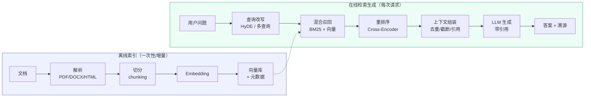
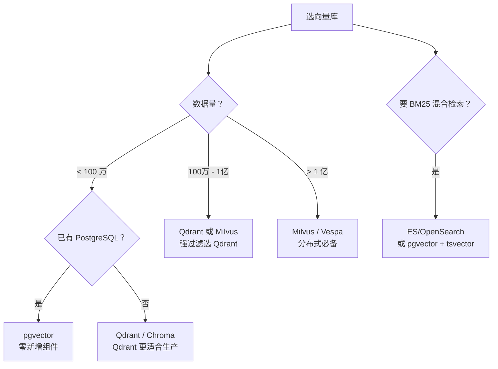
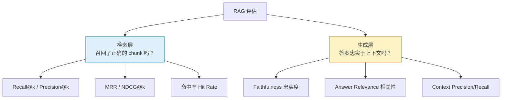
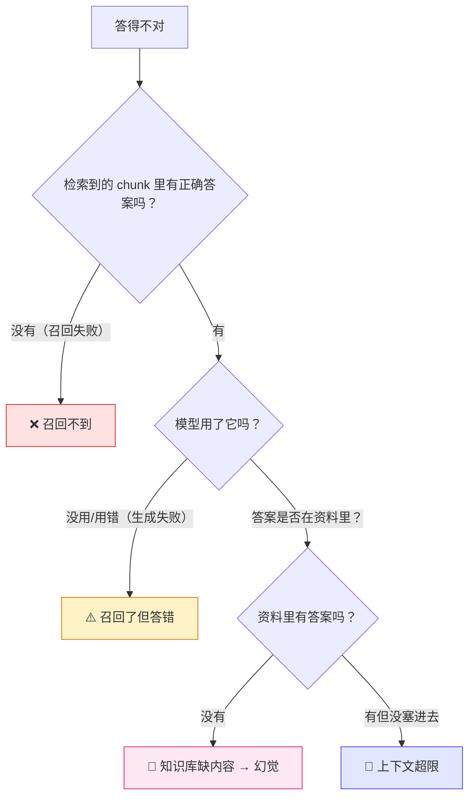

# 03 · RAG 技术全链路

> **这一篇写给谁**：写 Legacy 的我自己，以及会翻这份文档的面试官。
> **目标**：把 RAG 从「LangChain 里五行代码跑通」讲到「每一环的取舍都能说清、每一环的失败都能定位」。RAG 是 LLM 应用里**面试问得最多、也最容易问深**的题目，因为它把「召回评估、系统工程、模型行为」三件事绑在一起。
> **前置知识**：读过 [01 · 大模型基本原理与推理部署](./01-llm-basics.md)，知道 embedding 是把文本变成向量。
> **建议阅读时间**：100 分钟；面试前重点看第 1（决策表）、6（检索质量）、9（失败排查）节。

---

## 0. 一句话说清 RAG 在干什么

**RAG = 把「模型不知道 / 不该编」的问题，转化成「先找到相关原文，再让模型照着原文回答」的问题。**



**整条链路的成败有个残酷的乘法定律：**

```text
端到端正确率 ≈ 召回率 × 重排精度 × 生成忠实度

0.8 × 0.8 × 0.8 = 0.51
```

每一环掉 20%，最终只剩一半。**这就是为什么 RAG 的优化必须用「分段评估」而不是「感觉效果不好就换模型」**——换 embeddding 模型可能只解决 10% 的问题，而问题可能根本出在切分或漏召回上。

---

## 1. 为什么需要 RAG：与微调、长上下文的对比

### 1.1 三种「让模型知道新知识」的路线

| 维度 | **RAG** | **微调（SFT/LoRA）** | **长上下文直塞** |
| --- | --- | --- | --- |
| 知识存在哪 | 外部向量库 | 模型权重 | prompt 里 |
| 知识更新成本 | **改一条数据即可，秒级** | 重训，小时-天级 | 无需更新，但每次要重传 |
| 可溯源 | **强，能给出原文和页码** | 无（说不清从哪学的） | 强 |
| 幻觉控制 | 好（有原文约束） | 差（会自信地编） | 好，但受 lost-in-middle 影响 |
| 每 token 成本 | 中（检索到的上下文） | **最低（知识内化）** | **最高（每次全量塞）** |
| 延迟 | 检索 + 生成（+200-800ms） | 纯生成 | **prefill 极慢，O(n²)** |
| 擅长 | 事实性问答、私有文档问答 | **风格/格式/领域语气的对齐** | 全局推理（总结整本书、跨文档对比） |
| 不擅长 | 需要跨全文推理的任务 | 注入大量新事实（会忘、会串） | 高频请求（成本爆炸） |
| 单条知识的数据成本 | 1 个 chunk | 几十~几百条 QA 对 | 0 |

### 1.2 决策表（这张表面试可以直接画出来）

| 你的问题长这样 | 选 RAG | 选微调 | 选长上下文 |
| --- | --- | --- | --- |
| 「这份 JD 要求几年经验？」（查事实） | ✅ | | |
| 「所有 JD 里，哪些提到了 Rust？」（需要枚举/聚合） | ✅ 但要用 metadata 过滤或结构化查询 | | |
| 「把这份 200 页年报总结成 800 字」（全局推理） | ❌ 会切碎上下文 | | ✅ |
| 「用我们公司的话术风格写一封拒信」（风格对齐） | ❌ | ✅ | |
| 「模型总是把 JSON 格式写错」（格式对齐） | ❌ | ✅（或直接约束解码） | |
| 「我们产品上周改了定价」（时效性事实） | ✅ | ❌ 重训跟不上 | |
| 「回答必须严格引用原文出处」（合规） | ✅ | ❌ | ✅ |
| 「每天 10 万次调用，知识库 5 万条文档」 | ✅ | | ❌ 成本不可接受 |
| 「需要同时对比 30 份简历的差异」（跨文档全局） | 部分可（结构化 + 逐份摘要再聚合） | | ✅（如果塞得下） |

### 1.3 三者的真实关系：不是替代，是分层

工程上最常见的架构是**组合**：

```text
RAG（提供事实） + 微调（提供风格和格式） + 长上下文（处理全局推理）
```

具体到 Legacy：

- **RAG** 负责：简历库、JD 库、面试题库、公司信息的检索。这些是「随时会变」的私有事实。
- **微调** 负责：让它用「面试教练」的口气说话、输出固定格式的面试评估报告。（严格说这也可以用 few-shot + 约束解码搞定，**个人项目优先用 prompt，别上微调**——微调会带来版本管理、评测、部署一整套额外复杂度。）
- **长上下文** 负责：单份简历的深度分析（一份简历 2-5K token，直接塞就行，不需要 RAG）。
- **结构化查询** 负责：「筛选薪资 > 30k 且要求 Rust 的岗位」——这种聚合/过滤问题，让 LLM 生成 SQL/filter 交给数据库做，比向量检索准确得多。

**面试加分表述**：「我不会对所有问题都上 RAG。单文档分析直接塞进上下文更准；结构化筛选交给 SQL 或 metadata filter；只有『从大量非结构化文档里找相关片段』这一类问题才真正需要向量检索。RAG 的定位是模糊语义匹配，不是数据库查询。」

---

## 2. 文档解析与切分

### 2.1 解析：垃圾进，垃圾出

**解析质量决定 RAG 的上限。** 这一步往往被忽略，但一份排版混乱的 PDF 能让下游所有优化归零。

| 格式 | 推荐工具 | 关键坑 |
| --- | --- | --- |
| 文本型 PDF | `PyMuPDF`(fitz)、`pdfplumber` | 分栏文档会串行；页眉页脚要剥离（否则每个 chunk 都带一堆噪声） |
| 扫描型 PDF | `PaddleOCR`、`MinerU`、`RapidOCR` | 必须 OCR，慢；OCR 错字会让 embedding 直接偏 |
| 复杂排版 PDF（论文/财报、双栏、多表格） | **MinerU**、`unstructured`、`marker` | 表格结构丢失是重灾区；公式是灾难 |
| DOCX | `python-docx`、`markitdown` | 要保留标题层级（这是后续切分的关键信号） |
| HTML | `trafilatura`、`readability` | 必须去导航/广告/页脚，正文提取不准会引入大量噪声 |
| Markdown | 直接按 `##` 切 | 最理想的情况，结构化信号天然存在 |
| Excel/CSV | 转成「每行一句话」或序列化成 markdown 表 | 别直接切行，会丢掉表头语义 |

**表格必须特殊处理**，三种做法按优先级：

1. **整表不切**：把一张表作为一个 chunk，并**把表头重复拼到每一行**（"岗位：后端工程师；薪资：30k"）。纯表格切碎后每一行都失去语义。
2. **转成自然语言**：`"AI 工程师岗位要求 3 年经验，薪资 25-40k"`。检索效果通常比原始 markdown 表好，因为 embedder 是在自然语言上训的。
3. **表格摘要**：用 LLM 给表生成一段描述，把描述做 embedding，原始表作为 payload 返回。多一次 LLM 调用，但检索质量最好。

**代码块同理**：按行切成 20 行的片段，函数签名和实现分了家，检索到的内容根本不能用。**做法是按 AST 或按函数/类边界切**（Python 用 `ast` 模块，通用可用 `tree-sitter`），一个 chunk = 一个完整函数。

### 2.2 切分策略对比

| 策略 | 做法 | 优点 | 缺点 | 适用 |
| --- | --- | --- | --- | --- |
| **固定长度** | 每 N 个字符/token 切一刀 | 实现简单、长度均匀 | 会在句子/段落中间截断，语义断裂 | 日志、纯文本流；基线 |
| **递归字符切分** | 按 `\n\n` → `\n` → `。` → ` ` 的优先级递归尝试，尽量在自然边界切 | 简单有效，**默认首选** | 仍不理解语义 | 通用文档 |
| **Token 切分** | 按 tokenizer 计数切（tiktoken） | 长度精确可控（不用担心超模型上限） | 需要 tokenizer，仍会断句 | 对上下文长度敏感的场景 |
| **结构感知切分** | 按 Markdown 标题层级 / HTML DOM / 文档章节切 | **保留语义完整性**，能带 section 路径元数据 | 依赖解析质量，长度可能很不均匀 | 技术文档、规范、README |
| **语义切分** | 算相邻句子的 embedding 余弦相似度，相似度骤降处切 | 语义边界准 | **慢（每句都要 embed）+ 贵**；阈值难调 | 高质量要求、离线批处理 |
| **父子分块**（small-to-big） | 子块（256 token）做检索，命中后返回**父块**（1024 token）给 LLM | **同时解决「检索要精细」和「生成要上下文」** | 需要两级索引和 ID 映射 | **推荐给 RAG 应用** |
| **句子窗口** | 索引单句，命中后带回前后各 k 句 | 检索精度最高 | 索引量爆炸（一句话一个向量） | 精确问答 |
| **命题切分**（proposition） | 用 LLM 把段落拆成独立事实句 | 粒度最细、最自包含 | LLM 成本高 | 研究/高价值语料 |

**父子分块展开讲（这是最实用的技巧）：**

```text
文档 → 父块 P1 (1024 token) → 子块 C1, C2, C3 (各 256 token)
                              ↑ 只把子块做 embedding 入向量库
                              ↑ 每个子块记录 parent_id

检索时：命中 C2 → 返回 P1 给 LLM

收益：小 chunk 让向量更「聚焦」，召回更准；
      大 chunk 让 LLM 有足够上下文，答案更完整。
      实测比单纯 512 token 单一粒度，端到端正确率提升明显。
```

### 2.3 chunk size 与 overlap 的经验值

**没有普适最优，只有起点。但起点很重要：**

| 场景 | chunk size | overlap | 理由 |
| --- | --- | --- | --- |
| 中文通用文档 | **300-500 字** | 50-100 字（10-20%） | 中文一个字约 1-1.5 token，500 字 ≈ 350-750 token |
| 英文通用文档 | 256-512 token | 10-20% | |
| 技术文档 / API 文档 | 按章节，400-800 字 | 小（结构本身是边界） | 结构感知，不需要大 overlap |
| 法律 / 合同 / 医疗 | 按条款，200-400 字 | 0-10% | 条款本身是语义单元，overlap 会引入错误引用 |
| 对话记录 / 会议纪要 | 按话题，500-1000 字 | 100 字 | 话题边界模糊，需要更多 overlap |
| 代码 | 按函数/类 | 0 | 别用字符切 |

**为什么是 256-512 而不是更大或更小？** 三个力量的平衡：

- **太小（<128 token）**：单个 chunk 信息量不足，一句话里「它」指代什么都不知道；向量被噪声主导；一个完整答案被切到 3 个 chunk，任何一个都不完整 → LLM 拿到残缺信息。
- **太大（>1024 token）**：一个向量要表征多个主题，embedding 被**平均化**（这就是所谓的「语义稀释」），检索精度下降；同时 LLM 上下文里塞进大量不相关文本，容易被干扰、更容易忽略中间内容（lost in the middle）。
- **overlap 的作用**：防止「答案刚好跨在两个 chunk 的边界上」导致的漏召回。**但 overlap 不是越大越好**——它会让索引体积和存储成本线性增加，也会让检索结果里出现大量重复片段（浪费上下文预算）。10-20% 是甜点。

**必做的一件事：把 chunk size 当成超参数来调。** 用第 7 节的评测集，跑 256/384/512/768/1024 五档，看 Recall@10 的曲线。**这一步能做出「有数据支撑的工程决策」，是简历上很值钱的一句话。**

### 2.4 元数据设计（决定了后面能做什么）

每个 chunk 除了文本和向量，一定要存：

```python
class Chunk(BaseModel):
    id: str                      # 稳定 ID（用于增量更新去重）
    text: str                    # 子块原文
    parent_id: str | None        # 父块 ID（父子分块用）
    doc_id: str
    source: str                  # 文件名 / URL
    doc_type: str                # resume / jd / interview_qa / company_info
    page: int | None             # 页码（用于引用和溯源）
    section_path: list[str]      # ["第3章", "3.2 薪资结构"]，可拼进 embedding 文本
    user_id: str | None          # 多租户隔离（必做，见失败模式）
    created_at: datetime
    updated_at: datetime         # 用于增量更新和时效性排序
    token_count: int
    hash: str                    # 内容 hash，用于幂等更新
```

**`section_path` 要拼进 embedding 的输入文本**：

```text
"第3章 > 3.2 薪资结构 > 表3-1：各职级薪资范围\n" + chunk_text
```

一行代码，能让「薪资结构」这个主题的检索准确率明显上升，因为 chunk 本身就带上了它所属章节的语义信号。**成本为零，收益为正，没有理由不做。**

---

## 3. Embedding

### 3.1 双塔模型原理

Embedding 模型（bi-encoder / 双塔）的结构：**query 和 document 分别过同一个（或对称的）编码器，各自压成一个固定维度向量，用向量相似度衡量相关性。**

```text
query    —[Encoder]→  q ∈ R^d
document —[Encoder]→  d ∈ R^d
score = cosine(q, d)
```

**为什么必须双塔？** 因为 document 向量可以**离线预计算**。100 万个 chunk 的向量存在库里，线上只编码 1 条 query（约 10-30ms 的 GPU 前向），然后做向量检索（毫秒级）。

**对比 cross-encoder（重排序用的）：**

| | Bi-Encoder（双塔） | Cross-Encoder（交叉编码器） |
| --- | --- | --- |
| 输入 | query、doc 分别编码 | `[query; doc]` 拼在一起送进模型 |
| 交互时机 | 只在最后算余弦（**交互晚**） | 每一层 attention 都能交互（**交互早**） |
| 精度 | 中 | **高（明显更好）** |
| 离线预计算 | ✅ 可以 | ❌ 必须每条 query 现算 |
| 10 万文档排序耗时 | ~10ms（向量检索） | 不可行（要跑 10 万次前向） |
| 用途 | **召回（第一阶段）** | **重排（第二阶段）** |

**这就是「召回-重排」两阶段架构的物理原因**：用便宜的 bi-encoder 把 100 万缩到 100，再用贵的 cross-encoder 把 100 精排到 5。**面试问到「为什么要重排序」，答案就是这个成本和精度的权衡。**

### 3.2 对比学习训练目标

Embedding 模型不是「通用语义相似度」，它是**对比学习训练出来的**，目标是「让相关的 (query, doc) 向量靠近，不相关的拉远」。

主流损失是 **InfoNCE**（in-batch negatives）：

```text
L = - log [ exp(sim(q, d⁺) / τ) / Σ_{d ∈ {d⁺} ∪ N} exp(sim(q, d) / τ) ]
```

拆解：

- `d⁺`：正样本（相关的文档）。
- `N`：负样本集合。**最关键的技巧是 in-batch negatives**：一个 batch 里 B 对 (q, d)，对于某个 q，其余 B-1 个 d 都是「大概率不相关」的，直接免费当负样本。**这让 batch size 直接决定了负样本质量——所以 embedding 训练非常吃 batch（常见 1024-8192）。**
- `τ`（temperature，常取 0.01-0.05）：控制分布的尖锐度。τ 越小，模型越专注把最难的负样本推开（hard negative mining 的效果），但训练也越容易不稳。
- **hard negatives 是效果的分水岭**。随机负样本太容易了，模型学不到细粒度区分。真正有效的 hard negative 是「BM25 能召回但语义不相关」的样本——这也解释了为什么 bge 系列效果比早期模型好那么多：**训练数据里大量用了检索器挖出来的难负例。**

**这对使用者的实践含义：**

1. **embedding 模型只在它的训练分布上强**。拿一个在英文网页上训的模型去 embed 中文技术术语，效果会很差。选型要看它训了什么。
2. **`query:` 和 `passage:` 前缀不是玄学**。bge、E5 等模型的训练数据里有这些指令前缀，**不按格式用会掉点**（尤其 bge，官方明确要求在 query 前加 `"为这个句子生成表示以用于检索相关文章："`）。用 FAISS/检索库时最容易忘这一步。
3. **非对称检索 vs 对称检索**：query→doc 是不对称的，用的是同一个双塔；但 similarity 任务（两个句子是否相似）需要另一套指令。别混用。

### 3.3 中文模型选型

| 模型 | 维度 | 最大长度 | 特点 | 推荐场景 |
| --- | --- | --- | --- | --- |
| **BAAI/bge-large-zh-v1.5** | 1024 | 512 | 中文检索最经典、生态最成熟，C-MTEB 上长期领先 | **中文 RAG 默认首选** |
| BAAI/bge-base-zh-v1.5 | 768 | 512 | large 的轻量版，速度约快 3 倍，效果差 1-2 个点 | 高并发 / 边缘部署 |
| **BAAI/bge-m3** | 1024 | **8192** | 一个模型同时输出 dense + sparse(lexical) + multi-vector(ColBERT)，多语言（100+ 语言），长文本 | **混合检索一把梭，强烈推荐** |
| BAAI/bge-reranker-v2-m3 | - | 8192 | 不是 embedding，是 cross-encoder 重排模型 | 配 bge-m3 用 |
| moka-ai/m3e-base | 768 | 512 | 中文，曾在 C-MTEB 表现好，模型小 | 轻量中文场景 |
| GTE（Alibaba-NLP/gte-large-zh） | 1024 | 512 | 中文效果与 bge 同级 | 备选 |
| **Qwen3-Embedding-0.6B/4B/8B**（2025） | 1024-4096 | 32K | 支持 MRL（可截断维度）、指令感知、多语言，当前 MTEB 榜单强 | 想要 SOTA 且能接受更大模型 |
| text-embedding-3-small | 1536（可降维） | 8191 | OpenAI，便宜（$0.02/1M token），多语言可接受，中文不如 bge 强 | 不想本地部署、预算充足 |
| text-embedding-3-large | 3072（可降维到 256-1024） | 8191 | 效果更好（$0.13/1M token），支持 MRL 降维 | 英文/多语言高质量需求 |
| jina-embeddings-v3 | 1024 | 8192 | 支持任务 LoRA 适配 | 多语言 |

**选型建议（务实版）：**

- **个人项目 / 中文为主** → `bge-m3`。理由：一个模型兼顾 dense + sparse（省掉单独的 BM25 组件）、支持 8K 长文本（不用为长 chunk 单独处理）、Apache 协议可商用、本地跑 0.6B 级别参数量在 CPU 上也能用。
- **要极致检索质量** → `bge-large-zh-v1.5` + `bge-reranker-v2-m3`，经典组合，中文社区大量实战验证。
- **成本敏感** → `text-embedding-3-small` 或本地 `bge-base-zh-v1.5`。
- **别做的事**：用 `text-embedding-ada-002`（老、中文差）；用 BERT 的 `[CLS]` 向量（没做对比学习，效果差得远）。

**自建 vs API 的权衡：**

| | 本地模型 | API |
| --- | --- | --- |
| 首次索引 10 万 chunk | 一张 4090 上约 10-20 分钟 | 约 $2（3-small），但受限流 |
| 增量索引延迟 | 无网络往返，约 10ms/chunk | 100-500ms/chunk |
| 隐私 | ✅ 数据不出内网 | ❌ 简历数据上传（**Legacy 必须注意这点**） |
| 可复现性 | 版本锁定，向量稳定 | 模型可能静默升级，**向量漂移导致必须全量重建** |
| 质量 | 中文场景更好 | 英文/多语言更好 |

**「模型升级要全量重建索引」是个必须提前说的坑**：不同模型（甚至同模型不同版本）的向量空间不可比，**不能混合索引**。所以索引设计要支持「重建 + 双写 + 灰度切换」，并且在元数据里记下 `embedding_model` 和 `embedding_version`。

### 3.4 维度与成本

**存储估算公式：**

```text
向量存储字节数 = N_chunks × d × bytes_per_dim
                 N=chunk 数, d=维度
                 fp32: 4 B/dim   fp16: 2 B/dim   int8: 1 B/dim

100 万 chunk 的实际数字：
  d=1024, fp32:  100万 × 1024 × 4 = 4.1 GB
  d=1024, fp16:  ≈ 2.0 GB
  d=1024, int8:  ≈ 1.0 GB   （PQ 量化后可到 100-200 MB）
  d=1536, fp32:  ≈ 6.1 GB
  d=3072, fp32:  ≈ 12.3 GB
```

**注意：真正的开销不止向量本身。** 还要加上原文（一个 400 字中文 chunk 约 1.2KB UTF-8）、元数据（约 200-500 B）、以及 HNSW 索引结构（图的邻接表，M=16 时约 `N × M × 2 × 4B`，100 万点约 128 MB）。

**实际经验：1 亿字符的中文语料（约 400 万 chunk、d=1024 fp16）总占用约 10-15 GB。** 这个量级单机 PostgreSQL + pgvector 完全装得下。

**「要不要降维」的决策：**

| 维度 | 检索质量 | 存储 | 检索速度 | 何时选 |
| --- | --- | --- | --- | --- |
| 256 | 明显下降（-5-10% Recall） | 1/4 | 快 | 千万级 + 极致成本约束 |
| 512 | 轻微下降（-1-3%） | 1/2 | 较快 | 大规模、质量可接受 |
| **768-1024** | 基线 | 基线 | 基线 | **默认** |
| 1536-3072 | 略好（+0-2%） | 2-3× | 慢 | 中小规模、追求质量 |

**MRL（Matryoshka Representation Learning）** 值得一提：像 `text-embedding-3-*`、bge-m3、Qwen3-Embedding 支持**把前 k 维直接截断使用**（比如 3072 → 512），因为训练时就把「前 k 维要能独立工作」作为约束加进去了。这比 PCA 降维好得多（PCA 要额外训练、且新数据要重新投影）。**面试可讲：MRL 让「同一个索引支持不同精度档位」成为可能。**

### 3.5 归一化与相似度度量

**余弦相似度 vs 点积 vs 欧氏距离：**

```text
cosine(q, d) = (q·d) / (‖q‖‖d‖)
dot(q, d)    = q·d
L2(q, d)     = ‖q - d‖₂
```

**三者在一件事上等价：当所有向量都做了 L2 归一化（‖v‖=1）时**：

```text
‖q - d‖² = ‖q‖² + ‖d‖² - 2q·d = 1 + 1 - 2·q·d = 2 - 2·cos(q,d)
cosine(q,d) = q·d          （因为分母 = 1）
```

所以**归一化后，cosine 单调等价于 dot 单调等价于 L2 距离（反向）**。排序结果完全一致。

**为什么工程上几乎总是「先归一化 + 用内积」？** 因为 `L2` 距离和 cosine 都要额外算范数/开方，而内积是纯粹的矩阵乘，**能直接吃到 GPU/CPU 的 SIMD 和 BLAS 优化，快 20-40%**。FAISS 的 `IndexFlatIP` 就是为此而生的。

**实践规则：**

1. **入库前必须 L2 归一化**，然后统一用内积（IP）。这件事错了会静默出错——不归一化时，范数大的向量（通常长文本）会主导内积排序，导致「检索总是返回长 chunk」。
2. 用 pgvector 时用 `vector_cosine_ops` 建索引，或归一化后用 `<#>`（负内积）。**别混用 `vector_l2_ops` 和归一化向量再指望得到同样的结果**——不会错，但语义上容易混淆。
3. **不要在归一化后又去做任何线性变换**（比如手动缩放），会破坏等价性。

```python
import numpy as np

def normalize(vectors: np.ndarray) -> np.ndarray:
    """L2 归一化，入库前必做"""
    norms = np.linalg.norm(vectors, axis=1, keepdims=True)
    return vectors / np.clip(norms, 1e-12, None)   # 防除零

# 验证三者在归一化后排序一致
a, b, c = normalize(np.random.randn(3, 8))
print("cos:", a @ b)                       # 内积 = 余弦
print("l2 :", np.linalg.norm(a - b))       # sqrt(2 - 2*cos)
print("等价:", np.isclose(np.linalg.norm(a - b)**2, 2 - 2*(a @ b)))
```

---

## 4. 向量索引：HNSW 与 IVF 的原理与调参

### 4.1 为什么需要索引

暴力检索（flat / brute-force）是精确的，复杂度 `O(N × d)`。100 万条 1024 维向量 = 约 10 亿次浮点运算，单次查询几十到几百毫秒。**能接受吗？在 10 万条以内可以，100 万以上就必须上近似索引（ANN）。**

ANN 的核心 tradeoff：**用一点点召回率换取数量级的速度提升。** 常见的「用 1-2% 的召回损失换 10-100 倍速度」是完全值得的。

### 4.2 HNSW：基于图的索引

**原理**：分层的可导航小世界图（Hierarchical Navigable Small World）。

```text
Layer 2 (最稀疏):   A ——————————— E           ← 长跳，快速逼近
Layer 1:            A ——— C ——— E ——— G
Layer 0 (最稠密):   A-B-C-D-E-F-G-H-I-J       ← 全量数据，短跳，精细定位

查询从 Layer 2 的入口点开始，贪心地向最近的邻居跳；
到局部最优后下降到 Layer 1 继续；最后在 Layer 0 精确定位。
```

类比：先坐飞机跨省（顶层稀疏图，跳得远），再坐高铁（中层），最后走路（底层）。

**为什么是「跳表 + 图」的组合？** 因为它达到了 `O(log N)` 的查询复杂度，且**不需要训练**、支持增量插入（IVF 的聚类中心一旦确定，新数据只能塞进最近的桶，或重建）。

**核心参数：**

| 参数 | 含义 | 经验值 | 影响 |
| --- | --- | --- | --- |
| `M` | 每个节点的最大出边数（Layer 0 通常是 2×M） | **16-32**（默认 16） | ↑M 提升召回、增加内存（`≈ N×M×8B`）和建索引时间 |
| `efConstruction` | 建索引时候选列表大小 | **200-500** | ↑ 建索引慢，但图质量更好、召回更高。**对查询速度无影响。** |
| `efSearch`（`ef`） | 查询时候选列表大小 | **64-256** | ↑ 召回↑、延迟↑。**这是运行时唯一可调的旋钮，必须能在线调** |
| `ml` / `level_mult` | 层级分配因子 | `1/ln(M)` 默认即可 | 一般不动 |

**关键工程点：**

- **`efSearch` 是运行时参数**。可以「低 efSearch 快查 → 结果不够就升 efSearch 重查」做自适应；也可以按 SLA 设固定值。**这是 HNSW 最实用的特性。**
- **删除支持差**。早期实现只能标记删除（tombstone），图结构不变，长期增删会导致图质量退化。生产上长时间运行后需要**定期重建索引**——这是很多团队踩过的坑（跑半年后召回率莫名下降）。
- **内存开销大**。HNSW 必须把整个图 + 向量放内存。100 万 × 1024 维 fp32 向量本身 4GB，加上图结构（M=16 时约 128MB）和元数据，实际需要 6-8 GB。
- **`M` 不是越大越好**。M 从 16 涨到 64，召回可能只提升 1-2%，但内存涨 4 倍、建索引慢 3 倍。**16-32 是甜点。**

### 4.3 IVF：基于聚类的索引

**原理**：Inverted File Index。先用 k-means 把向量空间聚成 `nlist` 个簇（每个簇有一个质心），检索时**只搜索距离 query 最近的 `nprobe` 个簇**。

```text
建索引：100 万向量 --k-means--> 4096 个质心（nlist=4096）
        每个向量归入最近的簇，构建倒排表：
        簇 0: [id3, id17, id992, ...]
        簇 1: [id5, id88, ...]

查询：q → 找最近的 nprobe 个质心 → 只在这几个簇的成员里暴力搜索
        扫描量从 N 降到 N × nprobe / nlist
```

**核心参数：**

| 参数 | 含义 | 经验值 | 影响 |
| --- | --- | --- | --- |
| `nlist` | 簇数量 | **`4×sqrt(N)` ~ `16×sqrt(N)`**；100万 → 1024-4096 | ↑ 簇更细，单簇更小，但需要更多 nprobe 才能覆盖；太多会导致很多簇为空 |
| `nprobe` | 查询时扫多少个簇 | **`nlist` 的 1%-10%**；4096 → 40-400 | **召回和延迟的主要旋钮**，线性影响扫描量和延迟 |
| 训练数据 | k-means 需要训练样本 | ≥ 30×nlist | 训练不足会得到很差的质心分布 |

**经验规则（FAISS 官方文档的经典建议）**：`nlist = 4 * sqrt(N)`。100 万 → 4000。`nprobe = 1` 时速度最快但召回约 50-70%；`nprobe = 32`（约 nlist 的 1%）通常能到 90%+。

**HNSW vs IVF 对比：**

| | HNSW | IVF（+PQ 量化） |
| --- | --- | --- |
| 索引类型 | 图 | 倒排 + 聚类 |
| 查询复杂度 | `O(log N)` | `O(nprobe × N/nlist)` |
| 召回（同延迟下） | **更高** | 略低 |
| 内存占用 | **高（必须全内存）** | 低（PQ 量化后可降 10-30 倍） |
| 建索引速度 | 慢（10 万/分钟级） | 快 |
| 增量插入 | 原生支持 | 只能塞进最近的簇，质量会退化 |
| 删除 | 差（tombstone） | 好（倒排表删除即可） |
| 需要训练 | 否 | **是**（k-means） |
| 适合规模 | 10 万 - 1 亿 | **亿级以上**、内存敏感 |

**选型建议**：`N < 100 万` → HNSW（简单、质量好、不用训练）；`N > 1000 万` 且内存受限 → IVF-PQ 或 DiskANN。

### 4.4 量化索引（PQ / SQ / BQ）

**问题**：向量本身太占内存。1000 万 × 1024 维 fp32 = 41 GB，放不进内存。

**Product Quantization (PQ)**：把 d 维向量切成 `m` 段子向量（如 1024 维切成 32 段，每段 32 维），对每段分别做 k-means（`2^nbits` 个质心，通常 nbits=8 即 256 个），**每个子向量只存质心的编号（1 字节）**。

```text
原始：1024 维 × 4 B = 4096 B/向量
PQ(m=32, nbits=8)：32 × 1 B = 32 B/向量      ← 压缩 128 倍！

1000 万向量：41 GB → 320 MB
```

代价：**召回率下降 5-15%**（量化误差）。所以工程上常用 **IVF-PQ + 重排**：用 PQ 快速召回 top-1000（用压缩向量），再用**原始向量**对 top-1000 重新精排（`IndexIVFPQ` 的 `reconstruct` 或把原始向量单独存）。这样速度接近纯 PQ，精度接近 Flat。

| 量化方式 | 压缩比 | 召回损失 | 说明 |
| --- | --- | --- | --- |
| SQ8（标量量化） | 4× | 1-2% | 每维量化到 1 字节，几乎无损，**性价比最高** |
| SQ4 | 8× | 3-5% | |
| **PQ (m=32, 8bit)** | 128× | 5-15% | 需要重排补救 |
| BQ（二值量化） | 32× | 10-20% | 用汉明距离，极快，适合超大规模粗筛 |

**pgvector 的对应能力**：`halfvec`（fp16，省一半）、`bit`（二值）、以及 0.7+ 的 `halfvec` 索引。**别指望 pgvector 有 PQ**——它的定位是「够用的向量检索 + 完整的关系型能力」，不是极致规模。

---

## 5. 向量库选型对比

| 向量库 | 定位 | 索引支持 | 适用规模 | 优点 | 缺点 |
| --- | --- | --- | --- | --- | --- |
| **pgvector** | PostgreSQL 扩展 | HNSW、IVFFlat、halfvec、bit | **100 万以内** | **和业务数据在同一个库，能 JOIN、能用事务**；运维成本零；SQL 生态完整 | 召回/延迟不如专用库；内存管理不精细；超 1000 万吃力 |
| **Milvus** | 分布式专用向量库 | HNSW、IVF、DiskANN、GPU 索引 | **亿级 - 百亿** | 水平扩展、多索引类型、存算分离、功能最全 | 组件多（etcd/MinIO/Pulsar），运维重；小规模是杀鸡用牛刀 |
| **Qdrant** | 专用向量库（Rust） | HNSW + 量化（SQ/PQ/BQ） | 100 万 - 1 亿 | **过滤（filter）性能最好**、payload 支持丰富、单机可跑、REST/gRPC API 优雅 | 生态比 Milvus 小；分布式是较新能力 |
| **Chroma** | 轻量嵌入式 | HNSW（底层 hnswlib） | **10 万以内 / 原型** | 3 行代码跑起来，自带 embedding 函数和文档管理 | 生产能力弱（并发、持久化、权限）；**不适合做作品集的后端核心** |
| **FAISS** | 索引算法库（不是数据库） | 全部（Flat/IVF/HNSW/PQ/GPU） | 任意（你自己管存储） | **性能最强、算法最全、GPU 加速**；Meta 出品 | **没有持久化、没有 CRUD、没有过滤、没有并发服务**——它是库不是库 |
| Elasticsearch / OpenSearch | 搜索引擎 + 向量 | HNSW（kNN） | 千万级 | **原生 BM25 + 向量混合检索**；过滤/聚合强；团队熟悉 | 向量能力弱于专用库；内存开销大 |
| Weaviate / Vespa / LanceDB | 其他 | 各异 | - | Vespa 的排序表达能力极强；LanceDB 是嵌入式列存 | - |

### 选型决策（面试可以直接背的版本）



**给 Legacy 的结论：用 `pgvector`。** 理由要说得出来：

1. **零新增组件**。简历/JD 数据本来就在 PostgreSQL 里，向量放同一个库能**直接 JOIN**——「找出与该 JD 相似度最高的 10 份简历，且这些简历必须属于当前用户、状态为已投递」这种查询，用纯向量库要写两段代码再在应用层做交集，用 pgvector 就是一句 SQL。
2. **规模匹配**。个人项目的量级在 10 万 chunk 以内，pgvector 的 HNSW 完全够用。
3. **面试表达**：「我知道 Milvus 在亿级场景更强，但这个项目的规模用 pgvector 能少一个组件、少一层运维，而且交易和元数据能在一个事务里保证一致性——**过度设计是个人项目最常见的问题**。」这段话展示的是工程判断力，比堆技术栈更有说服力。

**pgvector 实操要点：**

```sql
CREATE EXTENSION IF NOT EXISTS vector;

CREATE TABLE chunks (
    id           BIGSERIAL PRIMARY KEY,
    doc_id       BIGINT NOT NULL REFERENCES documents(id) ON DELETE CASCADE,
    user_id      BIGINT NOT NULL,                 -- 多租户隔离，必须有
    text         TEXT   NOT NULL,
    embedding    vector(1024) NOT NULL,           -- 维度必须写死
    meta         JSONB  NOT NULL DEFAULT '{}',
    section_path TEXT[],
    token_count  INT,
    content_hash TEXT,
    created_at   TIMESTAMPTZ DEFAULT now()
);

-- HNSW 索引：必须显式指定 ops 类，且要和查询用的算子匹配
-- vector_cosine_ops <-> <=>   |   vector_ip_ops <#>   |   vector_l2_ops <->  (注意符号冲突)
CREATE INDEX idx_chunks_embedding ON chunks
USING hnsw (embedding vector_cosine_ops)
WITH (m = 16, ef_construction = 200);

-- 元数据索引：过滤条件一定要有索引，否则会退化成全表扫描
CREATE INDEX idx_chunks_user_type ON chunks (user_id, (meta->>'doc_type'));

-- 查询时动态调 ef_search（运行时旋钮）
SET hnsw.ef_search = 100;
```

```sql
-- 混合检索：向量 + 全文，在一条 SQL 里做 RRF 融合（见 6.1）
-- 注意：一定要用 CTE 先各自 LIMIT 再融合，
-- 否则全表算相似度会慢到不可用（这是 pgvector 最大的坑）
WITH vec AS (
    SELECT id, ROW_NUMBER() OVER (ORDER BY embedding <=> $1) AS rank
    FROM chunks
    WHERE user_id = $2 AND meta->>'doc_type' = ANY($3)   -- 过滤下沉，先缩小范围
    ORDER BY embedding <=> $1
    LIMIT 50
),
bm25 AS (
    SELECT id, ROW_NUMBER() OVER (ORDER BY ts_rank_cd(tsv, q) DESC) AS rank
    FROM chunks, plainto_tsquery('simple', $4) q
    WHERE user_id = $2 AND tsv @@ q
    ORDER BY ts_rank_cd(tsv, q) DESC
    LIMIT 50
)
SELECT c.id, c.text,
       COALESCE(1.0/(60 + vec.rank), 0) + COALESCE(1.0/(60 + bm25.rank), 0) AS rrf_score
FROM vec FULL OUTER JOIN bm25 USING (id)
JOIN chunks c ON c.id = COALESCE(vec.id, bm25.id)
ORDER BY rrf_score DESC
LIMIT 10;
```

**pgvector 三个高频坑：**

1. **`LIMIT` 必须在 CTE 里面**。直接在最终查询里 `ORDER BY embedding <=> x LIMIT 10` 时，如果 `WHERE` 条件的选择度很高，优化器可能放弃索引走全表扫描 + 排序。
2. **过滤 + 向量检索的顺序问题（filter 悖论）**。如果先做向量检索再过滤（post-filter），当过滤条件筛掉 99% 的数据时，top-10 可能只剩 1 条。pgvector 的 HNSW 支持带过滤的查询（迭代扫描 `hnsw.iterative_scan`），但更通用的解法是**把过滤条件尽量前置缩小候选集，或给过滤列建索引**。Qdrant 在这方面做得比 pgvector 好，这是它的一大卖点。
3. **`ef_search` 是会话级的**，要用连接池配置或每次查询前 SET。

---

## 6. 检索质量：RAG 效果的分水岭

> 这一节是全文最重要的一节。**90% 的 RAG 效果问题出在检索，而不是生成。**

### 6.1 混合检索与 RRF 融合

**为什么要混合？** 向量检索和 BM25 的失败模式**互补**：

| | 向量检索（Dense） | BM25（Sparse） |
| --- | --- | --- |
| 匹配方式 | 语义相似 | 词面精确匹配 |
| 强项 | 同义改写（"怎么涨薪" ↔ "调薪机制"）、跨语言、模糊描述 | **专有名词、产品型号、代码标识符、数字**（"GPT-4o"、"Pydantic v2"、"RFC 7519"） |
| 弱项 | **对稀有词、ID、精确术语不敏感**（tokenizer 会把它切碎） | 同义词完全招不回来；短 query 效果差 |
| 是否需训练 | 是（embedding 模型） | 否 |
| 冷启动 | 需要好模型 | 立即可用 |

**实测经验：混合检索相比纯向量检索，召回率通常提升 5-15 个点**，尤其是在有专有名词的垂直领域（招聘、法律、医疗）。**这个收益比换 embedding 模型大得多，而成本几乎为零（BM25 是免费的）。**

**RRF（Reciprocal Rank Fusion）—— 融合多路召回的标准做法：**

```text
RRF_score(d) = Σ_{r ∈ R} 1 / (k + rank_r(d))

R = 各路召回的结果列表
rank_r(d) = d 在第 r 路里的排名（从 1 开始）
k = 平滑常数，论文推荐 60
```

**为什么用 RRF 而不是加权分数求和？**

1. **分数不可比**。BM25 的分数范围是 0-30+，余弦相似度是 0-1，直接加权需要归一化，而不同 query 的分布还不同。
2. **RRF 只用排名，不用分数**，天然免疫分数尺度问题。
3. **k=60 的作用**：让排名靠前的结果差距不至于过大（rank 1 得 1/61，rank 2 得 1/62，几乎一样），从而「多路都靠前」比「单路第一」更重要。**这正是我们想要的：多个检索器都认可的结果更可信。**

**调权重**：如果某一路明显更强，可以用加权 RRF：`Σ w_r / (k + rank_r(d))`，`w_dense = 2.0, w_bm25 = 1.0` 是常见的起点。

### 6.2 查询改写

用户的问题往往**不是好的检索 query**。三种主流技术：

**(1) HyDE（Hypothetical Document Embeddings）**

思路：**别用 query 去找文档，用「假想的答案」去找文档。**

```text
用户问："RAG 里怎么解决召不回专有名词的问题？"
        ↓ LLM 生成假想答案（不需要正确！）
假想答案："可以使用混合检索，把 BM25 和向量检索的结果用 RRF 融合……"
        ↓ 用这个假想答案去检索
命中的真实文档远比用原始问题检索更相关
```

**为什么有效？** Query 和 document 的**长度和文体分布不同**（query 是短问句，document 是长陈述）。用 query 的向量去匹配 document 的向量存在「模态鸿沟」。假想答案在**文体上和真实文档一致**，向量距离更近。

**代价**：多一次 LLM 调用（约 300-800ms + token 成本）。**踩坑**：假想答案可能包含错误信息，把它也塞进最终上下文会导致幻觉——**HyDE 生成的文本只用于检索，绝不能进上下文。**

**(2) 多查询生成（Multi-Query）**

让 LLM 把一个问题改写成 3-5 个不同角度的 query，分别检索后 RRF 融合。

```text
原问题："这份简历适合投这个岗位吗？"
   ↓
改写 1："该岗位的技能要求有哪些"      → 召回 JD 要求
改写 2："该候选人的工作经历和技术栈"  → 召回简历内容
改写 3："岗位要求与候选人经历的匹配点" → 召回匹配分析
   ↓ 三路检索 + RRF 融合
```

**收益**：提升召回率（覆盖不同表述）。**代价**：N 倍检索开销 + 一次 LLM 调用。**适合**：query 复杂、多意图的场景。**不适合**：简单事实问题（纯增加延迟）。

**(3) 查询分解 / Step-back**

- **分解（Decomposition）**：「A 和 B 的区别是什么」→ 拆成「A 是什么」「B 是什么」，分别检索。
- **Step-back**：「GPT-4 的上下文窗口是多少」→ 先问一个更抽象的问题「GPT-4 的技术规格」，用抽象问题的答案作为检索上下文。适合问题太具体、文档里没有直接对应表述的情况。

**工程上最重要的一条：查询改写的收益必须用评测集验证。** 它很容易变成「多花 800ms 和多 2000 token，召回率 +2%」。**建议：先用简单的规则（把对话历史压缩成一个独立问题，即 query rewriting for conversational RAG）——这个基础动作的收益最大且最便宜，别一上来就上 HyDE。**

### 6.3 元数据过滤

**这是最被低估、性价比最高的优化。**

用户问「我投过的字节跳动的岗位」，正确做法**不是**让向量检索去理解「我投过的」——向量检索不该做结构化筛选。

```python
# ❌ 错误：全靠语义检索
results = vector_search(query="我投过的字节跳动的岗位", top_k=10)

# ✅ 正确：LLM 解析出结构化条件，先过滤再检索
filters = {"user_id": current_user.id,      # 租户隔离（安全！）
           "status": "applied",
           "company": "字节跳动"}
results = vector_search(query=..., filters=filters, top_k=10)
```

**过滤的两种执行顺序（filter 悖论）：**

| | Pre-filter | Post-filter |
| --- | --- | --- |
| 做法 | 先按条件筛出候选集，再在候选集里做向量检索 | 先向量检索 top-K，再过滤掉不符合的 |
| 优点 | 结果一定满足条件 | 实现简单（很多库只支持这个） |
| 缺点 | 候选集小的时候可能退回暴力搜索 | **过滤条件筛掉 99% 时，top-10 可能一条不剩** |
| 何时用 | 过滤后候选仍 > 1 万 | 过滤条件宽松 |

**生产上的正确姿势**：LLM 负责把自然语言转成结构化 filter（这是 Function Calling 的绝佳应用，见 01 篇第 7 节），然后**根据过滤选择性选择策略**：选择性低（过滤后仍有很多）→ pre-filter；选择性高（过滤后很少）→ 直接 SQL 查出来走暴力检索。

### 6.4 重排序（Cross-Encoder Rerank）

**这是 RAG 里 ROI 最高的单点优化之一。**

**原理**：用 cross-encoder 把 `[query, doc]` 拼在一起过一遍 Transformer，输出的相关性分数是**逐层充分交互**得到的，远准于双塔的「先各自编码再算余弦」。

```python
# 第一阶段：便宜的双塔 + 向量检索，把 100 万缩到 50
candidates = vector_search(query, top_k=50)

# 第二阶段：贵的 cross-encoder 精排，把 50 缩到 5
from FlagEmbedding import FlagReranker
reranker = FlagReranker('BAAI/bge-reranker-v2-m3', use_fp16=True)

pairs = [(query, c.text) for c in candidates]
scores = reranker.compute_score(pairs, normalize=True)
top5 = [c for c, s in sorted(zip(candidates, scores), key=lambda x: -x[1])[:5]]
```

**收益的量化（经验值）：**

| 指标 | 仅向量检索 | + Rerank | 提升 |
| --- | --- | --- | --- |
| Recall@5 | 62% | 81% | **+19 点** |
| MRR | 0.55 | 0.74 | +35% |
| 端到端答案正确率 | 61% | 78% | +17 点 |
| 延迟 | +0ms | **+80-250ms**（50 条，GPU） | 需权衡 |

**关键工程决策：**

| 决策点 | 建议 |
| --- | --- |
| 召回多少条给 rerank？ | **20-50 条**。太少重排无意义；太多延迟线性上升（cross-encoder 是 O(n) 次前向） |
| 重排后留几条？ | **3-8 条**。取决于 chunk 大小和上下文预算。经验：总 token 控制在 2000-4000 |
| 用哪个模型？ | 中文：`bge-reranker-v2-m3`（多语言、8K 长度）；轻量：`bge-reranker-base`；英文：`ms-marco-MiniLM-L-6-v2` |
| 延迟预算？ | 50 条 + bge-reranker-v2-m3 在 4090 上约 80-150ms；CPU 上会到 1-2 秒，**CPU 部署要减到 20 条或用更小的模型** |
| 要不要做阈值截断？ | **要**。如果所有 rerank 分数都低于阈值（如 0.3），说明**知识库里没有相关内容**，此时应该回复「资料中没有找到」，而不是硬塞不相关的内容让模型编。**这是控制幻觉最有效的一招。** |

**比 rerank 更便宜的替代方案（预算紧张时）**：LLM 直接打分（把 20 条候选和问题一起给 LLM，让它排序输出 ID）。一次调用搞定，质量接近 cross-encoder，但慢且贵，适合离线。

### 6.5 上下文组装的细节

检索完不是直接拼接就完事：

| 问题 | 处理方式 |
| --- | --- |
| 重复内容（同一父块下的多个子块命中） | 按 `parent_id` 去重合并 |
| 顺序 | **把最相关的放最前面和最后面**（因为 lost-in-the-middle），别按原始文档顺序 |
| 长度超限 | 按 rerank 分数截断（**不是按文档顺序截**）；并留出 30% 预算给对话历史和 system prompt |
| 引用标注 | 每条上下文加编号 `[1] [2]`，system prompt 里要求「引用时标注编号」 |
| 元数据提示 | 每条前面加上 `【来源：简历.pdf 第 3 页】`，让模型能引用来源 |
| 无关内容 | **宁缺毋滥**。塞 3 条高相关的 > 塞 10 条中等相关的。多出来的噪声会让模型分心、产生幻觉 |

**上下文模板示例：**

```text
你是一个求职助手。请**仅**根据下面提供的资料回答问题。

规则：
1. 如果资料中没有足够信息，直接回答"根据现有资料无法确定"，不要推测。
2. 引用资料时用 [编号] 标注，例如 [1]。
3. 不要编造资料中没有的数字、公司名或技术栈。

资料：
[1] 来源：resume_2024.pdf 第 2 页
候选人于 2021-2023 年在字节跳动担任后端工程师，主导了…

[2] 来源：jd_bytedance_ai.md
岗位要求 3 年以上后端经验，熟悉 Python 和分布式系统…

问题：这位候选人符合该岗位要求吗？

回答：
```

注意规则 1 的措辞——**「如果资料中没有足够信息，直接回答无法确定」这一句能显著降低幻觉率，且成本为零。** 很多团队不做这一步，然后抱怨模型爱编。

---

## 7. 评估：怎么知道 RAG 有没有变好

> **没有评测集的 RAG 优化 = 瞎调。** 这是面试里最能区分「做过 demo」和「做过项目」的问题。

### 7.1 分层评估的框架



**为什么要分层？** 因为「答案错了」有两种完全不同的原因，处理方式也完全不同：

- 检索层问题（答案的原文根本没被召回来）→ 优化切分、embedding、混合检索、rerank
- 生成层问题（原文召回了但模型没用好）→ 优化 prompt、降低 temperature、换更强的模型

**Agent 项目里如果只有一个端到端指标，你永远不知道该改哪。**

### 7.2 检索层指标（公式 + 直觉）

```text
设：相关文档集合 = R (relevant)，检索返回的前 k 条 = A_k

Recall@k    = |R ∩ A_k| / |R|              "该召回的有多少被召回了"
Precision@k = |R ∩ A_k| / k                "召回的里面有多少是对的"
Hit Rate@k  = 1 if R ∩ A_k ≠ ∅ else 0      "top-k 里有没有命中至少一条"（最宽松）
MRR         = 1/|Q| Σ_q 1/rank_q           "第一条正确答案排在第几位"（rank 是第一条相关的排名）
NDCG@k      = DCG@k / IDCG@k               "考虑了相关性等级和位置衰减"
  DCG@k     = Σ_{i=1..k} (2^{rel_i} - 1) / log₂(i + 1)
```

**该看哪个？**

| 指标 | 适用 | 说明 |
| --- | --- | --- |
| **Recall@k** | **RAG 的第一指标** | 因为 RAG 是「先召回再重排」，召回阶段的目标就是**别漏**。RAG 场景下召回层应该看 Recall@20/50 而不是 Precision |
| MRR | 单答案场景 | 「标准答案只有一个 chunk」时最直观 |
| NDCG@k | 相关性有等级 | 当 chunk 有「完全相关 / 部分相关 / 不相关」多档标注时用 |
| Precision@k | 重排层评估 | 重排后的 top-5 应该 precision 很高 |

**关键认知：RAG 的召回层要「宁滥勿缺」，重排层要「宁缺毋滥」。** 所以召回评估看 Recall@50（目标 > 90%），重排评估看 NDCG@5 / Precision@5（目标 > 80%）。**这两个目标分开看，别用一个指标衡量整条链路。**

### 7.3 生成层指标

| 指标 | 定义 | 怎么算 | 关注什么 |
| --- | --- | --- | --- |
| **Faithfulness（忠实度）** | 答案是否**只**基于给定上下文，没有编造 | 把答案拆成若干断言，逐条判断能否从上下文推出；`= 可推出断言数 / 总断言数` | **幻觉检测。这是 RAG 最重要的生成指标** |
| **Answer Relevance（答案相关性）** | 答案是否切题（不跑题、不答非所问） | 用答案反推几个可能的问题，算与原问题的相似度 | 答非所问、答得太空泛 |
| **Context Precision** | 召回的上下文里,有用的排得靠不靠前 | `Σ (precision@k × rel_k) / 相关总数` | 重排质量 |
| **Context Recall** | 标准答案里的信息点，有多少能在上下文里找到 | `上下文覆盖的断言数 / 标准答案断言数` | 召回质量 |
| **Answer Correctness** | 与标准答案的事实一致性 | LLM 抽取事实点比对 + 语义相似度加权 | 端到端正确性 |

**工具**：`RAGAS`（最常用，实现了上面大部分指标）、`TruLens`、`DeepEval`、`ARES`。

**LLM-as-Judge 的坑（必须主动说，否则显得只会调库）：**

1. **位置偏好**：LLM 倾向于选第一个/最后一个选项。评测时**要交换顺序算两次取平均**。
2. **长度偏好**：LLM 倾向于给更长的答案更高分。要控制答案长度或用长度归一化。
3. **自己评自己有偏**：用 GPT-4 评 GPT-4 的输出会偏高。**尽量用不同家族的模型当 judge**，或至少用更强的模型评更弱的。
4. **不稳定**：temperature 要设 0；同一个样本评 3 次看一致性，一致性低于 80% 说明指标定义太模糊。
5. **无法评「我不知道」**：很多 judge prompt 没定义「正确地拒答」应该算好还是坏。**对 RAG 必须显式处理这种情况**（拒答且确实是资料里没有 → 满分）。

### 7.4 搭一个最小评测集（落地步骤）

**这是我在 Legacy 里要做的具体事情：**

```python
# eval/dataset.jsonl —— 手工标注 50-100 条
{"question": "字节跳动这个 AI 岗位要求几年经验？",
 "gold_chunk_ids": ["jd_bytedance_ai#chunk_3"],       # 标准答案所在的 chunk（检索评估用）
 "gold_answer": "要求 3 年以上后端开发经验，有 LLM 应用经验优先。",  # 生成评估用
 "difficulty": "easy",
 "category": "fact_lookup"}                            # 分类统计，定位问题类型
```

**搭建步骤（1 天的工作量，收益巨大）：**

1. **从真实问题出发，别自己编**。收集 30-50 个你实际会问的问题。编出来的问题往往比真实问题「更规整」，会高估系统能力。
2. **覆盖不同难度**：
   - `fact_lookup`（单一事实）：30%
   - `multi_chunk`（需要跨多个 chunk 综合）：30%
   - `unanswerable`（知识库里没有答案，**必须测！**）：20%
   - `ambiguous`（表述模糊、需要澄清）：10%
   - `keyword_heavy`（含专有名词/型号/数字，测 BM25）：10%
3. **标注 gold chunk ids**：用 `top_k=50` 检索一次，人工从候选里挑出真正相关的。**这一步最耗时但也最值得**——它让检索层评估成为可能。
4. **建一个对比脚本**：

```python
import json
from dataclasses import dataclass

@dataclass
class EvalResult:
    recall_at_50: float
    ndcg_at_5: float
    faithfulness: float
    answer_correctness: float
    avg_latency_ms: float
    avg_cost_tokens: float

def evaluate(config: dict, dataset_path: str) -> EvalResult:
    """config 里放 chunk_size / embed_model / use_bm25 / use_rerank / top_k 等开关"""
    dataset = [json.loads(l) for l in open(dataset_path, encoding="utf-8")]
    hits, ndcgs, faiths, corrects, latencies, tokens = [], [], [], [], [], []

    for item in dataset:
        retrieved = retriever.search(item["question"], config)   # 返回 chunk id 列表
        gold = set(item["gold_chunk_ids"])
        hits.append(len(gold & set(retrieved[:50])) / len(gold) if gold else 1.0)
        ndcgs.append(ndcg_at_k(retrieved[:5], gold, k=5))

        if item.get("gold_answer"):
            answer = generator.answer(item["question"], retrieved[:5], config)
            faiths.append(judge_faithfulness(answer, retrieved[:5]))   # RAGAS
            corrects.append(judge_correctness(answer, item["gold_answer"]))
        latencies.append(...); tokens.append(...)

    return EvalResult(mean(hits), mean(ndcgs), mean(faiths), mean(corrects),
                      mean(latencies), mean(tokens))
```

5. **用消融实验（ablation）驱动优化**，把结果记成一张表——**这张表就是简历和面试里最有说服力的东西**：

| 配置 | Recall@50 | NDCG@5 | Faithfulness | P95 延迟 | 说明 |
| --- | --- | --- | --- | --- | --- |
| 基线（固定切分 512 + 纯向量） | 0.71 | 0.52 | 0.79 | 420ms | |
| + 递归切分 400/overlap 80 | 0.78 | 0.58 | 0.81 | 430ms | 切分影响比想象中大 |
| + 父子分块 | 0.81 | 0.63 | 0.86 | 450ms | 生成层提升明显 |
| + 混合检索（BM25 + RRF） | **0.89** | 0.68 | 0.87 | 480ms | **专有名词类问题提升最快** |
| + bge-reranker-v2-m3 | 0.89 | **0.81** | 0.89 | 620ms | 重排层收益最大 |
| + query rewriting（多轮） | 0.91 | 0.83 | 0.90 | 780ms | 边际收益递减，延迟代价大 |
| + 阈值拒答 | 0.91 | 0.83 | **0.93** | 620ms | 幻觉率显著下降 |

**这张表的叙述方式（面试）：**
> 「我给 RAG 建了 80 条标注评测集，包含 20% 的不可回答问题和 10% 的专有名词问题。做消融后发现：混合检索对含型号/数字的问题提升最大（Recall@50 从 0.78 到 0.89）；rerank 主要提升 NDCG@5（0.68 → 0.81）但增加了 140ms 延迟；多查询改写只带来 2 个点、却多花 160ms，所以我最终没上。最后加入基于 rerank 分数的拒答阈值，faithfulness 从 0.89 提到 0.93。**我砍掉了收益不划算的优化。**」

最后这句话是关键——展示你会做**成本收益权衡**，而不是无脑堆技术。

---

## 8. 进阶范式

| 范式 | 核心思路 | 解决什么 | 代价 |
| --- | --- | --- | --- |
| **Self-RAG** | 模型自己生成**反思 token**：`[Retrieve]` 决定要不要检索、`[IsRel]` 判断召回是否相关、`[IsSup]` 判断答案是否有支撑、`[IsUse]` 判断是否有用。按需检索、按需重试 | 简单问题不必检索（省延迟）；检索结果不相关时自动重试 | 需要专门微调模型；多轮生成成本高 |
| **CRAG（Corrective RAG）** | 加一个**检索评估器**给召回质量打分：Correct → 直接用；Incorrect → 丢弃并转为 **Web 搜索**；Ambiguous → 两者结合 | 知识库覆盖不到时能兜底（走网络搜索） | 多一个评估模型 + 可能的外部 API 依赖 |
| **GraphRAG** | 用 LLM 从文档中抽取**实体和关系**构建知识图谱，检索时沿图遍历（社区摘要 + 多跳） | **多跳推理**（"A 的 CEO 的母校在哪"）和**全局问题**（"整个语料的主要主题是什么"）。向量检索对这些无能为力 | 建图成本极高（全量 LLM 抽取）；增量更新困难；微软实现一次全量 index 很贵 |
| **Agentic RAG** | 把检索当作**工具**交给 Agent，由 Agent 决定「检索几次、用什么 query、要不要换工具、结果够不够」 | 复杂多步问题；可组合多个数据源（SQL + 向量 + Web） | 延迟和成本成倍增长；需要控制最大迭代次数防止死循环 |
| **RAG-Fusion** | 多查询 + RRF（前面 6.2 讲过） | 召回覆盖度 | N 倍检索开销 |
| **Contextual Retrieval**（Anthropic 2024） | 索引前用 LLM 给每个 chunk 生成一段「它在整篇文档中的上下文」并**拼进 chunk 开头** | 解决「chunk 离开文档就失去指代」的问题（"该公司" 指哪家） | 索引期一次 LLM 调用/chunk（贵但一次性）。**实测检索失败率降 35%，加 rerank 后降 67%。性价比很高** |

**对我的项目的建议：**

- **现在做**：混合检索 + rerank + 拒答阈值。这是基础盘。
- **可以试**：Contextual Retrieval（索引期一次性成本，收益明确且好讲）。
- **暂不做**：GraphRAG（成本高、和招聘场景的多跳需求不匹配）、Self-RAG（要微调模型）。
- **面试聊到就讲**：Agentic RAG 是 Legacy 的天然形态——「分析这份简历和这个岗位的匹配度」本身就需要多轮检索（先查岗位要求、再查简历经历、再查面试题），所以我不是把 RAG 做成固定 pipeline，而是**把检索封装成 tool 交给 Agent 编排**。这正好把两篇文档串起来了。

**面试时对 Self-RAG 的正确表述**：「Self-RAG 的核心价值是**把『要不要检索』也变成一个学习出来的决策**，而不是无条件检索。我在工程上用一个更轻的近似：先用一次小模型判断问题类型，事实类才走 RAG，闲聊和通用知识直接答。效果接近但对基础设施要求低得多。」

---

## 9. 常见失败模式与排查清单

> **这一节是面试的「你踩过什么坑」问题的弹药库。** 建议直接照着这张表准备故事。

### 9.1 四类失败模式



### 9.2 排查清单

**症状 A：召回不到（检索结果里没有正确内容）**

| 可能原因 | 怎么验证 | 修复 |
| --- | --- | --- |
| 知识库里根本没有这条知识 | 人工 grep 原始文档 | 补数据（这不是技术问题） |
| chunk 切得太碎，答案跨了边界 | 打印命中的 chunk 看是否残缺 | 加大 chunk / 加 overlap / 父子分块 |
| chunk 太大，语义被稀释 | 看命中 chunk 是否主题混杂 | 缩小 chunk；结构感知切分 |
| query 与 document 表述差异大 | 人工看 query 和正确 chunk 的措辞 | 混合检索（BM25 补精确匹配） |
| **embedding 模型不匹配语言/领域** | 用几个已知相关的对，直接算相似度看排序 | 换中文模型（bge-m3） |
| **忘了给 query 加 bge 的指令前缀** | 看代码 | 加前缀（bge 必须加） |
| **向量没归一化就用了内积** | 检查入库流程 | 归一化 |
| 检索的 top_k 太小 | 把 top_k 提到 100 看有没有 | 提 top_k + rerank |
| 过滤条件太严 | 打印 filter 后的候选数 | 放宽 filter，或改 pre/post-filter 策略 |
| 多租户隔离写错，搜到了别人的数据 | 用不同 user_id 测试 | **修 SQL（这是安全问题，优先级最高）** |

**症状 B：召回了但答错（上下文里有正确答案，模型却没用）**

| 可能原因 | 怎么验证 | 修复 |
| --- | --- | --- |
| **正确答案被埋在中间位置**（lost in the middle） | 把正确 chunk 移到第一个位置重试 | 按相关性排序并把最相关的放头尾；减少 top_k |
| 噪声太多，模型被干扰 | 只保留 top-1 上下文重试 | 减少上下文条数；加 rerank |
| **prompt 没强调「只依据资料回答」** | 看 system prompt | 加约束 + 要求引用编号 |
| temperature 太高 | 设成 0.1 重试 | 降到 0-0.3 |
| 上下文里的相关内容是**过期的** | 检查文档时间 | 加时间过滤 / 时效性加权 |
| 检索到的是**相似但相反**的内容 | 人工看命中内容 | 需要 rerank；或 chunk 太碎导致丢了否定词 |
| 模型本身能力不足（小模型） | 换更大的模型测一次 | 换模型 or 拆解任务 |
| 上下文体例不一致 | 看 chunk 里是否有 OCR 乱码 | 修解析 |

**症状 C：幻觉（编造资料里没有的内容）**

| 可能原因 | 怎么验证 | 修复 |
| --- | --- | --- |
| **知识库里没有，但检索硬塞了不相关内容** | 看 rerank 分数是否全部很低 | **加分数阈值拒答（最有效）** |
| prompt 没说「不知道就说不知道」 | 看 prompt | 加这句话，成本为零 |
| 模型把参数化知识混进来了 | 问一个资料里没有的问题看它怎么答 | 强约束 + few-shot 示例展示「拒答」的样子 |
| 要求模型做推理，但资料只给了事实 | 看问题类型 | 明确区分「抽取」和「推理」，推理类要降低期望或加思维链 |
| 引用编号是模型编的 | 校验引用的编号是否存在 | 后置校验：解析答案里的 `[n]`，核对是否在上下文范围内 |

**症状 D：上下文超限 / 被静默截断**

| 可能原因 | 怎么验证 | 修复 |
| --- | --- | --- |
| **Ollama 默认 num_ctx=2048 静默截断** | 打印实际送入的 token 数 | Modelfile 里设 `num_ctx 16384`（01 篇 6.2 有讲） |
| top_k 太大 × chunk 太大 | 算 `top_k × chunk_tokens` | 动态预算：按 rerank 分数填，直到预算用完 |
| 对话历史无限增长 | 看 messages 长度 | 滑动窗口 + 历史压缩（把旧对话摘要成一个 system 消息） |
| 工具返回了巨型 JSON | 打工具返回值长度 | 工具侧截断到 2000 字以内 |
| 用了长上下文模型但没算 KV Cache | 按 01 篇 3.2 的公式算 | 限制 max_model_len，或减少检索条数 |

### 9.3 一个可复用的排查脚本

**出问题时不要猜，把中间结果打出来：**

```python
async def debug_rag(question: str, verbose: bool = True) -> dict:
    """RAG 全链路可观测性：每一步都留痕，这是排障的基础设施"""
    trace = {"question": question, "steps": {}}

    # 1) 查询改写
    rewritten = await rewrite_query(question)
    trace["steps"]["rewrite"] = {"input": question, "output": rewritten}

    # 2) 召回（分别看每一路，别只看融合结果！）
    dense = vector_search(rewritten, top_k=50)
    sparse = bm25_search(rewritten, top_k=50)
    fused = rrf_fuse([dense, sparse])
    trace["steps"]["retrieve"] = {
        "dense_top5": [(c.id, round(c.score, 4)) for c in dense[:5]],
        "sparse_top5": [(c.id, round(c.score, 4)) for c in sparse[:5]],
        "fused_top10": [c.id for c in fused[:10]],
        "dense_only_ids": set(c.id for c in dense[:20]) - set(c.id for c in sparse[:20]),
        # ↑ 只看 dense 召回的（说明是 BM25 的盲区）和反之，能立刻定位是哪一路的问题
    }

    # 3) 重排
    reranked = await rerank(rewritten, fused[:50])
    trace["steps"]["rerank"] = {
        "top5": [(c.id, round(c.score, 4)) for c in reranked[:5]],
        "score_range": (min(s for _, s in reranked), max(s for _, s in reranked)),
        # ↑ 如果最高分也很低，说明知识库里没有相关内容 → 应该拒答
    }

    # 4) 拒答判断
    if reranked and reranked[0][1] < RERANK_THRESHOLD:      # 经验值 0.3-0.4
        trace["steps"]["decision"] = "reject: 无相关内容"
        return {**trace, "answer": "根据现有资料无法确定。", "rejected": True}

    # 5) 上下文组装
    context = build_context(reranked[:5])
    prompt_tokens = count_tokens(context)
    trace["steps"]["context"] = {
        "num_chunks": len(reranked[:5]),
        "prompt_tokens": prompt_tokens,
        "budget": MAX_CONTEXT_TOKENS,
        "truncated": prompt_tokens > MAX_CONTEXT_TOKENS,   # 超限必须显式告警，不能静默截断
    }

    # 6) 生成
    answer = await generate(question, context)
    trace["steps"]["generate"] = {
        "answer": answer,
        "cited_ids": parse_citations(answer),   # 校验引用的编号是否存在
    }

    if verbose:
        print(json.dumps(trace, ensure_ascii=False, indent=2))
    return {**trace, "answer": answer}
```

**这个 `debug_rag` 本身就是简历上的一个加分项**：说明你不是「跑通了就完事」，而是建了可观测性。面试时说「我为 RAG 链路写了全链路 trace，能打印每一路召回的差异，所以定位问题很快」，比说「我调过很多参数」有说服力得多。

---

## 10. 面试高频问题清单（带答案要点）

**Q1. RAG 和微调怎么选？**
看知识属性和变更频率。RAG 适合：事实性知识、频繁更新、需要溯源、私有数据、量大的文档库。微调适合：风格/格式/输出规范的对齐，以及把「怎么答」的能力内化。**注入新事实优先 RAG**——微调注入事实不可靠（会忘、会串、无法溯源），且更新要重训。两者可以组合：RAG 给事实，微调给风格。另外长上下文不是替代方案：token 成本 O(n)、prefill O(n²)、lost-in-the-middle，成本上不如 RAG。

**Q2. 为什么 RAG 要做「召回 + 重排」两阶段？**
因为精度和成本是跷跷板。Bi-encoder 双塔可以离线预计算 doc 向量，线上只编码 query，能毫秒级从 100 万缩到 100；但它 query 和 doc 只在最后算余弦交互，精度有限。Cross-encoder 把 query 和 doc 拼起来过模型、逐层充分交互，精度高得多，但每条都要现算前向，10 万文档不可能。所以用便宜的做召回、贵的做精排。典型配置：向量 top-50 → cross-encoder → top-5。

**Q3. chunk size 怎么定？**
没有理论最优，但有经验起点和调试方法。中文通用文档从 300-500 字起步、overlap 10-20%。太小的 chunk 信息量不足、指代丢失；太大的 chunk 语义被平均化、检索精度下降、还挤占上下文。**关键是把它当超参数用评测集扫一遍**（256/384/512/768/1024 五档看 Recall@10）。更优的做法是父子分块：子块 256 检索、返回父块 1024 给 LLM，同时满足「检索要精细」和「生成要上下文完整」。表格和代码必须特殊处理——表格整表不切且重复表头，代码按 AST/函数边界切。

**Q4. 为什么用 RRF 融合，而不是分数加权求和？**
因为不同检索器的分数**不可比**：BM25 是无上界的对数分数，余弦相似度在 0-1。归一化之后不同 query 的分布也不同，加权求和需要大量调参且不稳定。RRF 只用排名 `Σ 1/(k + rank)`，k=60，天然免疫分数尺度问题，且「k=60 让相邻排名差距很小」这个特性正好实现了我们想要的：多路都排前面 > 单路排第一。实现零成本、无需调参。

**Q5. 混合检索为什么有效？**
因为 dense 和 sparse 的失败模式互补。向量检索对语义改写好（"怎么涨薪" ↔ "调薪机制"），但对稀有词/专有名词/型号/数字不敏感（tokenizer 会把它切碎）。BM25 反之：精确匹配强，但同义词完全招不回。招聘、法律、医疗这类含大量专有名词的垂直领域，混合检索通常能带来 5-15 个点的召回提升，而成本几乎为零。

**Q6. 向量归一化后 cosine、dot、L2 有区别吗？**
没有排序区别。数学上 `‖q-d‖² = 2 - 2·cos(q,d)`（当 ‖q‖=‖d‖=1），三者单调等价，排序结果完全一致。工程上统一先 L2 归一化再用内积，因为内积是纯矩阵乘，能吃到 BLAS/SIMD 优化，比算 L2 开方或算余弦分母快 20-40%。**不归一化是隐性 bug**：范数大的向量（通常是长 chunk）会主导内积排序，导致检索总返回长文本。

**Q7. HNSW 和 IVF 的区别？参数怎么调？**
HNSW 是分层可导航小世界图，查询 `O(log N)`，召回高、不支持训练、原生支持增量，但内存占用大、删除支持差（tombstone，长期增删后需重建）。IVF 先用 k-means 聚 `nlist` 个簇，查询只扫最近 `nprobe` 个簇，内存小、删除好，但要训练、召回略低。参数：HNSW 的 `M=16-32`（影响内存和召回）、`efConstruction=200-500`（只影响建索引）、`efSearch=64-256`（**运行时旋钮，必须能在线调**）。IVF 的 `nlist ≈ 4√N`、`nprobe` 取 nlist 的 1%-10%。**10 万到 100 万选 HNSW，亿级以上内存受限选 IVF-PQ + 重排。**

**Q8. 向量库怎么选？**
按规模和现有技术栈。`< 100 万`且已有 PostgreSQL → pgvector（零新组件，能和业务表 JOIN、能事务）；`100 万-1 亿` → Qdrant（过滤性能最好）或 Milvus；`> 1 亿` → Milvus/Vespa 分布式。需要原生 BM25 混合检索 → ES/OpenSearch。Chroma 只适合原型，FAISS 是算法库不是数据库（无持久化、无 CRUD）。**关键是要说得出「我的项目规模用 pgvector 就够了，多引入一个组件是过度设计」。**

**Q9. 为什么要重排序？收益多大？怎么做？**
Cross-encoder 逐层交互，精度显著高于双塔的「编码后算余弦」。经验收益：NDCG@5 提升 15-30%，端到端正确率提升 10-20 点。做法：召回 20-50 条 → cross-encoder（bge-reranker-v2-m3）打分 → 取 top 3-8。**两个关键工程点**：(1) 延迟随候选数线性增长，50 条 GPU 上约 80-150ms，CPU 上要减到 20 条；(2) **一定要做分数阈值截断**——如果最高分低于阈值（如 0.3），说明知识库没有相关内容，应该拒答而不是硬塞。这是控制幻觉最有效的手段。

**Q10. 怎么评估 RAG？**
必须分层。检索层：Recall@k（召回层第一指标，目标 Recall@50 > 90%）、NDCG@k、MRR。生成层：Faithfulness（最重要，检测幻觉）、Answer Relevance、Context Precision/Recall。工具用 RAGAS。**关键是建一个 50-100 条的人工标注评测集**，含 gold chunk ids 和 gold answer，并且必须包含 20% 的**不可回答**问题（测拒答）和 10% 的**专有名词/数字**问题（测 BM25）。然后用消融实验表驱动优化，记录每一档改动的指标和延迟代价。

**Q11. 答案错了，怎么定位是检索问题还是生成问题？**
先看「正确内容是否在召回结果里」。做法是打印每一路召回的 top-k 和 rerank 分数：如果 gold chunk 根本没被召回 → 检索层问题（切分/embedding/混合检索/top_k）；如果被召回了但模型没用 → 生成层问题（lost in the middle、噪声多、prompt 约束不足、temperature 高）。**我为此写了全链路 debug trace，能直接对比 dense 和 BM25 两路的差异，快速定位是哪一路的盲区。**

**Q12. 怎么减少 RAG 的幻觉？**
按性价比排序：(1) **无关时拒答**——用 rerank 分数阈值判断，这个最有效；(2) **prompt 里明确「资料中没有就说无法确定」**——成本为零；(3) 减少上下文噪声（少而精 > 多而杂，加 rerank）；(4) 把最相关的 chunk 放在开头和结尾（对抗 lost-in-the-middle）；(5) 要求并校验引用编号；(6) 降 temperature 到 0-0.3；(7) 用更强的生成模型。

**Q13. 多轮对话里 RAG 要注意什么？**
核心问题是**查询改写**：用户第二句说「那它的要求呢」，「它」是哪个？必须先用 LLM 把多轮历史压缩成一个独立的、自包含的检索 query，否则检索必然跑偏。另外：对话历史增长要控制预算（滑动窗口 + 摘要压缩），别让历史和检索上下文抢空间。

**Q14. 知识库更新了怎么办？**
三条路线：(1) **全量重建**——最简单，适合小库（< 10 万 chunk），用内容 hash 做幂等；(2) **增量 upsert**——按 `doc_id` 删除旧 chunk 再插入新 chunk（HNSW 删除是 tombstone，长期要重建）；(3) **版本化 + 双写切换**——新索引建好后再原子切换 alias，最安全。**必须记的坑**：换了 embedding 模型（哪怕同模型换了版本）后，新旧向量**不可比，不能混合索引**，必须全量重建。所以元数据里一定要记 `embedding_model` 和 `embedding_version`。

**Q15. Self-RAG、CRAG、GraphRAG 的区别？**
Self-RAG：模型自己生成反思 token 决定「要不要检索、召回是否相关、答案是否有支撑」，把检索变成学出来的决策，可按需检索和重试；代价是要专门微调。CRAG：加一个检索质量评估器，质量差时降级到 Web 搜索兜底，解决知识库覆盖不足。GraphRAG：用 LLM 抽实体和关系建知识图谱，支持多跳推理和全局主题总结，向量检索对这些无能为力；但建图成本极高、增量更新困难。**工程建议**：基础盘是混合检索 + rerank + 拒答，Contextual Retrieval 性价比很高值得试，GraphRAG 除非有明确的多跳需求否则不建议。

**Q16. 如果用户问的问题知识库里没有，应该怎么办？**
不能硬编。正确做法是「先判断可回答性，再决定答不答」：用 rerank 分数阈值做初筛；用 LLM 做一次「给定上下文能否回答」的判断；然后明确回复「根据现有资料无法确定」，并给出建议（换个说法问、联系谁）。**并且这个 case 必须写进评测集**——很多团队测的全是可以回答的问题，上线后一遇到库外问题就崩。

**Q17. RAG 的效果指标和成本怎么平衡？**
路径是「先做便宜的大收益，后做贵的边缘收益」，并用评测集验证。按 ROI 排序：BM25 混合检索（免费，+5-15 点召回）> rerank（+80-150ms，NDCG +15-30%）> 切分优化（免费，取决于数据）> Contextual Retrieval（一次性索引成本）> HyDE/多查询改写（每次 300-800ms，收益常常只有 2-5 点）。**我在项目里砍掉了多查询改写，因为评测显示它只带来 2 个点的 Recall 提升却增加了 160ms** —— 敢于砍掉不划算的优化，比无脑堆技术更能体现工程判断。

**Q18. 为什么不用长上下文直接替代 RAG？**
四个理由：(1) **成本**：每次请求都要为全部文档付 token 费，RAG 只付检索到的部分；(2) **延迟**：prefill 是 O(n²)，塞 10 万 token 的 TTFT 是秒级；(3) **效果**：lost-in-the-middle 导致中间内容召回率显著下降，128K 上下文不等于 128K 有效上下文；(4) **工程**：知识更新时不需要重建 prompt。**例外**：需要跨全文全局推理的任务（总结整本书、跨文档对比），这时应该用长上下文或 map-reduce 式的分段摘要。

---

## 11. 落到 Legacy 上的清单

| 结论 | Legacy 里的落地动作 | 优先级 |
| --- | --- | --- |
| 结构化查询和语义检索要分开 | 「筛选薪资 > 30k」走 SQL/filter，走 RAG 的只有非结构化模糊检索 | P0 |
| 解析是上限 | 简历 PDF 用 PyMuPDF + 表格特殊处理；解析失败要显式告警而不是静默跳过 | P0 |
| 父子分块 | 子块 256 字检索、返回父块 800 字给 LLM | P0 |
| 元数据要留全 | `user_id`（多租户隔离，安全底线）、`section_path` 拼进 embedding 文本、`doc_type` 做过滤 | P0 |
| embedding 选 bge-m3 | 一个模型给 dense + sparse，省掉单独的 BM25 组件；记下 `embedding_version` | P0 |
| 归一化 + 内积 | 入库前 L2 归一化，pgvector 用 cosine_ops | P0 |
| 混合检索 + RRF | pgvector + `tsvector` 在一条 SQL 里做 RRF（k=60），**CTE 里必须 LIMIT** | P0 |
| rerank + 阈值拒答 | bge-reranker-v2-m3，召回 30 条留 5 条，最高分 < 0.35 就拒答 | P1 |
| 建评测集 | 80 条标注（含 20% 不可回答、10% 专有名词），跑消融表 | P1 |
| 全链路 debug trace | 打印 dense/sparse/融合/rerank 每一层的结果 | P1 |
| prompt 约束 | 「资料中没有就说无法确定」+ 要求引用编号 + temperature 0.2 | P1 |
| 上下文预算 | 动态预算，留 30% 给对话历史；超限要显式告警 | P2 |
| 增量更新 | 按内容 hash 幂等 upsert；模型换了要全量重建 | P2 |

**面试叙述模板（背下来）：**

> 「Legacy 的 RAG 我用 pgvector 做的，因为数据和向量在同一个库能直接 JOIN——『找出与该 JD 最相似、且当前用户已投递的简历』这种查询在纯向量库里要写两段逻辑再求交集，在 pgvector 里就是一句 SQL。检索是混合的：bge-m3 的 dense 加 PostgreSQL 全文的 BM25，用 RRF（k=60）融合，因为招聘语料里专有名词多，纯向量对『Pydantic v2』这类词不敏感。召回 30 条后用 bge-reranker-v2-m3 精排到 5 条，父子分块保证返回给模型的是完整段落。
>
> 我建了 80 条评测集，包含 20% 的知识库里没有答案的问题。消融结果显示混合检索把 Recall@50 从 0.78 提到 0.89，rerank 把 NDCG@5 从 0.68 提到 0.81 但增加 140ms；多查询改写只提升 2 个点却多花 160ms，我砍掉了。最后加了 rerank 分数阈值做拒答，faithfulness 从 0.89 提到 0.93——**对求职助手这个场景，给出错误的信息比说『我不知道』代价大得多。**」

这段话里有选型理由、有具体数字、有成本收益权衡、有场景理解的价值观判断。**这比「我用了 LangChain + Chroma + OpenAI」高出一个量级。**

---

## 参考与延伸

- *Retrieval-Augmented Generation for Knowledge-Intensive NLP Tasks* (Lewis et al., 2020) — RAG 原点
- *Precise Zero-Shot Dense Retrieval without Relevance Labels* (HyDE, 2022)
- *Reciprocal Rank Fusion* (Cormack et al., 2009) — RRF 原始论文
- *Self-RAG* (2023) / *Corrective RAG* (2024) / *From Local to Global: A Graph RAG Approach* (Microsoft, 2024)
- *Introducing Contextual Retrieval* (Anthropic, 2024) — 性价比极高的索引期优化
- *Efficient and Robust Approximate Nearest Neighbor Search Using HNSW Graphs* (2018)
- *Billion-scale similarity search with GPUs* (FAISS, 2017)
- **RAGAS** 文档（评估指标定义）· **pgvector** README（性能调优章节必读）· bge / m3e 的 HuggingFace model card（**前缀和输入格式务必按官方说明用**）
