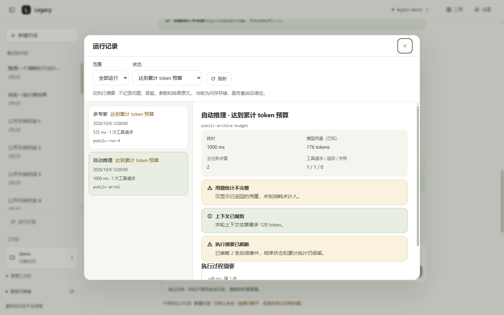

# 任务运行记录与失败排查

2026-10-06。适用于 HTTP/SSE 对话；不调用模型重新执行任务。

## 使用入口

会话栏点击「运行记录」，可按当前会话或结束状态筛选。当前回答下方的「查看运行摘要」直接定位该轮；即使 SSE 首帧前取消，也可使用响应头中的运行标识查询。
列表每页 50 轮，支持刷新、分页及二次确认删除；正在运行的摘要不能删除。历史问答仍只保存成功轮次的文本，失败记录在独立的运行摘要中查看。

默认存储为内存，重启后清空。要保留摘要，在「设置 → Agent」显式勾选「持久保存运行摘要（SQLite）」并保存，然后重启服务。界面分别展示保存的配置、实际存储与等待重启状态。切回内存不会删除已有数据库，也不会把旧的内存记录追溯写入数据库。

```dotenv
RUN_HISTORY_BACKEND=memory
RUN_HISTORY_PATH=./data/run-history.db
RUN_HISTORY_MAX_RECORDS=200
RUN_HISTORY_MAX_EVENTS=256
```

`path` 相对仓库根目录解析；仅 `sql` 会创建文件。上限为最新 200 轮、每轮 256 条结构化事件，超出后累计统计与终态仍保留并显示截断提示。极高并发时，较早且仍在运行的轮次也可能从有界列表淘汰；结束保存时重新参与时间排序。

## 记录内容与边界

每轮拥有服务端生成的 `run_id`，记录模式、来源（Agent / 离线回放）、已验证的会话 ID、开始/结束时间、耗时、主任务步数、已知 Usage、完整性、上下文裁剪及工具请求/返回/失败次数。

过程仅包含事件类型、相对耗时、步骤、主任务/子任务标记、注册工具名、工具成功与否、工具耗时、截断及计划状态计数。采用白名单投影，**不记录问题、答案、token 文本、工具参数、工具结果、专家名称、任务描述或原始异常**；模型给出的未注册工具名统一写为 `unknown_tool`。这些限制也适用于内存后端。

工具请求次数表示发出的调用意图，尚在等待互斥、尚未执行或取消未返回的请求也会计入；返回与失败次数另列。Plan / Supervisor 的内部子工具通过共享 `RunContext` 观察，不能只统计外层 SSE。子任务 Usage 不再次相加，终态使用整轮账本。

记录支持 `running`、`finished`、`max_steps`、`loop_detected`、`timeout`、`token_budget`、`error`、`cancelled`、`interrupted`。最后两种属于记录状态，未给聊天 SSE 新增事件类型。未完成、取消与异常保留已有用量，`usage_complete=false`；零只表示已知值为零，不能宣称没有消耗。

SQLite 在开始和结束各提交一次，运行中事件仅在内存更新。硬退出后残留的 `running` 在启动时标为 `interrupted`，耗时无法确定、Usage 不完整，不能恢复崩溃前尚未提交的事件。该存储用于**单机单 API 进程**，没有跨实例共享与恢复协议。

开始摘要写入失败时，返回 503 和检查路径权限的提示，模型不启动；结束写入失败时，回答保持原终态，`record_saved=false`，答案旁提示摘要未保存并写日志。记录包含 `run_id`，开始/结束日志将它与已有请求 trace 关联。

不录原文意味着这不是完整事件重放、答案审计或自动重试。运行记录本身不提供审批或撤销；随后加入的[文件差异批准](11-file-approvals.md)只存于活跃请求，预览不落摘要。鉴权沿用 `/api` 访问控制，未做账户与租户隔离；会话删除不会连带删除摘要，可单独删除摘要。

## 接口

| 入口 | 行为 |
|---|---|
| `POST /api/chat` | 响应新增 `run_id`、`record_saved`，请求与旧字段保持兼容 |
| `POST /api/chat/stream` | 响应头 `X-Run-Id`；现有事件附带 `run_id`，结束事件附带 `record_saved`；跨域暴露该响应头 |
| `GET /api/runs` | `limit` 1–200、`offset`、可选 `session_id` / `stopped_reason`；返回总数、实际后端与不含事件的列表 |
| `GET /api/runs/{run_id}` | 读取结构化事件摘要；已淘汰记录 404 |
| `DELETE /api/runs/{run_id}` | 删除已结束记录；运行中 409，不存在 404 |
| `GET /api/settings` | 新增 `run_history`：配置后端、实际后端、是否需重启、保留上限 |
| `PUT /api/settings` | 可选 `run_history_backend=memory\|sql`；其他权限与预算字段原样保留 |

正常连接仍每轮恰好一个 `done`，预算终止后的结果不进入成功会话历史。SSE 断开时关闭生成器、等待清理，并在取消作用域保护下保存摘要；响应体尚未开始时，响应收尾任务也会补记取消。

## 验证证据

修改前：**1103 后端通过 + 1 live 跳过，159 前端通过**。完成后：**1132 后端通过 + 1 live 跳过，166 前端通过**；只读格式、lint、依赖 lock、类型及构建通过。新增后端用例 29 项，前端 7 项，不把数量增长当作业务成功率。

后端 `test_run_history.py` 的 26 项及既有取消/鉴权扩展覆盖：

- 内存默认不建文件、SQLite 重启恢复、保留上限、删除及查询快照隔离。
- 三模式内部子工具恰好计一次、失败工具和整轮 Usage；重复请求 ID 与账本隔离。
- 预算/异常/提前结束每轮仅一个结束事件；未知用量保持不完整。
- ASGI 断开时取消全部专家并将已知路由用量写入 SQLite；首帧前断开仍留下取消摘要。
- 任意文本、工具参数、结果及异常不能进入 JSON / SQLite；恶意工具名反例。
- 开始/结束存储失败可见，不重跑模型；运行接口仍受访问控制保护。
- 临时配置验证保存/实际后端差异，不修改用户 `.env`。

前端测试验证响应头先于首帧的运行标识、事件归约、未知状态、安全筛选编码及记录保存失败提示。Edge 用合成 API/SSE 验证真实组件，245 项通过，检查查询、筛选、取消记录、迟到详情、删除确认、读取失败重试、设置保存、焦点及三个尺寸。新增四张记录截图逐张复核；原始日志与截图在忽略提交的 `data/run-history-ui`。

```powershell
& .venv\Scripts\python.exe -X utf8 -m pytest services/api/tests -q
& .venv\Scripts\python.exe -X utf8 -m ruff format services/api --check
& .venv\Scripts\python.exe -X utf8 -m ruff check services/api
& .venv\Scripts\python.exe -X utf8 scripts/lock_deps.py --check
Set-Location apps/web
pnpm test
pnpm run typecheck
pnpm build
Set-Location ../..
# 可用已启动服务，或本地静态 dist；全部 API 在浏览器内合成。
& .venv\Scripts\python.exe -X utf8 scripts/smoke_ui.py --visual --screenshots-dir data/run-history-ui
```

本轮真实模型请求 **0 次**。用户 `.env` SHA-256 前后相同。远端 CI 待用户推送后确认。

## 演示截图

下图使用虚构公开数据，展示界面交互，不是模型推理成绩。



[1024×768](screenshots/run-history/12-runs-light-1024.png) · [390×844](screenshots/run-history/13-runs-light-390.png) · [石墨深色](screenshots/run-history/14-runs-dark-1440.png)
