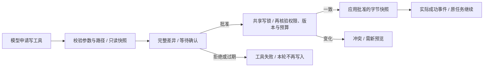

# 文件修改预览与批准

2026-10-06。已有 `write_file` / `edit_file` 只提供整体写权限开关；开启后，模型的具体修改会直接执行。本轮增加逐次差异批准，ReAct、Plan、Supervisor 都在原任务中等待，批准并成功写入后才继续。

## 使用

在「设置 → 工作区」显式指定目录、打开写权限，保留「写入前预览确认」。新建、覆盖、编辑都会在答案附近展示完整修改差异、相对路径、字节数、UTF-8 BOM、行分隔符及末尾换行信息。执行过程收起或隐藏运行统计时，确认卡片仍可操作。

“已批准”表示正在核验；只有“文件已写入”表示工具成功应用。拒绝或确认超时会禁止本轮后续文件修改，撤销其它尚未应用的批准；已完成写入保持原样。停止、断流、整轮预算终止、切换历史或清空后，旧确认入口失效。读取新会话期间暂停批准，读取失败后可继续原任务。

文件、工作区、解析后的路径或写权限在等待期间变化，会返回冲突，旧批准不能覆盖新版本。重新发起任务需要生成新的差异并再次确认。不会自动重试写入或把冲突当成成功。

```dotenv
AGENT_FILE_WRITE_ENABLED=false
AGENT_FILE_APPROVAL_REQUIRED=true
AGENT_FILE_APPROVAL_TIMEOUT=300
```

写权限仍默认关闭，未配置工作区或未开启写权限时不注册写工具。确认默认开启；300 秒是等待人的期限，0 表示仅受整轮预算约束。等待确认与排队使用原 `RunContext` 的 deadline；批准不能重领时间或 token 预算。写权限和确认设置保存后生效，现有运行的总预算保持原值，应用时重新读取当前权限。

HTTP 非流式与 CLI 没有互动审批通道，确认开启时明确返回工具失败并保持文件不变。只有用户显式关闭确认后，它们才沿用原来的直接写入模式。关闭确认也不能绕过当前运行已经发生的拒绝或确认超时。

## 实现与接口



`Tool.prepare_execution` 在共享副作用锁和工具执行超时之外生成预览、等待决定；普通工具沿用旧行为。批准后才拿原注册表锁执行 `execute_prepared`，再次检查共享预算。人审不会占住写锁，只读工具仍可并发。

文件内容、参数、路径解析结果及 stat 身份一起存入请求快照。应用只使用这份批准的字节，不从可变调用参数重算。已有文件以同目录临时文件和 `os.replace` 替换，保留 POSIX mode；硬链接会脱离，外部别名保持原内容。新文件使用排他新建，核验后出现同名文件也不会覆盖。

`RunContext.approvals` 引用本轮 `ApprovalBroker`。SSE 将原 Agent 源与审批队列合并，因此 Plan 的内部非流式子任务、Supervisor 的并发专家也能实时发出预览。取消时先使 broker 失效，再取消并等待驱动源与队列的任务、关闭底层生成器；AnyIO 取消作用域内保护清理。

| 接口 / 事件 | 契约 |
|---|---|
| `approval_request` | 新增 SSE 事件，`run_id` 与完整 `approval` 预览 |
| `approval_update` | 相同预览标识，明确 pending / approved / applied / rejected / expired / cancelled / conflict / failed |
| `POST /api/runs/{run_id}/approvals/{id}` | JSON `{ "decision": "approve" }` 或 `reject`，返回决定状态；不会在端点内执行写入 |
| 重复、过期、错误绑定或已结束 | 409，要求重新生成差异；非法决定与未知字段 422 |
| 设置 | `file_approval_required`、非负有限 `file_approval_timeout`；不传保持原值 |

`approval` 包含 `id/path/operation/diff/before_bytes/after_bytes/status/message`，以及 `before_format/after_format`。operation 为 create / overwrite / edit。既有事件与请求字段保持兼容，正常连接仍每轮恰好一次 `done`。确认 API 沿用 `/api` 的访问密钥鉴权，预览标识只对绑定的活跃运行有效。

保存工作区、权限或能力后，重新装配工具与 ReAct 提示词，保留工具注册表、共享写锁、记忆和模型客户端。避免界面显示“立即生效”但工具菜单仍是旧的，也避免保存权限时关闭在途模型连接。

## 边界

- 审批仅存在当前 API 进程的活跃请求内存中。进程重启或断流后不能恢复批准；没有新增账户、多租户或跨实例审批机制。
- 运行记录仍只保存白名单摘要，不保存差异、文件原文、工具参数或预览路径。当前聊天里的卡片不是持久化审计或崩溃恢复入口。
- 预览拒绝二进制、非 UTF-8、超过 2MB 的原文件；原文和结果各限 200000 字符 / 10000 行。差异不截断，超限明确要求拆分或使用本机编辑器。
- 共享锁约束同进程共享注册表；外部编辑器在最终核验与替换之间仍存在竞态，不能宣称文件系统事务或外部写锁。
- 替换已有文件不保证保留 Windows ACL、所有者、时间戳等元数据；仅保留 mode。写入失败需核对实际文件，已完成写入不会自动回滚。
- 敏感文件保护仍默认开启，并改为大小写无关，避免 Windows 下 `.ENV` 绕过 `.env`。

## 验证证据

修改前：1182 后端通过 + 1 live 跳过，166 前端通过。完成后：**1232 后端通过 + 1 live 跳过**（65.24 秒），**203 前端通过**。新增 50 项后端、37 项前端回归；只读格式、lint、依赖 lock、类型检查与构建均通过。pytest 的两条既有 Starlette/httpx 弃用警告仍保留。

后端 `test_file_approvals.py` 与 `test_file_approvals_review.py` 验证真实三种内核和 HTTP 路由，使用合成 LLM 与临时工作区：

- 批准前不写文件或创建父目录；批准后继续原任务，写入与用量计数不重复。
- 拒绝、确认超时、预算耗尽、真实 ASGI 断流均不启动后续写入；等待锁期间的批准可被另一拒绝撤销。
- 共享写锁之外等待确认，人审超过工具执行超时仍可批准；整轮 deadline 始终生效。
- 文件内容、身份、工作区、写权限和敏感文件权限变化使旧批准失效；新一轮预览可再次批准。
- 两个请求预览同一文件，最多一份旧快照成功；独立请求的拒绝与预算隔离。
- 精确应用 UTF-8 BOM、CRLF、无末尾换行字节；硬链接替换不修改工作区外别名。
- 鉴权、run/proposal 绑定、重复决定、非流式拒绝、源构造异常清理与设置刷新保持共享锁。

前端验证完整差异与所有状态、批准仅为核验中、防双击、HTTP 错误重试、迟到响应、停止／切历史／预算终止关闭以及设置校验。最终构建上 Edge **309 PASS、0 FAIL**，没有未捕获错误或未声明 API。1440×900、1024×768、390×844 的浅色与深色、实际成功与冲突共 8 张截图逐张复核；diff 行高实测 21.59px，与计算行高 21.6px 一致，没有空白行翻倍。

浏览器全部使用合成 API/SSE，只验证组件交互；真实文件副作用由临时工作区测试证明。日志在忽略提交的 `data/file-approval-ui/visual-smoke.log`，新增合成入口为 `scripts/file_approval_fixtures.js`。

本地等价 CI 额外复测两套公开 RAG、60 条证据校验和 30 任务 × 三编排的离线评测，90/90 执行／评分链路通过。检索指标保持 [检索复测记录](10-rag-retrieval.md) 的参数与结果，未修改语料或闸门默认值。真实模型请求 **0 次**，用户 `.env` SHA-256 前后相同。远端 CI 待用户推送后确认。

```powershell
& .venv\Scripts\python.exe -X utf8 -m pytest services/api/tests -q
& .venv\Scripts\python.exe -m ruff format services/api scripts/eval_agent.py scripts/eval_rag.py --check
& .venv\Scripts\python.exe -m ruff check services/api scripts/eval_agent.py scripts/eval_rag.py
& .venv\Scripts\python.exe -X utf8 scripts/lock_deps.py --check
Set-Location apps/web
pnpm test
pnpm run typecheck
pnpm build
Set-Location ../..
# 已启动服务或静态 dist，全部 API 在浏览器内合成，不读取用户资料。
& .venv\Scripts\python.exe -X utf8 scripts/smoke_ui.py --visual --screenshots-dir data/file-approval-ui
```

## 演示截图

审批、实际写入和冲突截图使用虚构公开数据。成功／冲突截图的“运行摘要未保存”是合成 fixture 显式设置 `record_saved=false`，用于验证保存失败提示，不是本轮后端存储故障。


[浅色 1024](screenshots/file-approvals/16-approval-light-1024.png) · [浅色 390](screenshots/file-approvals/17-approval-light-390.png) · [深色 1440](screenshots/file-approvals/18-approval-dark-1440.png) · [深色 1024](screenshots/file-approvals/19-approval-dark-1024.png) · [深色 390](screenshots/file-approvals/20-approval-dark-390.png)

[实际写入状态](screenshots/file-approvals/21-approval-applied-light-1440.png) · [文件冲突状态](screenshots/file-approvals/22-approval-conflict-dark-1440.png)
