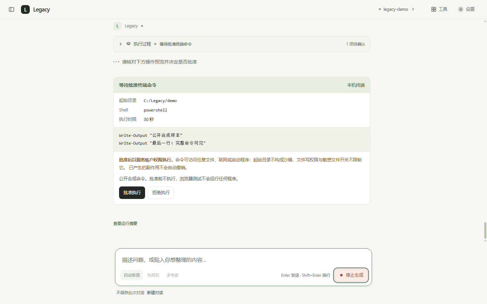

# 本机终端：每条命令确认后执行

Legacy 新增 `run_terminal` 工具。它执行服务所在机器的非交互命令，不是可持续输入的终端窗口。ReAct、Plan 和 Supervisor 共用请求内审批；没有审批通道的非流式 HTTP 与 CLI 明确拒绝执行。

## 开启与使用

1. 构建前端、重新启动服务，在「设置 → 工作区」指定现有目录。
2. 独立打开「本机终端」并保存；默认保持关闭，不会由文件写权限顺带开启。
3. 发起明确任务，例如「在当前工作区运行 Python 版本检查，执行前让我确认」。工具面板应出现 `run_terminal`。
4. 答案旁显示完整命令、绝对起始目录、shell 与执行上限。核对后批准或拒绝；「已批准」只是执行准备或执行中，退出码 0 后才显示执行完成。
5. 输出和错误在工具详情中查看；停止按钮取消本轮并清理普通子进程。超时、非零退出、停止都可能已产生部分修改，不会自动回滚。

```dotenv
AGENT_TERMINAL_ENABLED=false
AGENT_TERMINAL_TIMEOUT=30
AGENT_TERMINAL_APPROVAL_TIMEOUT=300
```

执行上限为 1–600 秒，确认等待为 1–3600 秒。每条命令强制确认，没有关闭确认的开关。等待确认、排队、执行都沿用原 `RunContext` 的 deadline，不能重新领取整体预算。设置保存刷新工具与提示词并保留共享副作用锁；启动前复核当前权限、工作区、目录身份、命令参数和执行上限，变更使旧批准失效。在途命令不会因修改设置而回滚，停止需使用停止按钮。

## 权限边界

起始目录解析后必须在显式工作区内，但 **cwd 不是沙箱**。自由命令可自行切换目录、读写服务账户可访问的文件、联网或读取磁盘凭据；文件工具的写入开关、敏感文件保护和完整 diff 确认不限制命令。不要把「关闭文件写权限」理解成「终端只读」。批准命令不会预览它可能产生的全部文件差异。

子进程只继承 OS 启动、PATH、用户目录、临时目录与编码相关的基础环境，不默认继承模型密钥、API 访问密钥、代理、`PYTHONPATH` 或本机误设的 `PIP_TARGET`。这避免服务配置直接流入进程环境，但用户目录、PATH 和自由命令仍可能访问用户配置与文件，不能声称凭据隔离。服务日志与运行摘要不记录命令、工作目录或输出原文；对话工具结果仍会进入模型上下文，分享截图也可能包含输出。

Windows 使用系统目录中的 PowerShell，关闭 Profile、无交互输入；先挂起进程、加入带关闭终止标记的 Job Object，再恢复执行，绑定失败拒绝启动。正常退出、超时和取消都清理 Job 内普通子孙。Job Object 管理进程组，不是安全沙箱，例如经其他系统服务创建的进程不一定属于该 Job，详见 [Microsoft 说明](https://learn.microsoft.com/en-us/windows/win32/procthread/job-objects)。POSIX 使用 `/bin/sh` 与独立进程组，主动脱离进程组的程序不在清理保证内。当前实测宿主是 Windows。

输出分别持续排空 stdout 与 stderr，各保留最多 32768 字节；模型观察分别保留两路最多 3000 字符的头尾，再应用统一 8000 字符上限，截断显式报告。失败 observation 同样包含两路输出，不能只给模型一句「退出码非零」。PowerShell 和 Python 使用 UTF-8；其他原生命令可能有不同编码，非法字节替换显示并标记 `encoding_errors`，不能保证所有程序的字符完全还原。执行器使用 `Popen` 与线程读管道，兼容 Windows Selector 事件循环，不依赖异步子进程支持。目录解析/核验也在线程执行；只读等待可取消，不阻塞心跳或预算控制。进程启动动作本身可能无法立即取消，清理等待结束后才释放共享锁；取消时清理失败会明确保留未确认结果与日志提示。[Python subprocess 说明](https://docs.python.org/3.12/library/subprocess.html)介绍了进程创建及超时限制。

## 接口与终态

聊天 HTTP/SSE、工具结果与既有审批端点保持兼容。仍用 `approval_request`、`approval_update` 与 `POST /api/runs/{run_id}/approvals/{id}`，审批端点只决定，不运行命令。

- 文件审批允许缺少 `kind`；命令审批必须为 `kind="command"`，附带完整 `command/cwd/shell/timeout_seconds`。
- 状态沿用 pending / approved / applied / rejected / expired / cancelled / conflict / failed；`applied` 对命令表示退出码 0，`failed` 包括非零退出和执行超时。
- 命令开始后更新 `started=true`，同一批准不能重复执行。另一份拒绝封锁后续副作用，不将已启动命令伪装成未执行。
- 拒绝或确认过期封锁本轮尚未启动的命令与尚未应用的文件写入；下一轮独立。停止、断流或结束使旧批准失效。
- 设置增补 `terminal_enabled`、`terminal_timeout`、`terminal_approval_timeout`；不传保持原值。默认不启用，用户保存设置时写入 `.env`；本次验证未修改用户配置。

## 验证

使用临时工作区、公开合成模型和浏览器内合成 API/SSE，模型联网请求为 0。进程测试运行真实安全命令，验证两路输出、编码、非零退出、超时、取消、子孙清理、输出限额与 Windows Selector 循环；审批测试验证三种真实内核、权限撤回、排队重核验、重复决定、预算、请求隔离和文件互斥。浏览器测试验证真实组件中的命令预览、审批、停止、设置保存与三种视口。

复测命令：

```powershell
& .venv\Scripts\python.exe -X utf8 -m pytest services\api\tests -q
cd apps\web
pnpm test
pnpm run typecheck
pnpm build
```

2026-10-07，Windows 11 / Python 3.12.3 / Node 24.20.0 的结果：

| 检查 | 结果与来源 |
|---|---|
| 修改前基线 | 后端 1361 通过、1 live 跳过；前端 203 通过，类型检查成功 |
| 最终后端 | **1458 通过、1 live 跳过**，104.90 秒；2 条既有依赖弃用警告。`data/terminal-backend-tests.log` / `data/terminal-ci/backend-tests.xml` |
| 新增后端反例 | 31 项真实进程回归 + 66 项审批/配置/预算回归；不把合成模型当真实模型选择能力 |
| 最终前端 | **211 通过**，类型与构建成功；76 模块，CSS 63.88 kB、JS 351.51 kB |
| Edge 实测 | **411 项通过、0 失败**，全部合成 API/SSE。参数 `--visual --target http://127.0.0.1:8097/ --cdp-port 9337 --screenshots-dir data/terminal-ui`；日志 `data/terminal-ui-smoke.log` |
| 门禁与公开评测 | 只读 format、lint、34 包 lock 一致；公共 sample/general/holdout、三数据集排序、两份答案受控自检与 90/90 合成 Agent 轮次均通过 |
| 用量与配置 | 真实模型请求 **0**；用户 `.env` 字节摘要前后相同；终端开关仍由用户显式启用 |

原始本地日志/报告在忽略提交的 `data/`，公开验收摘要见 [verification.json](evidence/local-terminal-v1/verification.json)。远端 CI 由用户推送后确认，真实模型如何选择命令、POSIX 实测和主动逃逸程序的进程管理不属于本轮已验证结论。

### CI 测试补强（2026-10-07）

上表与 `local-terminal-v1` 是终端初版的历史证据。用户随后提供的远端日志为
16失败、1427通过、16跳过；其中可选依赖检查误把 pypdf/docx/tiktoken 当成必装，
临时文件配置又被 CI 的 `AGENT_FILE_WRITE_ENABLED=false` 覆盖。这两项已定位：
依赖安装检查限定核心与 dev，声明检查仍包括所有 extras；临时文件用例隔离环境变量，
覆盖外部权限为空、false、true。缺 fastapi 或 pytest 的反例仍会失败。

终端失败日志只证明2–10秒时限内没有输出，不能证明只是冷启动慢。
本机 Windows 11 未复现远端 Windows Server 的相同故障，保留这个验证缺口。
真实 shell 用例改用与产品相同的基础环境和30秒默认时限；产品默认值未改。
UTF-8 初始化用 .NET 构造函数，减少包装器对 cmdlet 的依赖；没有移除 Job 保护。
超时清理用例在真实子孙输出就绪后推进执行器的独立测试时钟，仍检查进程确实停止；
另加2.2秒启动延迟和真实嵌套 Job 回归，不把这些测试当宿主性能标定。

`python scripts/probe_terminal.py` 仅运行固定公开输出命令：原始 shell、包装命令、
Job/进程组保护三阶段分别记录退出码、耗时及输出长度。原始/包装探测最多各60秒，
保护执行使用30秒产品默认时限；任何失败都非零退出，CI 上传 `data/terminal-probe.json`。
仅记录基础环境键名，不记录值；进程日志记录创建/恢复/超时位置而不记录命令原文。
前端构建已移到后端测试之前，避免7个静态挂载用例因 dist 缺失而跳过。

| 本轮本机验证 | 结果与来源 |
|---|---|
| 原基线 | 1458通过、1 live跳过，90.80秒 |
| CI 只读环境变量 | **1467通过、1 live跳过**，87.96秒；`data/ci-regression-tests.xml` |
| 模拟可选模块不可导入，并保留 CI 只读环境 | **1459通过、9跳过**，92.92秒；`data/ci-no-optional-tests.xml`。用导入阻断器模拟 pypdf/docx/tiktoken 缺失，未卸载用户依赖；8个token对拍和1个live按约定跳过 |
| 终端定向回归 | 32项真实进程、67项审批与2项探针回归通过；仍断言输出、退出码、取消、清理与资源关闭 |
| 本机三阶段探针 | 全部成功；`data/ci-terminal-probe.json`。单次探测不是P95标定 |
| 前端与静态门禁 | 211通过、类型/构建、只读格式、lint、34包lock通过；本轮没有界面改动，未重跑Edge |

公开摘要见 [CI 补强证据](evidence/ci-regression-v1/verification.json)。本轮真实模型请求0，
未改用户 `.env` 或现有 `.venv`。完整远端结果与终端故障的确切原因待推送后重跑确认；
若仍失败，先比较三阶段报告，不能跳过真实进程测试来换取通过。

六张最终构建截图已逐张复核：1440×900、1024×768、390×844，无页面横向溢出，输入与审批按钮可操作。



[浅色 1024](screenshots/local-terminal/24-terminal-light-1024.png) · [浅色 390](screenshots/local-terminal/25-terminal-light-390.png) · [深色 1440](screenshots/local-terminal/26-terminal-dark-1440.png) · [深色 1024](screenshots/local-terminal/27-terminal-dark-1024.png) · [深色 390](screenshots/local-terminal/28-terminal-dark-390.png)
