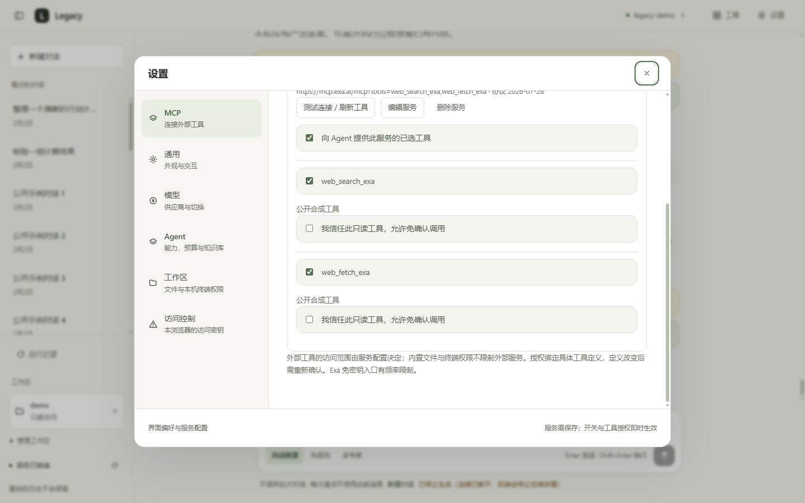
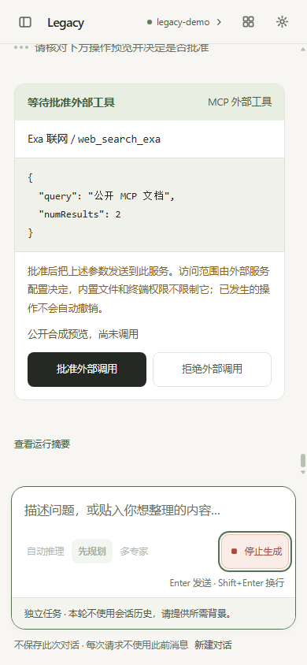

# MCP 客户端与跨轮执行记录

Legacy 使用官方 Python SDK `mcp==2.3.0`，接入本地 stdio 和远程 Streamable HTTP 的 Tools。
三种编排共用工具注册表、运行预算和副作用锁。默认 MCP 关闭、服务清单为空；没有启动或安装第三方服务。
本版不提供 Resources、Prompts、OAuth 登录或对外 MCP Server。

## 1. 开始使用

更新依赖并构建界面后，重启 API。进入「设置 → MCP」：

1. 点击「添加 Tavily 搜索 / Exa 搜索 / 本地文件 / Desktop Commander / 自定义服务」，只填写草稿，不自动启动。
2. Tavily 直接填写 **API Key**；本地预设填写允许目录。自定义 HTTP 填地址、鉴权方式与密钥，stdio 填程序与目录，参数/环境变量采用逐项编辑器。
3. 点击「保存并连接」，自动协调单服务与全局开关。成功显示「已连接」；失败保留草稿并给出修复提示。工具选择、测试连接、代理与启动详情放在「高级设置」。
4. 返回聊天，使用自动推理、先规划或多专家模式。默认每次调用都展示服务、工具与完整参数，由你批准或拒绝。
5. 只有在高级设置中明确授权具体只读工具后，该工具才可免确认并发调用。取消勾选立即恢复逐次确认。

Exa 示例地址为 `https://mcp.exa.ai/mcp?tools=web_search_exa,web_fetch_exa`，仅选择这两个工具。
免密钥入口有服务方频率限制。遇到限流应等待后另起任务，或按服务方说明配置自己的鉴权；不要反复发送结果未确认的操作。
示例和频率限制来源：[Exa 官方文档](https://exa.ai/docs/get-started/exa-mcp)。

通用远程服务填写完整 HTTP(S) URL、鉴权方式和密钥；Bearer 模式由程序转换为 Authorization 请求头。
查询仅返回掩码与配置状态；编辑密钥留空保留旧值，勾选明确清除才删除。密钥不能放在 URL。
连接不自动读取系统代理，环回服务也不会误走 Windows 注册表代理。没有代理时留空。

自定义本地服务选择 stdio，填写启动程序、绝对工作目录，高级设置中逐项填写参数与环境变量。
程序使用独立双向管道，stdout 只能输出 MCP 协议，日志应写 stderr。
源码入口的程序应已由用户安装；Windows 桌面包包含锁定版本 Filesystem 与 Desktop Commander。
首次默认均不启动，Legacy 不猜允许目录、不扫描私人文件；发行隔离与补丁见 [桌面记录](15-desktop-release.md)。

本地文件示例见 [未启用模板](examples/mcp-servers.example.json)。先明确填写允许目录和已安装服务入口，再保存/测试。
模板使用直接 `node` 入口，避免测试连接时由 `npx` 自动安装依赖。
文件服务配置方式来源：[官方 filesystem 服务说明](https://github.com/modelcontextprotocol/servers/tree/main/src/filesystem)。

### Tavily、Desktop Commander 和官方 Filesystem

2026-10-08 已在本机按用户明确指定的目录完成三项配置，存放在被忽略的 `data/mcp.json`。
两个本地服务已安装并连接验证；Tavily 使用远程 HTTP，等待用户在界面填写密钥，尚未完成鉴权/搜索验证。
这次没有修改 `.env`，未调用模型，也没有读取用户工作区里的文件。

| 服务 | 配置方式 | 本次向模型提供的工具 |
|---|---|---|
| Tavily | `https://mcp.tavily.com/mcp/`，请求头 `Authorization: Bearer <API Key>` | 远程发现的 `tavily_search`、`tavily_extract`；未填密钥时保持关闭 |
| Desktop Commander | 项目内安装 `@wonderwhy-er/desktop-commander@0.2.52`，stdio | `start_process`、`read_process_output`、`interact_with_process`、`force_terminate`、`list_sessions` |
| 官方 Filesystem | 项目内安装 `@modelcontextprotocol/server-filesystem@2026.8.31`，stdio | 文本读取/多文件读取、写入/编辑、建目录、列表/目录树、移动、搜索、文件信息和允许目录，共11项 |

重启后进入「设置 → MCP → Tavily 服务 → 配置」，直接在 **API Key** 输入框填写密钥，点击「保存并连接」。
旧配置仍兼容，无需编辑 JSON；查询不会返回原始密钥。
Tavily 的静态请求头鉴权来自 [官方 README](https://github.com/tavily-ai/tavily-mcp#remote-mcp-server)。
远程工具名以连接时的实际发现为准；旧预设连字符与远程下划线不匹配的修复、工具可用数量和 Agent 状态查询见 [可用性修复记录](16-mcp-availability.md)。
不把密钥放 URL，不提交本地清单；这一步无需安装本地 Tavily 服务。

本地安装可以复现为以下命令（只有用户明确决定安装时执行）：

```powershell
npm install --prefix data/mcp-services --cache data/npm-cache --ignore-scripts --no-audit --no-fund --save-exact @wonderwhy-er/desktop-commander@0.2.52 @modelcontextprotocol/server-filesystem@2026.8.31
```

程序均由本机 `node.exe` 直接启动，各自入口在安装包的 `dist/index.js`，不通过 `npx` 在每次连接时下载。
启动参数、cwd 和 Filesystem 的允许目录必须填写用户明确选择的绝对路径；通用未启用模板见 [三服务模板](examples/mcp-three-services.example.json)。
Desktop Commander 使用独立 `USERPROFILE` 指向项目的 `data/desktop-commander-home`，配置与调用日志不会混入其他客户端的默认状态目录。
其中 `.claude-server-commander/config.json` 保留上游默认命令阻止列表，明确设置 `allowedDirectories`，并关闭遥测和 onboarding。
只选择终端相关工具，未向模型提供该服务的配置修改、反馈或重复文件工具。
它的终端目录不是沙箱，外部权限与内置终端/文件开关独立；所有已选工具保留逐次审批，无免确认授权。
状态位置与目录限制来自 [Desktop Commander 实现](https://github.com/wonderwhy-er/DesktopCommanderMCP/blob/main/src/config.ts) 和 [使用说明](https://github.com/wonderwhy-er/DesktopCommanderMCP#usage)。

验收使用临时公开样本：Filesystem 写入/读取/查询允许目录成功；Desktop Commander 配置范围核验、固定 `Write-Output` 命令和读取异步输出成功。
`start_process` 返回“仍在运行”时，需要继续调用 `read_process_output`，不能把首次没有输出误判为命令失败。
实测发现 Filesystem 14 项、Desktop Commander 26 项工具；只选择上述16项本地工具，Tavily 预选2项，合计18项。
Schema 均通过现有校验；本机实际连接再次核验了用户指定目录，未列举其文件。脱敏证据见 [三服务配置验证](evidence/mcp-v1/three-services.json)。
首次 Desktop Commander 冷启动在并行门禁时耗时26.8秒，后续受控连接1.3秒；遇到15秒默认连接超时可重新点击测试连接，本轮没有自动重试业务调用或修改默认限时。
PDF、媒体读取、Desktop Commander 搜索及其远程登录不在本次选择/验收范围；安装未执行第三方安装脚本。

**外部服务的访问范围由该服务配置决定。** 内置文件工作区、写权限和敏感文件开关不约束 MCP 服务。
本地程序拥有服务账户权限，cwd 不是沙箱；仅配置自己信任的服务。

## 2. 配置、凭据与授权

| 配置 | 默认值 | 行为 |
|---|---|---|
| `MCP_ENABLED` | `false` | 全局开关，设置界面保存后立即生效 |
| `MCP_CONFIG_PATH` | `data/mcp.json` | 本机服务清单；相对路径按项目根解析 |
| `MCP_CONNECT_TIMEOUT` | `15` 秒 | 连接、协商和分页发现的总等待时间 |
| `MCP_TOOL_TIMEOUT` | `30` 秒 | 每次外部工具等待上限 |
| `MCP_APPROVAL_TIMEOUT` | `300` 秒 | 每次确认等待上限 |
| `MCP_MAX_TOOLS` | `32` | 全局最多向模型暴露的 MCP 工具数，可调低 |

路径、超时与工具上限修改后需重启；全局开关、服务保存与工具授权由专用接口即时应用。
清单默认在被 Git 忽略的 `data/` 下，不应提交自己的密钥。
本地清单以明文保存凭据，受文件系统权限保护；本版未提供系统钥匙串。
查询接口只返回环境变量、请求头与代理的掩码。编辑保留 `********` 表示不修改原值，不能用掩码创建新密钥。
损坏清单明确报错并阻止覆盖，不当成空清单。

服务自行声明只读只允许出现用户授权入口，不能自动获得信任。
明显写入、删除、执行与终端工具继续逐次确认，未知能力也不开放免确认入口。
信任摘要绑定连接配置与完整工具定义；地址、启动参数、环境、凭据、Schema 或描述变化都会失效。
刷新发现变化后，旧调用不能继续使用旧批准；需要重新确认或重新授权。

确认不等于成功。`applied` 表示收到外部工具的成功结果，`failed` 表示返回失败或等待发生异常。
已经发送但超时、断线或取消的调用记录为 `unknown`（结果未确认），可能仍在远端执行。
本轮禁止再次调用该工具，独立新轮仍需用户核实；没有自动重发或回滚。

## 3. 接口与执行契约

管理端点共用现有 `/api/*` 访问控制：

| 方法与路径 | 用途 |
|---|---|
| `GET /api/mcp` | 掩码配置、连接状态、协议版本、发现工具与授权状态 |
| `PATCH /api/mcp/config` | `{"enabled":true}`，保存全局开关 |
| `PUT /api/mcp/servers` | 新增或编辑服务；传已有 id 表示更新，不能导入伪造只读授权 |
| `POST /api/mcp/servers/{id}/test` | 显式连接与刷新工具，不调用业务工具 |
| `DELETE /api/mcp/servers/{id}` | 删除并清理连接/本地进程 |
| `PUT /api/mcp/servers/{id}/tools` | `{"selected":["工具名"],"trusted":["已选只读工具名"]}` |

`/api/tools` 增加 `source`、`server_name`、`remote_name`。模型工具名称包含稳定服务 ID 与原名摘要，避免跨服务重名。
原始 JSON Schema 保留并使用对应标准方言校验；拒绝外部引用及不支持的方言，不联网解析 Schema。
工具发现支持分页，拒绝循环游标、重复名称和过大的定义。工具定义的估算 token 同样占用上下文预算。
文本和结构化 JSON 回灌现有工具结果，保留失败、耗时与 8000 字符截断信息。
图片、音频、资源链接等明确标为未处理，不自动读取返回的资源链接。

聊天端点、请求字段与 SSE 事件类型保持兼容，外部确认沿用 `approval_request` / `approval_update`，增加 `kind:"mcp"`。
决定仍通过 `POST /api/runs/{run_id}/approvals/{approval_id}` 提交。
HTTP 无确认通道时，未授权外部工具明确拒绝；用户显式信任的只读工具可调用。
本版 MCP 由 API 应用生命周期装配，CLI 尚未自动加载 MCP 服务清单。
审批、排队、外部调用共享原 deadline，拿到副作用锁后再核验预算和授权。

连接由应用生命周期持有，切换模型和保存工作区保留连接及原注册表副作用锁。
关闭服务时清理 stdio 主进程和普通子孙；Windows 先挂起创建、绑定 Job，再恢复运行。
退出等待同时检查 Job 活跃计数和终止前保留的进程句柄，防止计数先归零造成过早返回。
这是普通进程生命周期管理，不是本地程序安全沙箱；POSIX 采用进程组，当前真实进程证据来自 Windows。

## 4. 修复“执行过却不记得”

普通历史和摘要压缩共用工具摘要渲染，摘要提示词恢复通用定位。
实际工具执行环节在 `RunContext` 收集事实，文件真实写入后立即确认相对路径，终端记录退出状态，MCP 记录返回或未确认状态。
在 `Session.meta.execution_facts` 有界保留最近 100 条，字段仅含记录 ID、run_id、工具、状态、时间和可选路径/退出码。
不保存完整命令、文件正文、调用参数或工具原始输出。旧会话缺少记录时按空列表处理，无需增加数据库列。

正常完成先保存事实与答案，再发 done。失败、超时和取消保存已发生的事实，未正常完成的答案不进入会话历史。
内存、SQLite、Redis 原子合并事实与已有元数据，避免覆盖并发轮次或复活已删除会话。
同一 API 进程内，同会话后续请求等待上一轮清理与保存，再读历史；不同会话继续并发。
这不是跨 API 副本的分布式执行锁。

ReAct 把事实送入下一轮模型上下文，并提示“历史执行成功不代表文件当前仍存在”。
Plan/Supervisor 继续独立任务语义；未选择会话时界面明确每次请求不使用此前消息。
响应/done 新增独立 `session_saved`：成功 `true`、失败 `false`、无会话 `null`。
它与运行摘要 `record_saved` 分开，保存失败提示显示在答案附近，不受统计显示开关影响。

## 5. 验证与证据

2026-10-08 本地验收：**1524 后端通过、1 live 跳过；216 前端通过；446 项 Edge 检查通过**。
类型检查、前端构建、只读格式检查、lint、51 包依赖锁校验和干净环境安装均通过。
终端三阶段探针全部成功；远端 CI 和 Linux 镜像本轮未验证。

本地受控服务在临时目录运行，使用真实官方 SDK 通过两种传输连接；三种真实编排由合成模型驱动。
覆盖审批前无写入、批准/拒绝、Schema 校验、定义与配置变化、超时/取消结果未确认、跨轮隔离、模型切换/能力刷新保留锁、分页异常、重名与不支持内容。
Windows 子进程测试保留实际 PID 存活断言；记忆回归直接检查下一轮模型收到的消息，包括取消后立即追问等待保存。

```powershell
& .venv\Scripts\python.exe -X utf8 -m pytest services/api/tests -o addopts="" -q
& .venv\Scripts\python.exe -X utf8 -m ruff check services/api
& .venv\Scripts\python.exe -X utf8 -m ruff format services/api --check
& .venv\Scripts\python.exe -X utf8 scripts/lock_deps.py --check
```

前端执行 `pnpm test`、`pnpm run typecheck`、`pnpm build`。
Edge 入口：`scripts/smoke_ui.py --visual --target http://127.0.0.1:8097/ --cdp-port 9237 --screenshots-dir data/mcp-ui-final`。
仅需静态站，API/SSE 全部公开合成；验证 MCP 分类、草稿焦点、工具选择、明确只读授权、来源、三模式确认、停止及会话保存提示。
保留原有三视口与主题、模式、文件/终端、运行记录检查，挂载前采集脚本错误。
本轮没有调用真实模型，也没有修改用户 `.env`。

Exa 实测：先连接/发现，因示例参数与当前 Schema 不同而未发工具请求；修正公开参数后实际业务调用 **2 次**。
`web_search_exa` 成功，用时 **2141ms**，返回 **1398** 字符；`web_fetch_exa` 读取 `https://example.com` 成功，用时 **1781ms**，返回 **543** 字符。
SDK 协商协议版本 **2025-11-25**。这是 MCP 接入证据，不是模型选择工具或答案质量成绩；来源和脱敏记录见 [验收清单](evidence/mcp-v1/verification.json)。
复现联网入口 `scripts/verify_mcp.py --exa`，最多两次公开业务调用，无模型、无配置读取、无自动重发。

官方依赖与协议参考：[SDK 2.3.0 发布页](https://pypi.org/project/mcp/2.3.0/)、[Client](https://py.sdk.modelcontextprotocol.io/client/)、[传输](https://py.sdk.modelcontextprotocol.io/client/transports/)。
`sse-starlette` 从 2.4.1 升级至 3.5.0，旧测试的模块级退出事件重置改为兼容判断；完整 SSE/文件/终端回归均保留。
`pywin32` 锁定项带 Windows marker，Linux 安装不会被此 Windows 专用 wheel 阻塞；本轮未重新构建 Linux 镜像。
干净虚拟环境已执行 CI 同等依赖安装与 `pip check`；远端完整 CI 仍需用户推送后确认。




